# Solar Project Management CRM System

## 1. Project Overview

### What is this?

This is a comprehensive **Customer Relationship Management (CRM) system** specifically designed for managing **solar installation projects** across India. The system serves as a centralized platform for coordinating all aspects of solar project execution, from initial planning through completion, including resource allocation, inventory management, task tracking, billing, and performance monitoring.

### What does it do?

The system streamlines the entire lifecycle of solar installation projects by:

- **Centralizing Project Management**: Provides a unified platform for managing multiple solar projects simultaneously, supporting two distinct project types with specialized workflows
- **Optimizing Resource Allocation**: Enables efficient assignment and tracking of staff, vendors, and materials across different project locations
- **Tracking Inventory Lifecycle**: Manages material procurement, storage, dispatch, and consumption with real-time visibility into stock levels and movement
- **Monitoring Performance**: Delivers role-based analytics and performance metrics to help stakeholders make data-driven decisions
- **Facilitating Collaboration**: Supports meeting management, discussion tracking, and follow-up scheduling to ensure effective communication across teams
- **Automating Administrative Tasks**: Handles billing, expense claims, and reporting to reduce manual effort and improve accuracy

The system is designed to handle the complexity of managing solar installations across India's administrative hierarchy (State → District → Block → Panchayat → Ward), making it particularly suited for large-scale streetlight projects while also supporting rooftop solar installations.

---

## 2. User Roles & Stakeholders

The system supports multiple user roles, each with specific permissions and responsibilities tailored to their function in the project lifecycle.

| Role | Primary Goal | Key Permissions |
|------|-------------|-----------------|
| **Administrator** | Oversee all projects and system operations | Full system access; can manage all projects, users, and settings; views all data across all projects |
| **Project Manager** | Oversee assigned projects and manage team performance | Manages assigned projects; assigns tasks to engineers and vendors; views team performance; can only manage direct reports |
| **Site Engineer** | Execute field operations and track on-ground progress | Views assigned tasks and sites; updates installation status; tracks material consumption; reports field issues |
| **Vendor** | Complete installation work and report progress | Views assigned targets/tasks; updates pole installation status; tracks dispatched inventory; submits completion reports |
| **Store Incharge** | Manage inventory and material dispatch | Manages store inventory; dispatches materials to vendors/engineers; tracks stock levels; handles returns and replacements |
| **Coordinator** | Facilitate administrative coordination | Assists with project coordination; views assigned project data; supports administrative workflows |
| **HR Manager** | Manage recruitment and candidate processes | Manages candidate applications; sends recruitment emails; handles document uploads; tracks hiring pipeline |
| **Reporting Manager** | Generate reports and analyze performance | Accesses reporting and analytics; views performance metrics; exports data for analysis |
| **Vertical Head** | Oversee department-level operations | Views department-wide performance; manages vertical-specific projects; accesses aggregated analytics |
| **Client** | Monitor project progress (external stakeholder) | Limited view access to assigned projects; views progress reports; cannot modify data |
| **Review Meeting Only** | Participate in review meetings | Can only access review meetings module; views meeting details and notes; cannot access other modules |

### Role-Based Access Summary

- **Administrators** have unrestricted access to all modules and data
- **Project Managers** can manage their assigned projects and direct team members only
- **Field Roles** (Site Engineers, Vendors) have access limited to their assigned tasks and sites
- **Support Roles** (Store Incharge, Coordinator) have access to their functional areas
- **External Stakeholders** (Clients) have read-only access to relevant project information

---

## 3. Modules & User Journeys

### 3.1 Dashboard Module

**Purpose**: The Dashboard serves as the central command center, providing stakeholders with real-time insights into project performance, meeting summaries, and financial analytics. It offers role-based views customized to each user's responsibilities and access level.

**User Journey - Project Manager (Satish)**:

1. **Access Dashboard**: Satish logs into the system and is automatically directed to the dashboard, which displays data filtered to his assigned projects
2. **Review Project Performance**: He sees an overview of district-wise performance metrics, showing progress across different districts under his management
3. **Check Competitive Metrics**: Satish views a competitive leaderboard showing his performance compared to other Project Managers (names visible, but detailed breakdowns of others are not shown)
4. **Analyze Team Performance**: He reviews top-performing engineers and vendors in his team, with metrics showing sites completed, poles installed, and progress percentages
5. **Monitor Meeting Activity**: Satish sees a summary of meetings where he is a participant, including recent discussions and follow-up items
6. **Review Financial Overview**: He checks TA/DA bills analytics for his team, viewing total amounts, disbursed amounts, and pending approvals
7. **Apply Filters**: Satish can filter data by project, date range (Today, This Week, This Month, All Time), or custom date ranges to focus on specific periods
8. **Export Data**: He clicks the "Export" button to download a comprehensive Excel report of the current filtered view for further analysis or reporting

**User Journey - Administrator**:

1. **Access Dashboard**: Admin logs in and sees a comprehensive overview of all projects across the organization
2. **View All Projects**: The dashboard displays aggregated metrics for all rooftop and streetlight projects, including total counts, completion rates, and progress indicators
3. **Monitor All Teams**: Admin can view performance metrics for all Project Managers, with full access to detailed breakdowns of each team's performance
4. **Review System-Wide Analytics**: He sees system-wide statistics including total users, inventory value, dispatched items, and overall project health
5. **Access All Meetings**: Admin views all meetings across all projects, not limited to personal participation
6. **Financial Overview**: He reviews TA/DA bills analytics for all users and projects, with ability to drill down into specific projects or time periods
7. **Export Comprehensive Reports**: Admin can export system-wide reports for executive presentations or compliance purposes

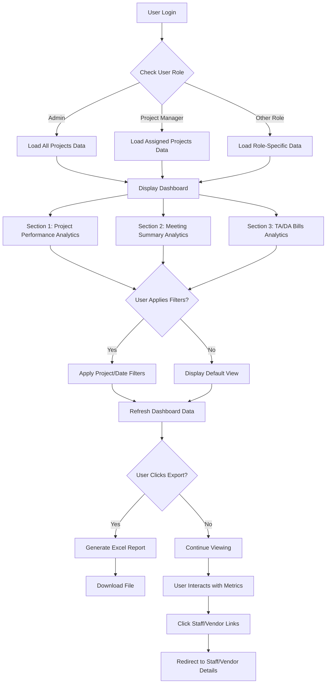

> [TODO: Insert Screenshot of Dashboard UI here]

---

### 3.2 Projects Module

**Purpose**: The Projects module serves as the master container for all project-related activities. It manages project creation, configuration, staff/vendor assignment, and provides a centralized view of all project components including sites, tasks, inventory, and stores.

**User Journey - Administrator Creating a Streetlight Project**:

1. **Navigate to Projects**: Admin clicks on "Projects" in the main navigation menu
2. **Create New Project**: He clicks the "Create Project" button and selects "Streetlight Project" as the project type
3. **Enter Project Details**: Admin fills in project information including:
   - Project name (e.g., "Panchayat Solar Streetlight Installation")
   - Work order number and agreement details
   - Project capacity and financial details
   - Start and end dates
   - State and district information
4. **Save Project**: He saves the project, which creates the project record in the system
5. **Assign Staff**: Admin navigates to the "Staff" tab within the project and assigns:
   - A Project Manager to oversee the project
   - Site Engineers for field operations
   - Store Incharge for inventory management
   - Coordinators for administrative support
6. **Assign Vendors**: He moves to the "Vendors" tab and assigns external contractors who will perform the installation work
7. **Create Stores**: Admin creates one or more stores (warehouses) for this project to manage inventory
8. **View Project Summary**: He reviews the project overview showing total targets, sites, staff count, and overall progress

**User Journey - Project Manager Viewing Project Details**:

1. **Access Projects List**: Satish (Project Manager) logs in and navigates to the Projects section
2. **Select Assigned Project**: He sees only projects assigned to him and clicks on a specific project (e.g., "Panchayat A Installation")
3. **Review Project Overview**: Satish views the project summary showing:
   - Total targets assigned
   - Number of sites/panchayats
   - Staff and vendor assignments
   - Overall completion percentage
4. **Check Sites Tab**: He navigates to the "Sites" tab to see all panchayats/wards under this project
5. **Review Targets Tab**: Satish views the "Targets" tab showing all streetlight tasks (targets) assigned to engineers and vendors
6. **Monitor Staff Performance**: He checks the "Staff" tab to see which engineers are assigned and can reassign targets if needed
7. **View Inventory**: Satish reviews the "Inventory" tab to see material availability and dispatch status
8. **Export Project Data**: He can export project details, targets, and progress reports for reporting purposes

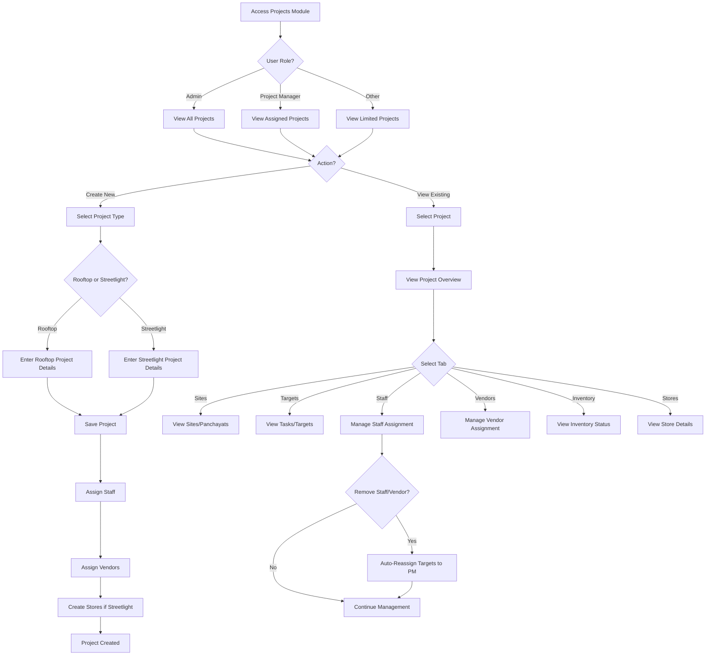

> [TODO: Insert Screenshot of Projects Module UI here]

---

### 3.3 Sites Module

**Purpose**: The Sites module manages physical locations where installations occur. For rooftop projects, sites represent individual buildings. For streetlight projects, sites represent panchayats/wards containing multiple poles. This module enables site creation, import, search, and detailed pole management.

**User Journey - Project Manager Creating Streetlight Sites**:

1. **Navigate to Sites**: Satish accesses the Sites section from the project detail page or main navigation
2. **Create New Site**: He clicks "Add Site" and selects the project for which he wants to create a site
3. **Enter Site Details**: Satish fills in the panchayat/ward information:
   - State, District, Block, Panchayat, Ward
   - Mukhiya contact information
   - Total number of poles expected
   - District and block codes
4. **Save Site**: He saves the site, which creates a streetlight site record
5. **Import Sites (Alternative)**: Alternatively, Satish can import multiple sites at once using an Excel template
6. **View Site Details**: He clicks on a specific site to view detailed information
7. **Manage Poles**: Within the site view, Satish can see two tabs:
   - **Surveyed Poles**: Shows poles that have been surveyed but not yet installed
   - **Installed Poles**: Shows poles that have been installed
8. **Filter by Ward**: He can filter poles by ward using the ward buttons in the sidebar
9. **Add/Import Poles**: Satish can manually add poles or import them from Excel with beneficiary information
10. **Export Pole Data**: He exports pole lists for reporting or further processing

**User Journey - Site Engineer Viewing Site and Updating Pole Status**:

1. **Access Assigned Sites**: The Site Engineer logs in and navigates to Sites, seeing only sites assigned to him
2. **Select Site**: He clicks on a specific panchayat/ward site
3. **View Site Information**: The engineer reviews site details including location, contact information, and pole counts
4. **Navigate to Surveyed Poles Tab**: He switches to the "Surveyed Poles" tab to see poles that need installation
5. **Filter by Ward**: The engineer uses ward filters to focus on specific areas
6. **Update Pole Status**: He clicks on a pole to edit it and updates:
   - Installation status (marks as installed)
   - Beneficiary information
   - GPS coordinates (actual installation location)
   - Installation images
   - Material consumption details
7. **Mark Pole as Installed**: Once installation is complete, the pole moves from "Surveyed" to "Installed" tab
8. **Track Inventory Consumption**: The engineer links consumed inventory items (panels, batteries, luminaries, structures) to the pole

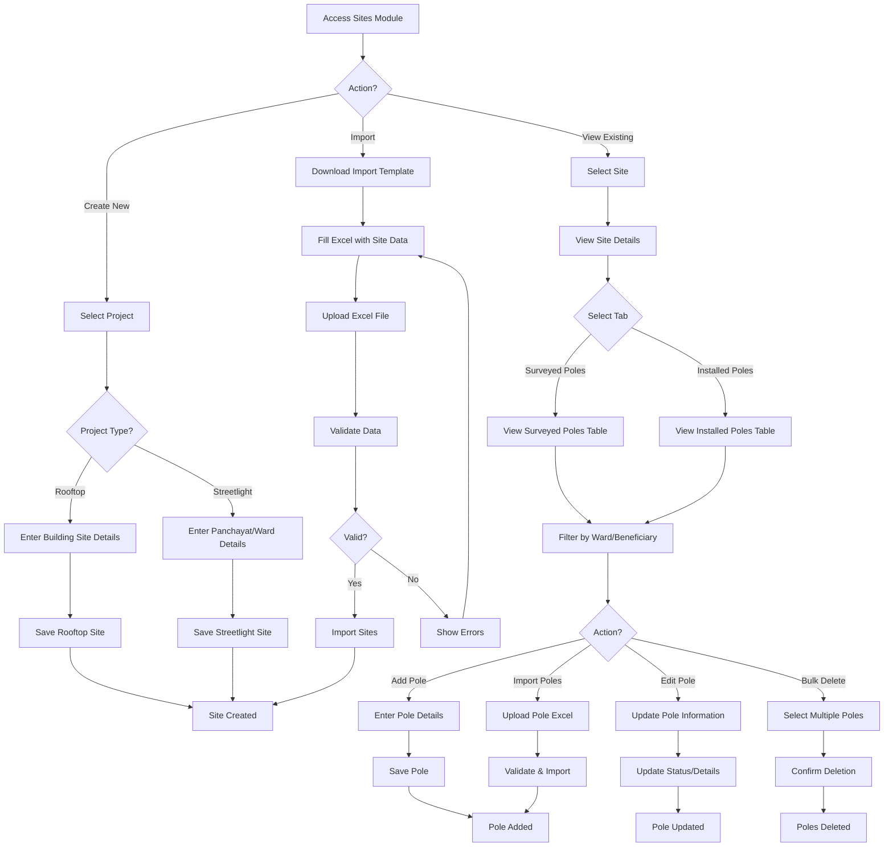

> [TODO: Insert Screenshot of Sites Module UI here]

---

### 3.4 Inventory & Stores Module

**Purpose**: The Inventory & Stores module manages the complete lifecycle of materials and equipment used in solar installations. It tracks inventory from procurement through storage, dispatch, consumption, and return/replacement. The module supports both rooftop projects (generic inventory) and streetlight projects (specialized items with QR codes and serial numbers).

**User Journey - Store Incharge Managing Inventory**:

1. **Access Store**: The Store Incharge logs in and navigates to the Stores section, selecting the store he manages
2. **View Inventory**: He sees the "View Inventory" tab showing all items currently in stock, including:
   - Item codes (SL01=Panel, SL02=Luminary, SL03=Battery, SL04=Structure for streetlight projects)
   - Serial numbers and QR codes
   - Available quantities
   - Vendor information
   - Dispatch and received dates
3. **Add Inventory**: The Store Incharge can:
   - Manually add new inventory items with details
   - Import inventory from Excel using the import template
   - Scan QR codes to verify items
4. **Dispatch Inventory**: When a vendor or engineer requests materials:
   - He navigates to the "Dispatch" section
   - Selects items to dispatch with quantities
   - Assigns items to specific vendors/engineers
   - Records dispatch date and generates dispatch records
5. **Track Dispatched Items**: The Store Incharge views the "Dispatched Inventory" tab to see:
   - Which items have been dispatched
   - To whom they were dispatched
   - Whether they have been consumed (installed) or are still in transit
6. **Handle Returns**: If items need to be returned:
   - He processes return requests
   - Updates inventory stock levels
   - Records return reasons
7. **Handle Replacements**: For defective items:
   - He processes replacement requests
   - Issues new items
   - Tracks replaced items
8. **Export Inventory Reports**: The Store Incharge exports inventory reports showing stock levels, dispatch history, and consumption patterns

**User Journey - Vendor Receiving and Consuming Inventory**:

1. **View Dispatched Items**: The Vendor logs in and navigates to the Inventory section, viewing items dispatched to him
2. **Check Item Details**: He reviews dispatched items including serial numbers, QR codes, and dispatch dates
3. **Install Items**: When installing a pole:
   - The vendor selects the pole being installed
   - Links consumed inventory items (panel, battery, luminary, structure) to the pole
   - System validates that items are from the correct district (district-based locking)
   - Marks items as consumed
4. **Track Consumption**: The vendor can see which items have been consumed and which are still available for installation
5. **Request Returns**: If items are unused or defective, the vendor can request returns through the system

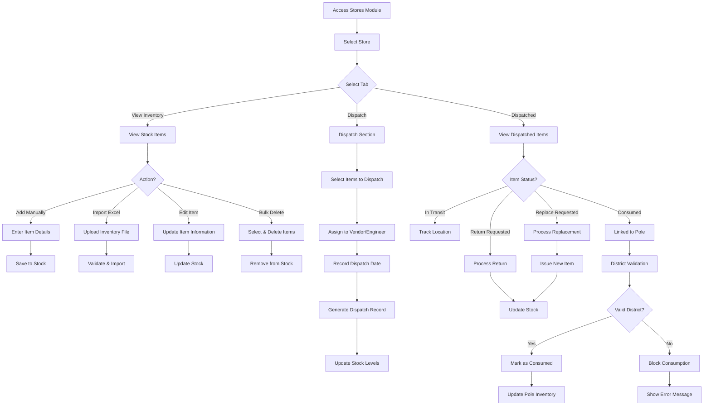

> [TODO: Insert Screenshot of Inventory & Stores Module UI here]

---

### 3.5 Tasks & Targets Module

**Purpose**: The Tasks & Targets module manages work assignments for both rooftop and streetlight projects. For rooftop projects, it handles individual installation tasks. For streetlight projects, it manages "targets" (streetlight tasks) that represent installation assignments for specific panchayats/wards, which are then broken down into individual pole installations.

**User Journey - Project Manager Assigning Targets**:

1. **Navigate to Project**: Satish opens a streetlight project and goes to the "Targets" tab
2. **View Existing Targets**: He sees all targets (streetlight tasks) for the project, showing:
   - Site/Panchayat name
   - Assigned engineer and vendor
   - Status (Pending, In Progress, Completed)
   - Start and end dates
   - Number of poles
3. **Create New Target**: Satish clicks "Add Target" and:
   - Selects a site/panchayat
   - Assigns an engineer and vendor
   - Sets start and end dates
   - Enters target description
4. **Import Targets (Bulk)**: Alternatively, he downloads the import template, fills it with multiple targets, and imports them at once
5. **Reassign Targets**: If needed, Satish can:
   - Select multiple targets
   - Reassign them to different engineers or vendors
   - System automatically updates assignments
6. **Monitor Progress**: He tracks target completion status and can see which targets are on track and which need attention
7. **Export Targets**: Satish exports target lists for reporting or planning purposes

**User Journey - Vendor Completing Target Work**:

1. **View Assigned Targets**: The Vendor logs in and navigates to the Tasks/Targets section, seeing only targets assigned to him
2. **Select Target**: He clicks on a specific target (e.g., "Panchayat XYZ Installation")
3. **View Target Details**: The vendor reviews:
   - Site location and contact information
   - Number of poles to install
   - Assigned engineer
   - Target dates
4. **Access Poles**: He navigates to the poles associated with this target
5. **Update Pole Status**: For each pole:
   - The vendor marks survey status
   - Updates installation status when complete
   - Links consumed inventory items
   - Uploads installation images
   - Records GPS coordinates
6. **Complete Target**: Once all poles are installed, the vendor marks the target as "Completed"
7. **Track Progress**: The vendor can see his overall progress across all assigned targets

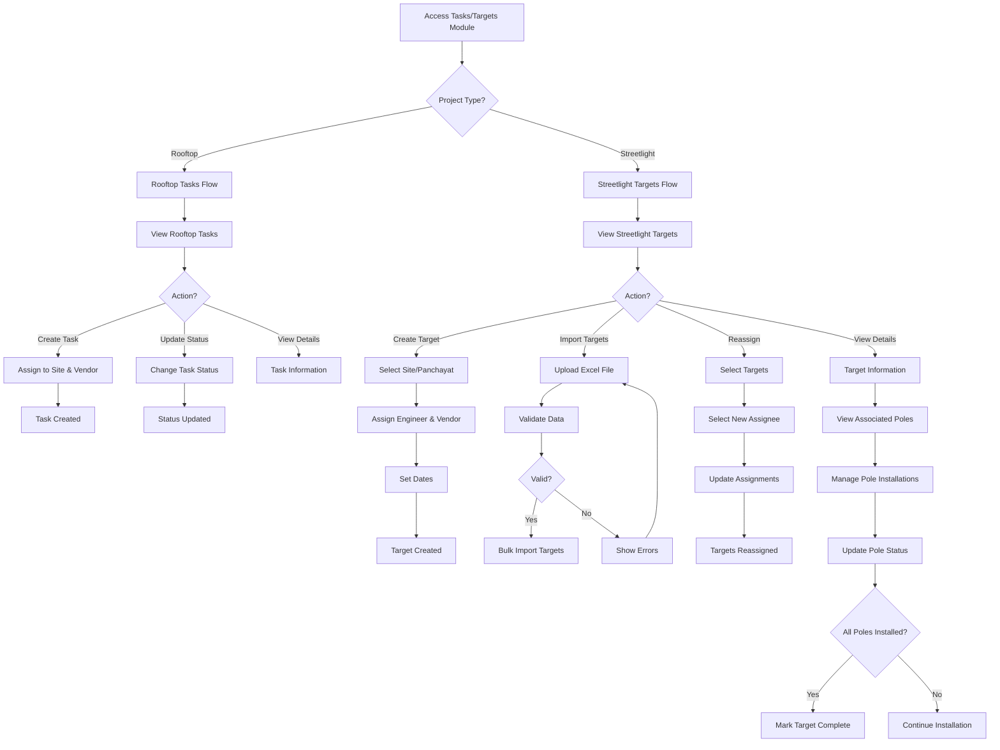

> [TODO: Insert Screenshot of Tasks & Targets Module UI here]

---

### 3.6 Meetings Module

**Purpose**: The Meetings module facilitates structured communication and collaboration across project teams. It enables scheduling of review meetings, tracking of discussion points, managing follow-ups, and maintaining meeting notes with full history. This module ensures important decisions and action items are captured and tracked.

**User Journey - Project Manager Creating a Review Meeting**:

1. **Navigate to Meetings**: Satish accesses the Meetings section from the main navigation
2. **Create New Meeting**: He clicks "Create Meeting" and fills in:
   - Meeting title and agenda
   - Meeting date and time
   - Meeting type (Status Meeting, Review Meeting, Planning Meeting)
   - Platform (in-person, video call, etc.) and meeting link if applicable
3. **Add Participants**: Satish selects participants from:
   - Project team members (engineers, vendors)
   - Other project managers
   - Administrators
   - External stakeholders if needed
4. **Save Meeting**: He saves the meeting, which sends notifications to all participants
5. **Add Discussion Points**: During or after the meeting, Satish adds discussion points:
   - Topic description
   - Assigned owner
   - Priority level
   - Status (Open, In Progress, Resolved)
6. **Update Discussion Points**: As work progresses, he updates discussion points with progress notes
7. **Schedule Follow-ups**: Satish schedules follow-up meetings for unresolved items
8. **Add Meeting Notes**: He adds comprehensive meeting notes, which are saved with history tracking
9. **Export Meeting Report**: Satish exports the meeting details, discussion points, and notes as PDF or Excel for distribution

**User Journey - Participant Attending Meeting**:

1. **View Meeting Invitation**: A participant (e.g., Site Engineer) logs in and sees meetings where he is a participant
2. **Access Meeting Details**: He clicks on a meeting to view:
   - Meeting agenda and details
   - List of participants
   - Discussion points assigned to him
   - Meeting notes
3. **Update Assigned Discussion Points**: The participant updates discussion points assigned to him:
   - Adds progress updates
   - Changes status as work completes
   - Adds comments or notes
4. **View Whiteboard**: If the meeting has a whiteboard, he can view collaborative notes and drawings
5. **Review Follow-ups**: The participant sees scheduled follow-up meetings related to this meeting
6. **Access Meeting History**: He can review previous meeting notes and discussion point history

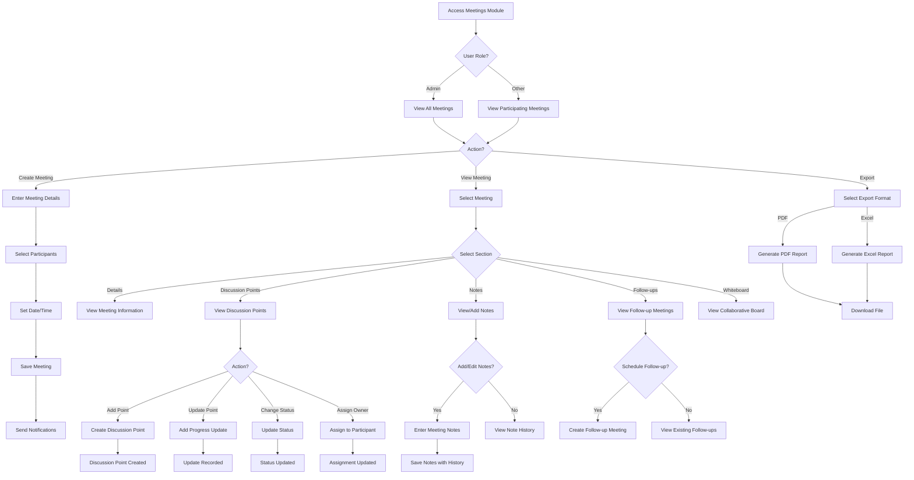

> [TODO: Insert Screenshot of Meetings Module UI here]

---

### 3.7 Performance Module

**Purpose**: The Performance module provides comprehensive analytics and performance tracking for individuals, teams, and the organization. It enables stakeholders to monitor productivity, identify top performers, track trends, and make data-driven decisions about resource allocation and project planning.

**User Journey - Project Manager Viewing Team Performance**:

1. **Access Performance Module**: Satish navigates to the Performance section
2. **View Personal Performance**: He sees his own performance metrics including:
   - Total projects managed
   - Sites/poles completed
   - Completion rates
   - Performance trends over time
3. **View Subordinates Performance**: Satish navigates to "Subordinates" view to see:
   - Performance of all engineers under his management
   - Individual completion rates
   - Sites/poles assigned vs completed
   - Performance rankings within his team
4. **Check Leaderboard**: He views the competitive leaderboard showing:
   - Rankings of all Project Managers
   - District-wise performance comparisons
   - Progress percentages
   - Trend indicators (improving/declining)
5. **Analyze Trends**: Satish reviews performance trends over time:
   - Monthly/weekly progress charts
   - Completion rate trends
   - Productivity patterns
6. **Export Performance Reports**: He exports performance data for reporting to management or for planning purposes

**User Journey - Administrator Viewing Organization-Wide Performance**:

1. **Access Performance Dashboard**: Admin navigates to Performance module
2. **View All Users Performance**: He sees performance metrics for all users across all roles
3. **Filter by Role**: Admin can filter performance views by:
   - Project Managers
   - Site Engineers
   - Vendors
   - Other roles
4. **View Leaderboards**: He accesses leaderboards for each role category to identify top performers
5. **Analyze Trends**: Admin reviews organization-wide trends:
   - Overall project completion rates
   - Team productivity trends
   - Performance by project type
   - Geographic performance patterns
6. **Generate Reports**: He exports comprehensive performance reports for executive review

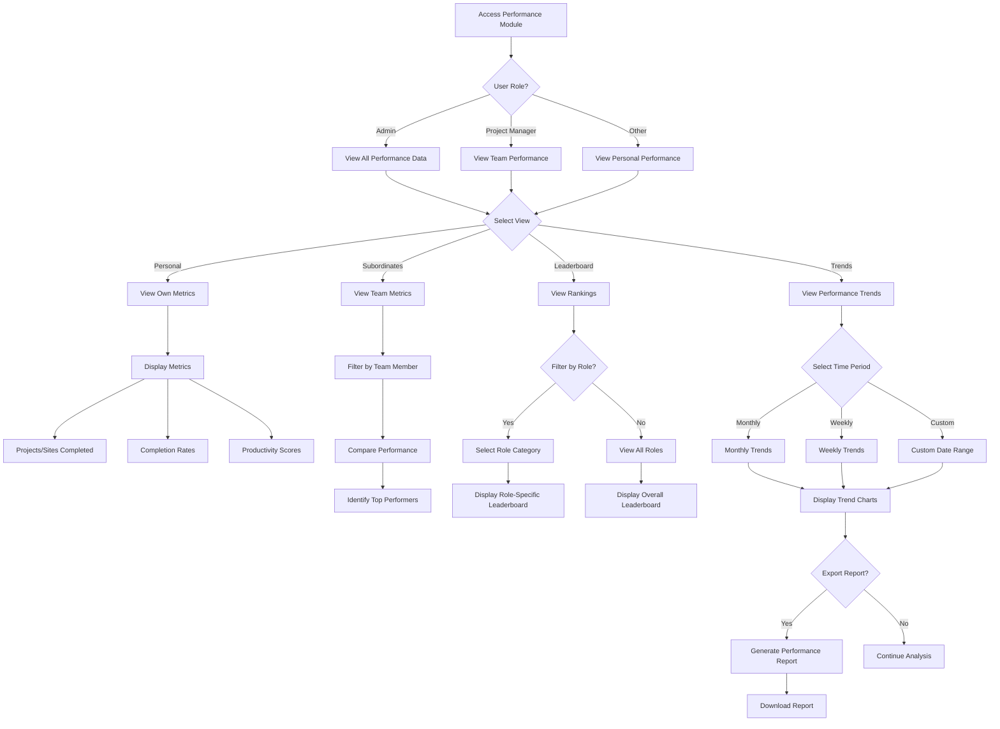

> [TODO: Insert Screenshot of Performance Module UI here]

---

### 3.8 Billing Module (TA/DA & Conveyance)

**Purpose**: The Billing module manages travel allowances, daily allowances, and conveyance expenses for field staff and project personnel. It handles expense claim submission, approval workflows, bulk processing, and financial reporting to ensure accurate and timely reimbursement.

**User Journey - Site Engineer Submitting TA/DA Claim**:

1. **Access Billing Module**: The Site Engineer navigates to the Billing section
2. **Navigate to TA/DA**: He clicks on "TA/DA" to access travel and daily allowance claims
3. **Create New Claim**: The engineer clicks "New Claim" and fills in:
   - Travel details (journey from/to, dates, mode of transport)
   - PNR number for train/flight tickets
   - Hotel expenses (check-in, check-out dates, bill amounts)
   - Daily allowance days
   - Miscellaneous expenses with descriptions
4. **Upload Supporting Documents**: He uploads:
   - Travel tickets
   - Hotel bills
   - Receipts for miscellaneous expenses
5. **Submit Claim**: The engineer submits the claim, which moves to "Pending" status
6. **Track Claim Status**: He monitors the claim status (Pending, Accepted, Rejected)
7. **View Claim Details**: The engineer can view detailed breakdown of his claim including all expenses

**User Journey - Administrator Processing TA/DA Claims**:

1. **Access TA/DA Management**: Admin navigates to Billing → TA/DA section
2. **View All Claims**: He sees all submitted claims with status filters (Pending, Accepted, Rejected)
3. **Review Claim Details**: Admin clicks on a claim to review:
   - All expense items
   - Supporting documents
   - Claim amount breakdown
   - Claimant information
4. **Approve or Reject**: He can:
   - Approve the claim (moves to "Accepted" status)
   - Reject the claim with rejection reason (moves to "Rejected" status)
5. **Bulk Processing**: Admin can select multiple claims and:
   - Bulk approve
   - Bulk reject
   - Update status in batch
6. **View Financial Analytics**: He accesses TA/DA analytics showing:
   - Total amounts claimed
   - Disbursed amounts
   - Pending approvals
   - Per-project breakdowns
   - Top travelers
7. **Export Reports**: Admin exports financial reports for accounting and audit purposes

**User Journey - Managing Conveyance Claims**:

1. **Access Conveyance Section**: User navigates to Billing → Conveyance
2. **Submit Conveyance Claim**: He creates a new conveyance claim with:
   - Vehicle type and details
   - Travel purpose
   - Distance traveled
   - Date and route
3. **Track Approval**: The user monitors claim status
4. **Process Claims (Admin/Authorized User)**: Authorized personnel can:
   - Accept or reject conveyance claims
   - Process bulk actions
   - View conveyance analytics

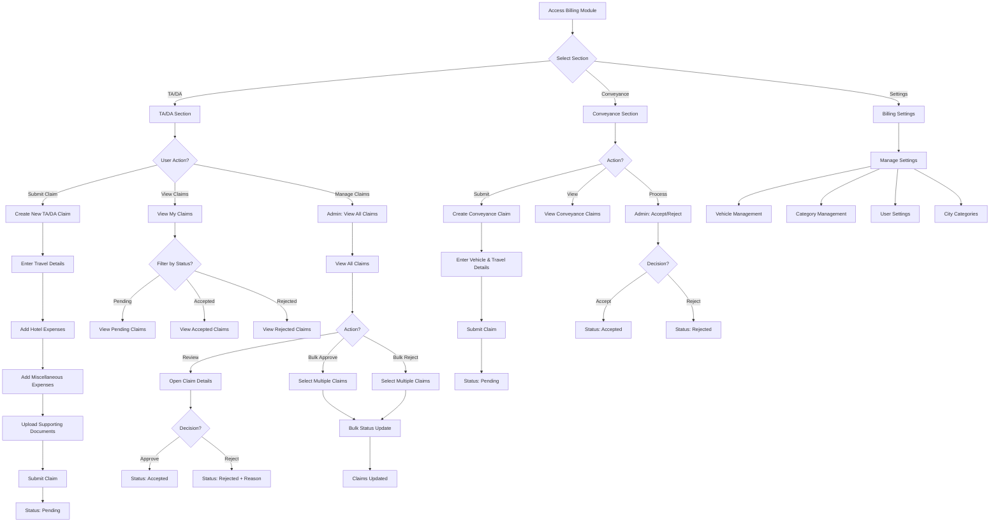

> [TODO: Insert Screenshot of Billing Module UI here]

---

### 3.9 Staff & Vendor Management Module

**Purpose**: The Staff & Vendor Management module enables administrators and project managers to manage user accounts, assign staff and vendors to projects, track profiles, and handle team composition. It supports bulk operations, profile management, and automatic task reassignment when team members are removed from projects.

**User Journey - Administrator Managing Staff**:

1. **Access Staff Module**: Admin navigates to the Staff section
2. **View Staff List**: He sees all staff members with filters by role (Project Manager, Site Engineer, Store Incharge, Coordinator)
3. **Create New Staff**: Admin clicks "Add Staff" and:
   - Enters personal information (name, email, contact)
   - Assigns role
   - Sets manager (for hierarchical structure)
   - Enters banking details
   - Sets initial status
4. **Import Staff (Bulk)**: Alternatively, he downloads the import template, fills it with staff data, and imports multiple staff members at once
5. **Edit Staff Profile**: Admin can update staff information, change roles, or modify assignments
6. **Assign to Projects**: He navigates to a project and uses the "Staff" tab to:
   - View currently assigned staff
   - Select and assign additional staff members
   - Remove staff from projects (with automatic target reassignment)
7. **Manage Profile Pictures**: Admin can upload or update staff profile pictures
8. **View Staff Details**: He clicks on a staff member to see:
   - Complete profile
   - Project assignments
   - Performance metrics
   - Task assignments

**User Journey - Project Manager Assigning Team to Project**:

1. **Access Project**: Satish opens a project and navigates to the "Staff" tab
2. **View Current Assignments**: He sees staff currently assigned to this project
3. **Assign Staff**: Satish can only assign staff where he is the manager:
   - He sees available staff (his direct reports) in the right column
   - Selects one or multiple staff members
   - Clicks "Assign" to add them to the project
4. **Remove Staff**: If needed, Satish can remove staff:
   - Selects staff to remove
   - Confirms removal
   - System automatically reassigns their targets to Satish (the Project Manager)
5. **Manage Vendors**: He navigates to the "Vendors" tab and:
   - Assigns vendors to the project
   - Removes vendors (with target reassignment)
   - Views vendor performance

**User Journey - Vendor Viewing Profile**:

1. **Access Profile**: The Vendor logs in and navigates to his profile
2. **View Profile Details**: He sees:
   - Personal information
   - Contact details
   - Banking information
   - Project assignments
   - Performance metrics
3. **View Installed Poles**: The vendor can see all poles he has installed with filters by:
   - Project
   - Panchayat
   - Installation status (surveyed, installed, billed)
4. **Update Profile Picture**: He can upload or change his profile picture
5. **View Earnings**: The vendor can see his earnings based on installed poles (configurable rate per pole)

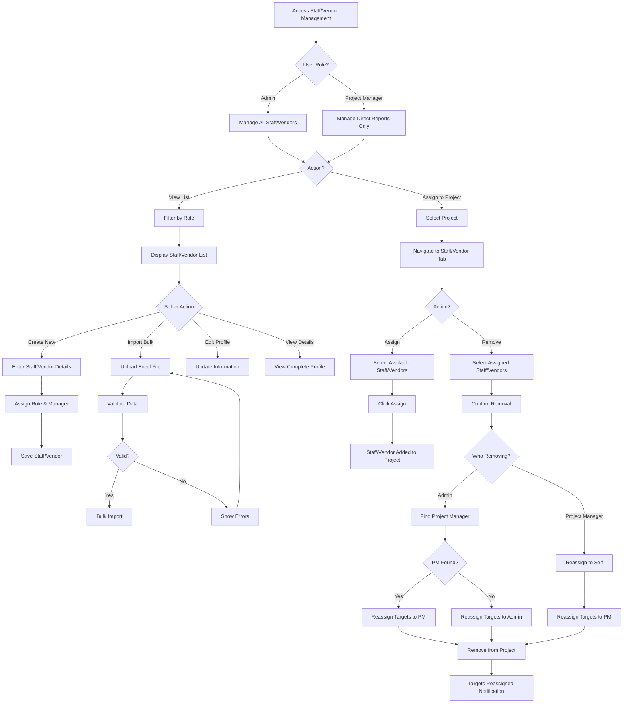

> [TODO: Insert Screenshot of Staff & Vendor Management Module UI here]

---

### 3.10 HRM/Candidates Module

**Purpose**: The HRM/Candidates module manages the recruitment lifecycle from candidate sourcing through application processing. It enables HR managers to import candidate lists, send recruitment communications, manage application documents, and track candidate status through the hiring pipeline.

**User Journey - HR Manager Managing Candidates**:

1. **Access Candidates Module**: The HR Manager navigates to the Candidates section
2. **View Candidate List**: He sees all candidates with their current status (Pending, In Review, Accepted, Rejected)
3. **Import Candidates (Bulk)**: The HR Manager can:
   - Download the import template
   - Fill it with candidate information (name, email, phone, position, etc.)
   - Upload the Excel file to import multiple candidates at once
4. **Send Recruitment Emails**: He selects one or multiple candidates and:
   - Sends recruitment invitation emails with application links
   - Tracks email delivery status
5. **Upload Documents**: For candidates who have submitted applications, the HR Manager can:
   - Upload supporting documents (resume, certificates, etc.)
   - Organize documents by candidate
6. **Update Candidate Status**: He updates candidate status as they progress through the hiring process:
   - Marks candidates as "In Review"
   - Accepts or rejects candidates
   - Tracks reasons for rejection
7. **View Application Details**: The HR Manager can preview candidate applications submitted through the public application form
8. **Bulk Operations**: He can perform bulk actions such as:
   - Bulk status updates
   - Bulk email sending
   - Bulk deletion of candidates

**User Journey - External Candidate Applying**:

1. **Receive Application Link**: A candidate receives an email invitation with a unique application link
2. **Access Application Form**: The candidate clicks the link and is taken to the public application form (`/apply-now/{id}`)
3. **Fill Application**: He completes the comprehensive application form including:
   - Personal information (name, contact, address, DOB)
   - Educational qualifications
   - Work experience
   - Previous employment details
   - Banking and identification information
   - Photo upload
   - Document uploads (resume, certificates)
4. **Preview Application**: Before submitting, the candidate can preview all entered information on the preview page
5. **Submit Application**: He submits the final application, which is saved in the system
6. **View Success Page**: The candidate sees a confirmation page indicating successful submission
7. **Track Status**: The candidate can check application status through follow-up communications from HR

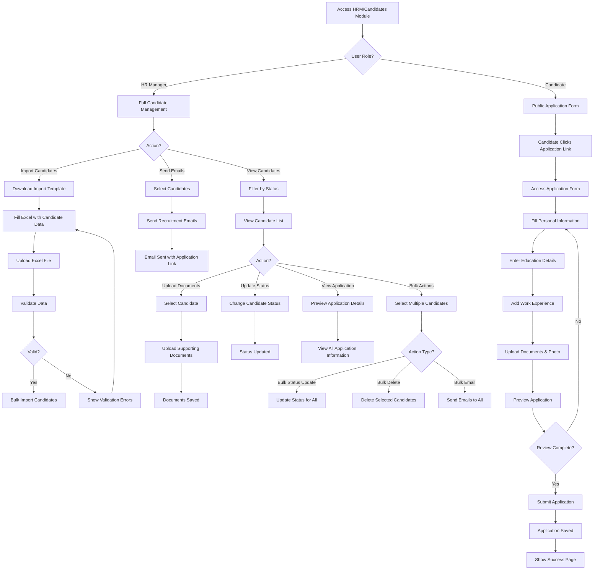

> [TODO: Insert Screenshot of HRM/Candidates Module UI here]

---

### 3.11 JICR (Job Inspection Completion Report) Module

**Purpose**: The JICR module generates official inspection completion reports for streetlight projects. It allows authorized users to create comprehensive reports documenting completed installations within specific geographic areas (districts, blocks, panchayats, wards) for compliance, auditing, and client delivery purposes.

**User Journey - Project Manager Generating JICR Report**:

1. **Access JICR Module**: Satish navigates to the JICR section from the main menu
2. **Select Geographic Area**: He uses cascading dropdowns to select:
   - District (from available districts in streetlight projects)
   - Block (populated based on selected district)
   - Panchayat (populated based on selected block)
   - Ward (populated based on selected panchayat)
3. **Set Date Range**: Satish enters:
   - From Date (start of the reporting period)
   - To Date (end of the reporting period)
4. **Generate Report**: He clicks "Generate JICR" button
5. **Review Report**: The system generates and displays a comprehensive report showing:
   - Project information
   - Selected geographic area details
   - All poles within the selected area and date range
   - Pole details (pole number, beneficiary, installation status, GPS coordinates)
   - Assignment information (engineer, vendor)
   - Installation dates
6. **Download PDF**: Satish clicks the download button to generate and download a PDF version of the report
7. **Share Report**: He can share the PDF report with clients, inspectors, or management for official documentation

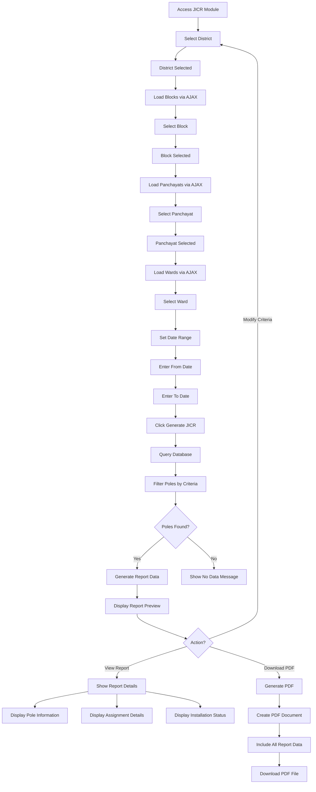

> [TODO: Insert Screenshot of JICR Module UI here]

---

### 3.12 Backup & Export Module

**Purpose**: The Backup & Export module enables comprehensive data backup and project-specific exports in a structured, human-readable format. It generates multi-sheet Excel files with organized project data, supporting both rooftop and streetlight project types with appropriate data transformations for easy analysis and archival.

**User Journey - Administrator Creating Project Backup**:

1. **Access Backup Module**: Admin navigates to the Backup section
2. **Select Project**: He selects a project for which to create a backup from a dropdown list
3. **Choose Project Type**: The system detects whether it's a Rooftop or Streetlight project
4. **Generate Backup**: Admin clicks "Create Backup" button
5. **System Processes Data**: The system:
   - Collects all project-related data
   - Transforms data to human-readable format (converts enums, booleans, dates)
   - Organizes data into appropriate sheets
6. **Download Backup File**: The system generates a multi-sheet Excel file:
   - **For Rooftop Projects**: Sheets include Project Details, Sites, Staff, Inventory Used/Stock, Tasks, Sites Done
   - **For Streetlight Projects**: Sheets include Project Details, Streetlight Sites, Store Inventory, Staff, Vendors, Targets, Installations (Poles)
7. **Save Backup**: Admin downloads and saves the backup file for archival or analysis purposes
8. **Manage Backups**: He can view previously created backups, download them again, or delete old backups

**Data Transformation Features**:

- **Boolean Fields**: Converts technical boolean values (0/1) to readable text (Yes/No, Done/Pending)
- **Enum Fields**: Converts enum codes to human-readable labels (e.g., role codes to role names, status codes to status descriptions)
- **Date Formats**: Standardizes date formats for readability
- **Relationship Data**: Includes related information (e.g., user names instead of just IDs)

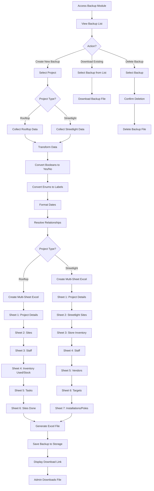

> [TODO: Insert Screenshot of Backup & Export Module UI here]

---

## 4. System Architecture Overview

### 4.1 Project Types

The system supports two distinct project types, each with specialized workflows and data models:

| Feature | Rooftop Solar Projects | Streetlight Projects |
|---------|----------------------|---------------------|
| **Site Type** | Individual building sites | Panchayats/Wards with multiple poles |
| **Geographic Hierarchy** | State → District → Site | State → District → Block → Panchayat → Ward → Pole |
| **Task Model** | Tasks (individual installations) | Streetlight Tasks/Targets (panchayat-level assignments) |
| **Inventory Items** | Generic items (panels, inverters, cables) | Specific items (SL01=Panel, SL02=Luminary, SL03=Battery, SL04=Structure) |
| **Tracking Granularity** | Site-level tracking | Pole-level tracking with QR codes |
| **Store Management** | Optional | Required (district-based stores) |

### 4.2 Key Business Rules

**Target Reassignment Logic**:
- When a staff member or vendor is removed from a project, their assigned targets/tasks are automatically reassigned
- **Admin removing staff**: Targets reassigned to Project Manager (or Admin if no PM exists)
- **Project Manager removing staff**: Targets reassigned to the Project Manager themselves
- This ensures no work assignments become orphaned when team composition changes

**District-Based Inventory Locking**:
- For streetlight projects, inventory items are locked to specific districts
- Items dispatched for one district cannot be consumed in a different district
- This prevents cross-district inventory movement and ensures accurate tracking

**Role-Based Assignment Restrictions**:
- **Administrators**: Can assign any staff/vendor to any project
- **Project Managers**: Can only assign staff/vendors where they are the direct manager (`manager_id` check)
- This maintains organizational hierarchy and prevents unauthorized assignments

---

## 5. Data Export & Reporting Capabilities

The system provides comprehensive export and reporting functionality across modules:

- **Dashboard Exports**: Filtered Excel reports of dashboard analytics
- **Project Exports**: Complete project data with all related entities
- **Task/Target Exports**: Lists of tasks or targets with status and assignment information
- **Inventory Exports**: Stock levels, dispatch history, and consumption reports
- **Meeting Exports**: PDF and Excel formats for meeting documentation
- **Performance Reports**: Performance metrics and analytics exports
- **Billing Reports**: TA/DA and conveyance expense reports
- **JICR Reports**: Official inspection completion reports in PDF format
- **Backup Exports**: Complete project backups with multi-sheet Excel organization

---

## 6. Integration Points

The system integrates with external services and systems:

- **AWS S3**: File storage for avatars, documents, and application materials
- **WhatsApp API**: Messaging integration for notifications and communications
- **RMS (Remote Management System)**: Data push capabilities for remote monitoring systems
- **Email Services**: Recruitment email delivery and system notifications

---

## Conclusion

This Solar Project Management CRM System provides a comprehensive solution for managing the complete lifecycle of solar installation projects across India. With support for both rooftop and streetlight projects, role-based access control, comprehensive inventory management, and extensive reporting capabilities, it enables organizations to efficiently coordinate resources, track progress, and deliver successful solar installation projects.

The system's architecture accommodates India's administrative hierarchy, making it particularly well-suited for large-scale streetlight projects while maintaining flexibility for rooftop installations. Its modular design ensures that each stakeholder has access to the tools and information they need to fulfill their responsibilities effectively.

---

**Document Version**: 1.0  
**Last Updated**: 2025-12-17  
**Maintained By**: Development Team
