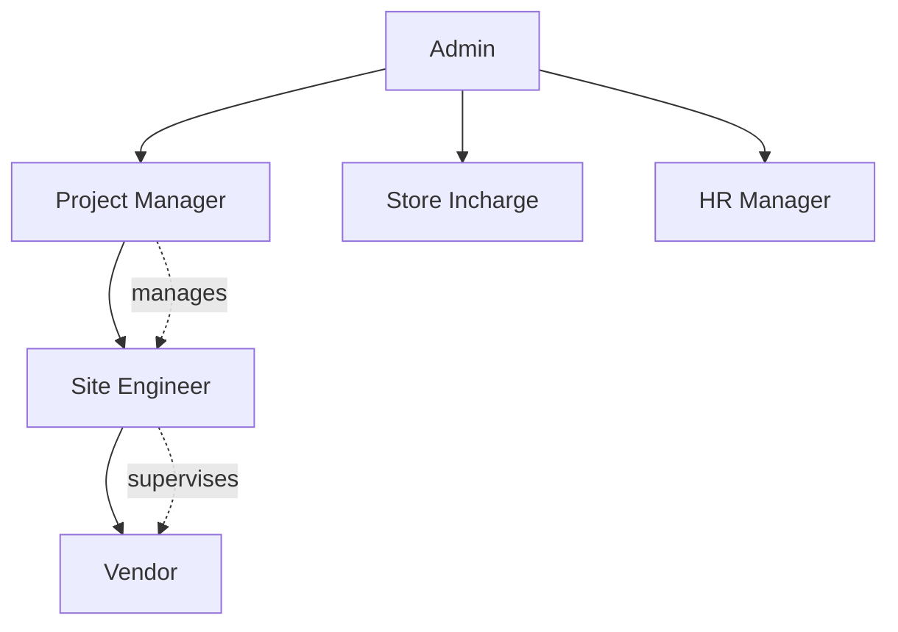
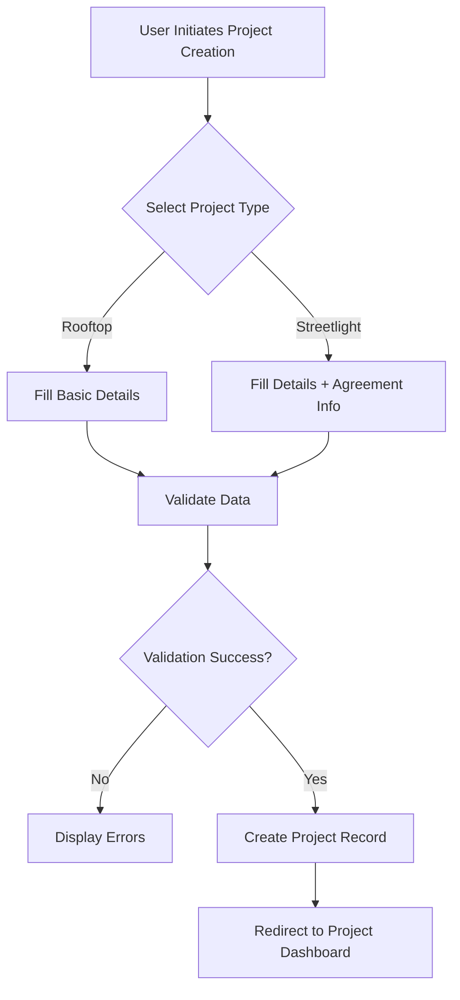
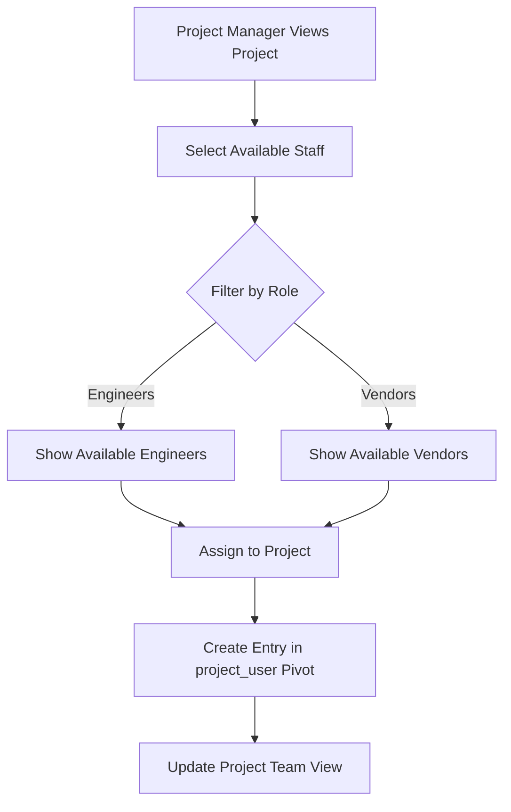
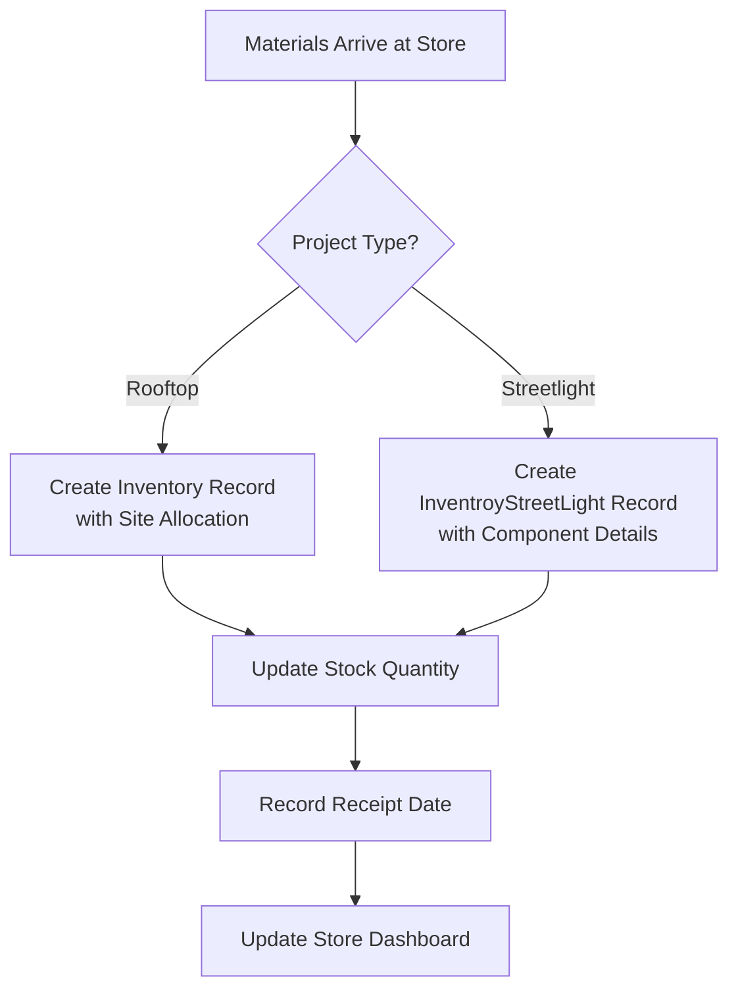
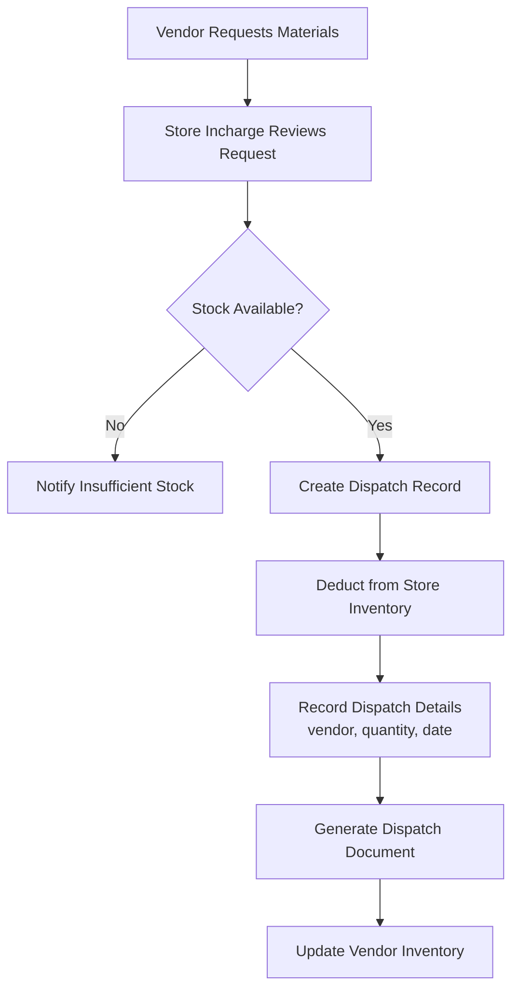
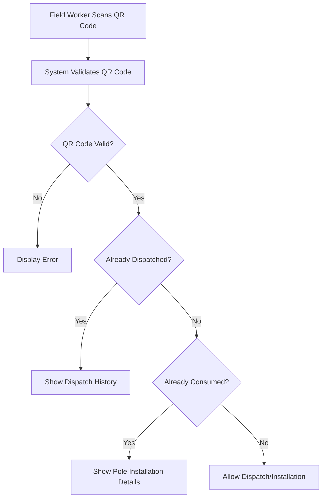
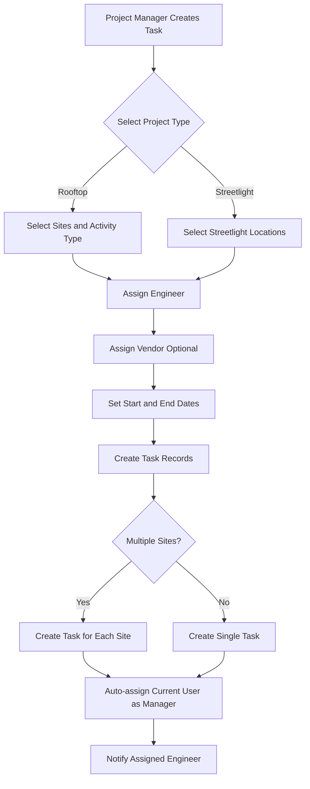
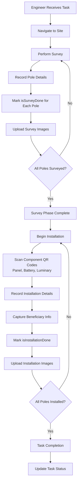
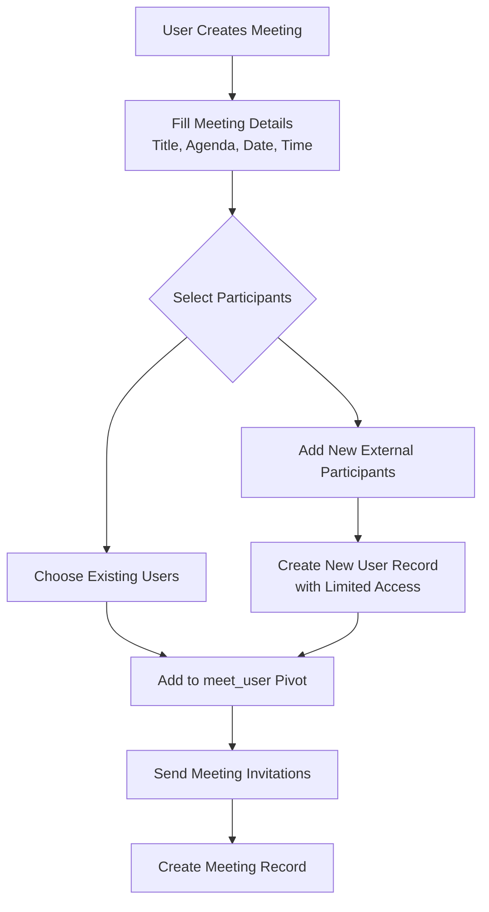

# Laravel CRM/ERP System - Complete Technical Documentation

## System Overview

### Purpose and Scope

This is an Enterprise Resource Planning (ERP) and Customer Relationship Management (CRM) solution designed specifically for managing renewable energy projects. The system handles the complete lifecycle of streetlight installation projects and rooftop solar projects, including inventory management, staff allocation, task tracking, expense management, and meeting coordination.

### Technology Stack

-   **Framework**: Laravel (PHP)
-   **Database**: MySQL
-   **Storage**: AWS S3 for file storage
-   **Authentication**: Laravel Sanctum
-   **Permissions**: Spatie Laravel Permission
-   **Excel Processing**: Maatwebsite Excel
-   **PDF Generation**: Barryvdh DomPDF

### User Roles and Access Control

The system supports seven distinct user roles with hierarchical relationships:

| Role ID | Role Name       | Description                                              |
| ------- | --------------- | -------------------------------------------------------- |
| 0       | Admin           | Full system access with administrative privileges        |
| 1       | Site Engineer   | Field engineers managing on-ground operations            |
| 2       | Project Manager | Oversees projects and manages site engineers and vendors |
| 3       | Vendor          | External contractors performing installation work        |
| 4       | Store Incharge  | Manages inventory and material dispatch                  |
| 5       | HR Manager      | Handles candidate recruitment and HR operations          |
| 10      | Client          | External stakeholders with limited view access           |

### Role Relationships

---

## Module 1: Project Management

### Purpose

Central module for creating, managing, and tracking renewable energy projects throughout their lifecycle.

### Project Types

The system supports two distinct project types:

| Type ID | Type Name              | Description                                          |
| ------- | ---------------------- | ---------------------------------------------------- |
| 0       | Rooftop Solar Projects | Solar panel installations on rooftops                |
| 1       | Streetlight Projects   | Solar streetlight installations in rural/urban areas |

### Key Entities

#### Project Entity

**Attributes:**

-   project_type: Determines whether rooftop or streetlight project
-   project_name: Descriptive name of the project
-   project_in_state: State where project is located
-   agreement_number: Contract agreement reference (mandatory for streetlight projects)
-   agreement_date: Contract signing date (mandatory for streetlight projects)
-   work_order_number: Unique work order identifier
-   start_date: Project commencement date
-   end_date: Expected project completion date
-   rate: Financial rate applicable
-   project_capacity: Total capacity in appropriate units
-   description: Additional project details
-   total: Total project value

**Relationships:**

-   Has many Sites (either Site entities for rooftop or Streetlight entities for streetlight projects)
-   Has many Tasks (project assignments)
-   Has many Stores (material storage locations)
-   Has many Inventory items
-   Belongs to many Users through pivot table (project_user) with role assignment

### Core Workflows

#### Workflow 1: Project Creation

#### Workflow 2: Staff Assignment to Project

### Business Rules

**Project Creation Constraints:**

-   Work order number must be unique across all projects
-   For streetlight projects, agreement_number and agreement_date are mandatory
-   End date must be after or equal to start_date
-   Project managers can only view and manage projects they are assigned to
-   Admins have visibility across all projects

**Staff Assignment Rules:**

-   Only users with matching project_id can be assigned to a project
-   Project managers can only assign engineers and vendors under their supervision
-   Users can be assigned to multiple projects simultaneously

### Data Aggregations

For each project, the system calculates:

**For Streetlight Projects:**

-   Total poles planned across all sites
-   Total poles surveyed (cumulative from all sites)
-   Total poles with installation completed
-   Initial inventory stock value
-   Dispatched inventory value
-   In-store inventory value (initial minus dispatched)

**For Rooftop Projects:**

-   Installation task count
-   RMS (Remote Monitoring System) task count
-   Inspection task count
-   Site completion percentage

---

## Module 2: Site and Location Management

### Purpose

Manages geographical sites and locations where project work is executed. The structure differs based on project type.

### Site Management for Rooftop Projects

#### Site Entity Attributes

**Basic Information:**

-   breda_sl_no: Unique serial number
-   project_id: Associated project reference
-   site_name: Descriptive site name
-   state: State location
-   district: District location
-   division: Administrative division
-   location: Detailed address

**Technical Details:**

-   project_capacity: Capacity at this site
-   ca_number: Consumer account number
-   sanction_load: Sanctioned electrical load
-   meter_number: Electricity meter reference
-   net_meter_sr_no: Net meter serial number
-   solar_meter_sr_no: Solar meter serial number

**Stakeholder Information:**

-   site_engineer: Assigned engineer user ID
-   ic_vendor_name: Installation contractor vendor ID
-   contact_no: Site contact number
-   department_name: Concerned department
-   bts_department_name: BTS department reference

**Status Tracking:**

-   installation_status: Current installation phase
-   site_survey_status: Survey completion status
-   load_enhancement_status: Load enhancement progress

**Dates:**

-   material_inspection_date: When materials were inspected
-   spp_installation_date: Solar power plant installation date
-   commissioning_date: System commissioning date

**Geographical Coordinates:**

-   survey_latitude: Surveyed location latitude
-   survey_longitude: Surveyed location longitude
-   actual_latitude: Actual installation latitude
-   actual_longitude: Actual installation longitude

**Installation Phases:** (All enum fields with values: Not Started, In Progress, Completed)

-   drawing_approval
-   inspection
-   material_supplied
-   structure_installation
-   structure_foundation
-   pv_module_installation
-   inverter_installation
-   dcdb_acdb_installaation
-   dc_cabelling
-   ac_cabelling
-   ac_cable_termination
-   dc_earthing
-   ac_earthing
-   lighntning_arrestor
-   remote_monitoring_unit
-   fire_safety
-   net_meter_registration
-   meter_installaton_commission
-   performance_guarantee_test
-   handover_status

**Relationships:**

-   Belongs to Project
-   Has many Tasks
-   Has many Inventory items
-   Belongs to State (stateRelation)
-   Belongs to City/District (districtRelation)
-   Belongs to User as Engineer (engineerRelation)
-   Belongs to User as Vendor (vendorRelation)

### Site Management for Streetlight Projects

#### Streetlight Entity Attributes

**Administrative Hierarchy:**

-   state: State name
-   district: District name
-   block: Block name
-   panchayat: Panchayat (village council) name
-   ward: Ward numbers (comma-separated)
-   district_id: District reference ID
-   block_id: Block reference ID
-   panchayat_id: Panchayat reference ID
-   ward_id: Ward reference ID

**Pole Information:**

-   total_poles: Total poles planned for this location
-   number_of_poles: Pole count
-   number_of_surveyed_poles: Count of surveyed poles
-   number_of_installed_poles: Count of installed poles

**Technical Details:**

-   pole_id: Reference to pole
-   SID: Site identification number
-   uname: User or reference name

**Location:**

-   lat: Latitude
-   lng: Longitude
-   file: Associated file reference

**Relationships:**

-   Belongs to Project
-   Has many Poles (individual streetlight poles)
-   Has many StreetlightTasks

### Pole Management (Streetlight Projects)

#### Pole Entity (streelight_poles table)

**Attributes:**

-   task_id: Associated streetlight task
-   complete_pole_number: Unique pole identifier
-   ward_name: Ward where pole is located

**Survey Status:**

-   isSurveyDone: Boolean indicating survey completion
-   survey_image: Array of survey images
-   lat: Survey latitude
-   lng: Survey longitude

**Installation Status:**

-   isInstallationDone: Boolean indicating installation completion
-   submission_image: Installation completion image

**Component Tracking:**

-   luminary_qr: QR code of light fixture
-   battery_qr: QR code of battery
-   panel_qr: QR code of solar panel
-   sim_number: SIM card number for monitoring

**Network:**

-   isNetworkAvailable: Network connectivity status

**Beneficiary Information:**

-   beneficiary: Name of beneficiary
-   beneficiary_contact: Contact number

**Other:**

-   remarks: Additional notes
-   file: Associated files

**Relationships:**

-   Belongs to Streetlight
-   Belongs to StreetlightTask

### Site Import Functionality

The system supports bulk site import through Excel files:

**For Streetlight Projects:**

-   Imports administrative hierarchy (State, District, Block, Panchayat, Ward)
-   Imports pole counts and geographical data
-   Associates sites with projects during import

**For Rooftop Projects:**

-   Imports site details with technical specifications
-   Imports stakeholder information
-   Sets initial status for all installation phases

---

## Module 3: Inventory and Store Management

### Purpose

Comprehensive inventory tracking system managing materials from procurement through dispatch to consumption at sites. Handles different inventory structures for rooftop and streetlight projects.

### Store Entity

**Attributes:**

-   store_name: Name of the storage facility
-   address: Physical address of store
-   project_id: Associated project
-   store_incharge_id: User responsible for store

**Relationships:**

-   Belongs to Project
-   Belongs to User as store incharge
-   Has many Inventory items

### Inventory Structure

The system maintains separate inventory tables based on project type:

#### For Rooftop Projects (Inventory table)

**Attributes:**

-   store_id: Storage location
-   project_id: Associated project
-   site_id: Intended site (optional)
-   category: Material category
-   sub_category: Material subcategory
-   productName: Product description
-   brand: Manufacturer brand
-   description: Detailed description
-   unit: Unit of measurement
-   initialQuantity: Initial stock received
-   quantityStock: Current available stock
-   rate: Per unit cost
-   total: Total value
-   materialDispatchDate: Date of dispatch
-   deliveryDate: Expected delivery date
-   receivedDate: Actual receipt date
-   allocationOfficer: Officer who allocated material
-   url: Reference URL or document

**Relationships:**

-   Belongs to Store
-   Belongs to Project
-   Belongs to Site

#### For Streetlight Projects (InventroyStreetLightModel table)

**Attributes:**

-   project_id: Associated project
-   store_id: Storage location
-   item: Item name/description
-   item_code: Unique item code
-   manufacturer: Manufacturer name
-   model: Model number
-   serial_number: Serial number
-   make: Make/brand
-   rate: Per unit rate
-   quantity: Quantity in stock
-   total_value: Total value (quantity × rate)
-   hsn: HSN code for taxation
-   description: Item description
-   unit: Unit of measurement
-   received_date: Date material received

**Key Difference:** Streetlight inventory is component-based with detailed tracking of each component type (luminaries, batteries, panels, poles, etc.)

### Inventory Dispatch Tracking

#### InventoryDispatch Entity

**Attributes:**

-   vendor_id: Vendor receiving materials
-   project_id: Project reference
-   store_id: Source store
-   store_incharge_id: Approving store manager
-   item_code: Item identifier
-   item: Item description
-   rate: Unit rate
-   make: Make/brand
-   model: Model number
-   total_quantity: Quantity dispatched
-   total_value: Total dispatch value
-   serial_number: Serial numbers of dispatched items
-   isDispatched: Dispatch confirmation flag
-   dispatch_date: Date of dispatch
-   is_consumed: Whether materials are consumed/installed
-   streetlight_pole_id: Specific pole where consumed (for streetlight projects)

**Relationships:**

-   Belongs to Inventory
-   Belongs to InventroyStreetLightModel
-   Belongs to User as vendor
-   Belongs to Project
-   Belongs to Store
-   Belongs to User as store incharge
-   Belongs to Pole (for streetlight consumption tracking)

### Inventory Workflows

#### Workflow 1: Material Receipt and Storage

#### Workflow 2: Material Dispatch to Vendor

#### Workflow 3: QR Code Validation (Streetlight Projects)

### Inventory Import Functionality

The system supports bulk inventory import through Excel:

**For Rooftop Projects:**

-   Imports standard inventory format
-   Maps to stores and projects
-   Validates quantities and rates

**For Streetlight Projects:**

-   Imports component-wise inventory
-   Validates item codes and descriptions
-   Groups by item categories
-   Calculates aggregate stock values

### Material Replacement

The system allows replacing defective or damaged materials:

**Process:**

-   Identify defective item by serial number or QR code
-   Record replacement reason
-   Deduct replacement item from stock
-   Update dispatch records
-   Maintain audit trail of replacements

### Stock Valuation

The system automatically calculates:

**At Project Level:**

-   Initial Stock Value: Sum of all materials received
-   Dispatched Stock Value: Sum of all materials sent to field
-   In-Store Stock Value: Initial minus dispatched
-   Consumption Value: Materials marked as consumed at poles/sites

**At Store Level:**

-   Current stock quantity by item
-   Current stock value by item
-   Dispatch history
-   Low stock alerts (if configured)

---

## Module 4: Task and Target Management

### Purpose

Manages work assignments, tracks progress, and monitors task completion across projects. Handles different task types for rooftop and streetlight projects.

### Task Types by Project

**Rooftop Projects (Task entity):**

-   Installation tasks
-   RMS (Remote Monitoring System) installation
-   Inspection tasks
-   Maintenance activities

**Streetlight Projects (StreetlightTask entity):**

-   Survey assignments
-   Installation assignments
-   Combined survey and installation tasks

### Task Entity (Rooftop Projects)

**Attributes:**

-   project_id: Associated project
-   site_id: Target site
-   vendor_id: Assigned vendor
-   engineer_id: Supervising engineer
-   manager_id: Project manager (auto-assigned as logged-in user)
-   activity: Type of activity (Installation, RMS, Inspection)
-   task_name: Descriptive task name
-   status: Current status (Pending, In Progress, Done)
-   start_date: Scheduled start
-   end_date: Scheduled completion
-   image: JSON array of progress images (stored on S3)
-   materials_consumed: Materials used in task
-   description: Task details
-   approved_by: Approval authority

**Relationships:**

-   Belongs to Project
-   Belongs to Site
-   Belongs to User as vendor
-   Belongs to User as engineer
-   Belongs to User as manager

### StreetlightTask Entity

**Attributes:**

-   project_id: Associated project
-   site_id: Streetlight site reference
-   vendor_id: Assigned vendor
-   engineer_id: Supervising engineer
-   manager_id: Project manager
-   start_date: Task start date
-   end_date: Task end date
-   billed: Whether task has been billed (boolean)

**Relationships:**

-   Belongs to Project
-   Belongs to Streetlight as site
-   Belongs to User as vendor
-   Belongs to User as engineer
-   Belongs to User as manager
-   Has many Poles

### Task Assignment Workflow

### Task Execution Workflow (Streetlight Projects)

### Task Progress Tracking

The system tracks task progress through multiple dimensions:

**For Individual Tasks:**

-   Status progression: Pending → In Progress → Done
-   Materials consumed tracking
-   Image documentation at each phase
-   Timestamp tracking for all updates

**For Project Dashboard:**

-   Total tasks assigned
-   Tasks by status (pending, in progress, completed)
-   Tasks assigned today
-   Tasks completed today
-   Engineer performance metrics
-   Vendor performance metrics

**For Streetlight Tasks:**

-   Pole-level tracking within each task
-   Survey completion percentage
-   Installation completion percentage
-   Network availability status for each pole

### Performance Metrics

#### Engineer Performance

-   Total tasks assigned
-   Tasks completed
-   Tasks in progress
-   Tasks pending
-   Daily completion rate
-   Average task duration

#### Vendor Performance

-   Total tasks assigned
-   Completion rate
-   Quality of work (based on inspection results)
-   Material consumption efficiency

#### Top Performers Dashboard

-   Top 5 engineers by tasks completed today
-   Top 5 vendors by tasks completed today
-   Performance trends over time

### Task Modification Rules

**Rooftop Tasks:**

-   Can modify assigned engineer
-   Can change site assignment
-   Can update activity type
-   Status updates only by assigned engineer or manager

**Streetlight Tasks:**

-   Can modify assigned engineer and vendor
-   Can update billing status
-   Cannot change site once poles are surveyed
-   Manager approval required for certain changes

### Material Consumption Integration

When tasks are executed:

-   Materials dispatched are linked to task
-   Consumption is recorded at pole level (streetlight) or site level (rooftop)
-   Inventory dispatch records are updated with consumption status
-   QR codes of consumed components are linked to specific poles

---

## Module 5: Meeting and Discussion Management

### Purpose

Facilitates collaborative meeting management, task tracking from meetings, and progress monitoring of action items discussed during meetings.

### Meet Entity

**Attributes:**

-   title: Meeting subject
-   agenda: Meeting agenda/topics
-   meet_link: Virtual meeting URL
-   platform: Meeting platform (Zoom, Teams, Google Meet, etc.)
-   meet_date: Scheduled date
-   meet_time: Scheduled time
-   type: Meeting type (Review, Planning, Status Update, etc.)
-   notes: Meeting minutes and notes

**Relationships:**

-   Has one Whiteboard (for collaborative notes)
-   Has many MeetingNoteHistory (version control of notes)
-   Has many DiscussionPoints (action items/tasks)
-   Has many FollowUps (scheduled follow-up meetings)
-   Belongs to many Users as participants (through meet_user pivot)
-   Belongs to many Users as attendees

### DiscussionPoint Entity (Tasks from Meetings)

**Attributes:**

-   meet_id: Source meeting
-   project_id: Related project
-   title: Task/discussion point title
-   description: Detailed description
-   assignee_id: Person who assigns the task
-   assigned_to: Person responsible for completion
-   department: Department responsible
-   priority: Priority level (High, Medium, Low)
-   status: Current status (Pending, In Progress, Completed)
-   due_date: Deadline for completion

**Relationships:**

-   Belongs to Meet
-   Belongs to Project
-   Belongs to User as assignee
-   Belongs to User as assignedToUser
-   Has many DiscussionPointUpdates (progress updates)

### DiscussionPointUpdates Entity

**Attributes:**

-   discussion_point_id: Parent discussion point
-   update_text: Progress update description
-   vertical_head_remark: Comments from vertical head
-   admin_remark: Comments from admin

**Relationships:**

-   Belongs to DiscussionPoint

### FollowUp Entity

**Attributes:**

-   parent_meet_id: Original meeting reference
-   title: Follow-up meeting title
-   meet_date: Scheduled follow-up date
-   status: Follow-up status

**Relationships:**

-   Belongs to Meet as parent meeting

### Whiteboard Entity

**Purpose:** Collaborative note-taking space during meetings

**Relationships:**

-   Belongs to Meet

### MeetingNoteHistory Entity

**Purpose:** Maintains version history of meeting notes

**Relationships:**

-   Belongs to Meet
-   Belongs to User (who made the update)

### Meeting Workflow

#### Workflow 1: Meeting Creation and Participant Management

#### Workflow 2: Discussion
