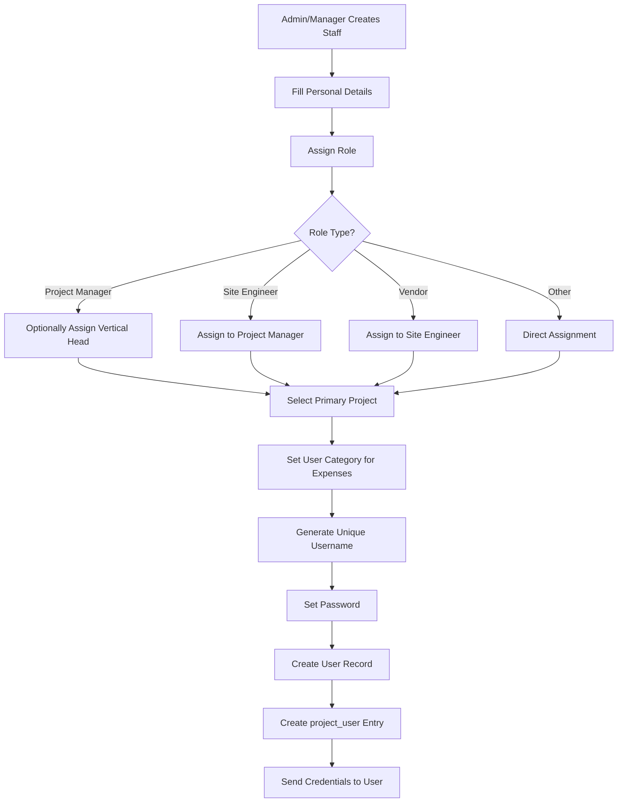

# Laravel CRM/ERP System - Complete Technical Documentation

## System Overview

### Purpose and Scope

This is an Enterprise Resource Planning (ERP) and Customer Relationship Management (CRM) solution designed specifically for managing renewable energy projects. The system handles the complete lifecycle of streetlight installation projects and rooftop solar projects, including inventory management, staff allocation, task tracking, expense management, and meeting coordination.

### Technology Stack

-   **Framework**: Laravel (PHP)
-   **Database**: MySQL
-   **Storage**: AWS S3 for file storage
-   **Authentication**: Laravel Sanctum
-   **Permissions**: Spatie Laravel Permission
-   **Excel Processing**: Maatwebsite Excel
-   **PDF Generation**: Barryvdh DomPDF

### User Roles and Access Control

The system supports seven distinct user roles with hierarchical relationships:

| Role ID | Role Name       | Description                                              |
| ------- | --------------- | -------------------------------------------------------- |
| 0       | Admin           | Full system access with administrative privileges        |
| 1       | Site Engineer   | Field engineers managing on-ground operations            |
| 2       | Project Manager | Oversees projects and manages site engineers and vendors |
| 3       | Vendor          | External contractors performing installation work        |
| 4       | Store Incharge  | Manages inventory and material dispatch                  |
| 5       | HR Manager      | Handles candidate recruitment and HR operations          |
| 10      | Client          | External stakeholders with limited view access           |

### Role Relationships


---

## Module 1: Project Management

### Purpose

Central module for creating, managing, and tracking renewable energy projects throughout their lifecycle.

### Project Types

The system supports two distinct project types:

| Type ID | Type Name              | Description                                          |
| ------- | ---------------------- | ---------------------------------------------------- |
| 0       | Rooftop Solar Projects | Solar panel installations on rooftops                |
| 1       | Streetlight Projects   | Solar streetlight installations in rural/urban areas |

### Key Entities

#### Project Entity

**Attributes:**

-   project_type: Determines whether rooftop or streetlight project
-   project_name: Descriptive name of the project
-   project_in_state: State where project is located
-   agreement_number: Contract agreement reference (mandatory for streetlight projects)
-   agreement_date: Contract signing date (mandatory for streetlight projects)
-   work_order_number: Unique work order identifier
-   start_date: Project commencement date
-   end_date: Expected project completion date
-   rate: Financial rate applicable
-   project_capacity: Total capacity in appropriate units
-   description: Additional project details
-   total: Total project value

**Relationships:**

-   Has many Sites (either Site entities for rooftop or Streetlight entities for streetlight projects)
-   Has many Tasks (project assignments)
-   Has many Stores (material storage locations)
-   Has many Inventory items
-   Belongs to many Users through pivot table (project_user) with role assignment

### Core Workflows

#### Workflow 1: Project Creation


#### Workflow 2: Staff Assignment to Project


### Business Rules

**Project Creation Constraints:**

-   Work order number must be unique across all projects
-   For streetlight projects, agreement_number and agreement_date are mandatory
-   End date must be after or equal to start_date
-   Project managers can only view and manage projects they are assigned to
-   Admins have visibility across all projects

**Staff Assignment Rules:**

-   Only users with matching project_id can be assigned to a project
-   Project managers can only assign engineers and vendors under their supervision
-   Users can be assigned to multiple projects simultaneously

### Data Aggregations

For each project, the system calculates:

**For Streetlight Projects:**

-   Total poles planned across all sites
-   Total poles surveyed (cumulative from all sites)
-   Total poles with installation completed
-   Initial inventory stock value
-   Dispatched inventory value
-   In-store inventory value (initial minus dispatched)

**For Rooftop Projects:**

-   Installation task count
-   RMS (Remote Monitoring System) task count
-   Inspection task count
-   Site completion percentage

---

## Module 2: Site and Location Management

### Purpose

Manages geographical sites and locations where project work is executed. The structure differs based on project type.

### Site Management for Rooftop Projects

#### Site Entity Attributes

**Basic Information:**

-   breda_sl_no: Unique serial number
-   project_id: Associated project reference
-   site_name: Descriptive site name
-   state: State location
-   district: District location
-   division: Administrative division
-   location: Detailed address

**Technical Details:**

-   project_capacity: Capacity at this site
-   ca_number: Consumer account number
-   sanction_load: Sanctioned electrical load
-   meter_number: Electricity meter reference
-   net_meter_sr_no: Net meter serial number
-   solar_meter_sr_no: Solar meter serial number

**Stakeholder Information:**

-   site_engineer: Assigned engineer user ID
-   ic_vendor_name: Installation contractor vendor ID
-   contact_no: Site contact number
-   department_name: Concerned department
-   bts_department_name: BTS department reference

**Status Tracking:**

-   installation_status: Current installation phase
-   site_survey_status: Survey completion status
-   load_enhancement_status: Load enhancement progress

**Dates:**

-   material_inspection_date: When materials were inspected
-   spp_installation_date: Solar power plant installation date
-   commissioning_date: System commissioning date

**Geographical Coordinates:**

-   survey_latitude: Surveyed location latitude
-   survey_longitude: Surveyed location longitude
-   actual_latitude: Actual installation latitude
-   actual_longitude: Actual installation longitude

**Installation Phases:** (All enum fields with values: Not Started, In Progress, Completed)

-   drawing_approval
-   inspection
-   material_supplied
-   structure_installation
-   structure_foundation
-   pv_module_installation
-   inverter_installation
-   dcdb_acdb_installaation
-   dc_cabelling
-   ac_cabelling
-   ac_cable_termination
-   dc_earthing
-   ac_earthing
-   lighntning_arrestor
-   remote_monitoring_unit
-   fire_safety
-   net_meter_registration
-   meter_installaton_commission
-   performance_guarantee_test
-   handover_status

**Relationships:**

-   Belongs to Project
-   Has many Tasks
-   Has many Inventory items
-   Belongs to State (stateRelation)
-   Belongs to City/District (districtRelation)
-   Belongs to User as Engineer (engineerRelation)
-   Belongs to User as Vendor (vendorRelation)

### Site Management for Streetlight Projects

#### Streetlight Entity Attributes

**Administrative Hierarchy:**

-   state: State name
-   district: District name
-   block: Block name
-   panchayat: Panchayat (village council) name
-   ward: Ward numbers (comma-separated)
-   district_id: District reference ID
-   block_id: Block reference ID
-   panchayat_id: Panchayat reference ID
-   ward_id: Ward reference ID

**Pole Information:**

-   total_poles: Total poles planned for this location
-   number_of_poles: Pole count
-   number_of_surveyed_poles: Count of surveyed poles
-   number_of_installed_poles: Count of installed poles

**Technical Details:**

-   pole_id: Reference to pole
-   SID: Site identification number
-   uname: User or reference name

**Location:**

-   lat: Latitude
-   lng: Longitude
-   file: Associated file reference

**Relationships:**

-   Belongs to Project
-   Has many Poles (individual streetlight poles)
-   Has many StreetlightTasks

### Pole Management (Streetlight Projects)

#### Pole Entity (streelight_poles table)

**Attributes:**

-   task_id: Associated streetlight task
-   complete_pole_number: Unique pole identifier
-   ward_name: Ward where pole is located

**Survey Status:**

-   isSurveyDone: Boolean indicating survey completion
-   survey_image: Array of survey images
-   lat: Survey latitude
-   lng: Survey longitude

**Installation Status:**

-   isInstallationDone: Boolean indicating installation completion
-   submission_image: Installation completion image

**Component Tracking:**

-   luminary_qr: QR code of light fixture
-   battery_qr: QR code of battery
-   panel_qr: QR code of solar panel
-   sim_number: SIM card number for monitoring

**Network:**

-   isNetworkAvailable: Network connectivity status

**Beneficiary Information:**

-   beneficiary: Name of beneficiary
-   beneficiary_contact: Contact number

**Other:**

-   remarks: Additional notes
-   file: Associated files

**Relationships:**

-   Belongs to Streetlight
-   Belongs to StreetlightTask

### Site Import Functionality

The system supports bulk site import through Excel files:

**For Streetlight Projects:**

-   Imports administrative hierarchy (State, District, Block, Panchayat, Ward)
-   Imports pole counts and geographical data
-   Associates sites with projects during import

**For Rooftop Projects:**

-   Imports site details with technical specifications
-   Imports stakeholder information
-   Sets initial status for all installation phases

---

## Module 3: Inventory and Store Management

### Purpose

Comprehensive inventory tracking system managing materials from procurement through dispatch to consumption at sites. Handles different inventory structures for rooftop and streetlight projects.

### Store Entity

**Attributes:**

-   store_name: Name of the storage facility
-   address: Physical address of store
-   project_id: Associated project
-   store_incharge_id: User responsible for store

**Relationships:**

-   Belongs to Project
-   Belongs to User as store incharge
-   Has many Inventory items

### Inventory Structure

The system maintains separate inventory tables based on project type:

#### For Rooftop Projects (Inventory table)

**Attributes:**

-   store_id: Storage location
-   project_id: Associated project
-   site_id: Intended site (optional)
-   category: Material category
-   sub_category: Material subcategory
-   productName: Product description
-   brand: Manufacturer brand
-   description: Detailed description
-   unit: Unit of measurement
-   initialQuantity: Initial stock received
-   quantityStock: Current available stock
-   rate: Per unit cost
-   total: Total value
-   materialDispatchDate: Date of dispatch
-   deliveryDate: Expected delivery date
-   receivedDate: Actual receipt date
-   allocationOfficer: Officer who allocated material
-   url: Reference URL or document

**Relationships:**

-   Belongs to Store
-   Belongs to Project
-   Belongs to Site

#### For Streetlight Projects (InventroyStreetLightModel table)

**Attributes:**

-   project_id: Associated project
-   store_id: Storage location
-   item: Item name/description
-   item_code: Unique item code
-   manufacturer: Manufacturer name
-   model: Model number
-   serial_number: Serial number
-   make: Make/brand
-   rate: Per unit rate
-   quantity: Quantity in stock
-   total_value: Total value (quantity × rate)
-   hsn: HSN code for taxation
-   description: Item description
-   unit: Unit of measurement
-   received_date: Date material received

**Key Difference:** Streetlight inventory is component-based with detailed tracking of each component type (luminaries, batteries, panels, poles, etc.)

### Inventory Dispatch Tracking

#### InventoryDispatch Entity

**Attributes:**

-   vendor_id: Vendor receiving materials
-   project_id: Project reference
-   store_id: Source store
-   store_incharge_id: Approving store manager
-   item_code: Item identifier
-   item: Item description
-   rate: Unit rate
-   make: Make/brand
-   model: Model number
-   total_quantity: Quantity dispatched
-   total_value: Total dispatch value
-   serial_number: Serial numbers of dispatched items
-   isDispatched: Dispatch confirmation flag
-   dispatch_date: Date of dispatch
-   is_consumed: Whether materials are consumed/installed
-   streetlight_pole_id: Specific pole where consumed (for streetlight projects)

**Relationships:**

-   Belongs to Inventory
-   Belongs to InventroyStreetLightModel
-   Belongs to User as vendor
-   Belongs to Project
-   Belongs to Store
-   Belongs to User as store incharge
-   Belongs to Pole (for streetlight consumption tracking)

### Inventory Workflows

#### Workflow 1: Material Receipt and Storage


#### Workflow 2: Material Dispatch to Vendor


#### Workflow 3: QR Code Validation (Streetlight Projects)


### Inventory Import Functionality

The system supports bulk inventory import through Excel:

**For Rooftop Projects:**

-   Imports standard inventory format
-   Maps to stores and projects
-   Validates quantities and rates

**For Streetlight Projects:**

-   Imports component-wise inventory
-   Validates item codes and descriptions
-   Groups by item categories
-   Calculates aggregate stock values

### Material Replacement

The system allows replacing defective or damaged materials:

**Process:**

-   Identify defective item by serial number or QR code
-   Record replacement reason
-   Deduct replacement item from stock
-   Update dispatch records
-   Maintain audit trail of replacements

### Stock Valuation

The system automatically calculates:

**At Project Level:**

-   Initial Stock Value: Sum of all materials received
-   Dispatched Stock Value: Sum of all materials sent to field
-   In-Store Stock Value: Initial minus dispatched
-   Consumption Value: Materials marked as consumed at poles/sites

**At Store Level:**

-   Current stock quantity by item
-   Current stock value by item
-   Dispatch history
-   Low stock alerts (if configured)

---

## Module 4: Task and Target Management

### Purpose

Manages work assignments, tracks progress, and monitors task completion across projects. Handles different task types for rooftop and streetlight projects.

### Task Types by Project

**Rooftop Projects (Task entity):**

-   Installation tasks
-   RMS (Remote Monitoring System) installation
-   Inspection tasks
-   Maintenance activities

**Streetlight Projects (StreetlightTask entity):**

-   Survey assignments
-   Installation assignments
-   Combined survey and installation tasks

### Task Entity (Rooftop Projects)

**Attributes:**

-   project_id: Associated project
-   site_id: Target site
-   vendor_id: Assigned vendor
-   engineer_id: Supervising engineer
-   manager_id: Project manager (auto-assigned as logged-in user)
-   activity: Type of activity (Installation, RMS, Inspection)
-   task_name: Descriptive task name
-   status: Current status (Pending, In Progress, Done)
-   start_date: Scheduled start
-   end_date: Scheduled completion
-   image: JSON array of progress images (stored on S3)
-   materials_consumed: Materials used in task
-   description: Task details
-   approved_by: Approval authority

**Relationships:**

-   Belongs to Project
-   Belongs to Site
-   Belongs to User as vendor
-   Belongs to User as engineer
-   Belongs to User as manager

### StreetlightTask Entity

**Attributes:**

-   project_id: Associated project
-   site_id: Streetlight site reference
-   vendor_id: Assigned vendor
-   engineer_id: Supervising engineer
-   manager_id: Project manager
-   start_date: Task start date
-   end_date: Task end date
-   billed: Whether task has been billed (boolean)

**Relationships:**

-   Belongs to Project
-   Belongs to Streetlight as site
-   Belongs to User as vendor
-   Belongs to User as engineer
-   Belongs to User as manager
-   Has many Poles

### Task Assignment Workflow


### Task Execution Workflow (Streetlight Projects)


### Task Progress Tracking

The system tracks task progress through multiple dimensions:

**For Individual Tasks:**

-   Status progression: Pending → In Progress → Done
-   Materials consumed tracking
-   Image documentation at each phase
-   Timestamp tracking for all updates

**For Project Dashboard:**

-   Total tasks assigned
-   Tasks by status (pending, in progress, completed)
-   Tasks assigned today
-   Tasks completed today
-   Engineer performance metrics
-   Vendor performance metrics

**For Streetlight Tasks:**

-   Pole-level tracking within each task
-   Survey completion percentage
-   Installation completion percentage
-   Network availability status for each pole

### Performance Metrics

#### Engineer Performance

-   Total tasks assigned
-   Tasks completed
-   Tasks in progress
-   Tasks pending
-   Daily completion rate
-   Average task duration

#### Vendor Performance

-   Total tasks assigned
-   Completion rate
-   Quality of work (based on inspection results)
-   Material consumption efficiency

#### Top Performers Dashboard

-   Top 5 engineers by tasks completed today
-   Top 5 vendors by tasks completed today
-   Performance trends over time

### Task Modification Rules

**Rooftop Tasks:**

-   Can modify assigned engineer
-   Can change site assignment
-   Can update activity type
-   Status updates only by assigned engineer or manager

**Streetlight Tasks:**

-   Can modify assigned engineer and vendor
-   Can update billing status
-   Cannot change site once poles are surveyed
-   Manager approval required for certain changes

### Material Consumption Integration

When tasks are executed:

-   Materials dispatched are linked to task
-   Consumption is recorded at pole level (streetlight) or site level (rooftop)
-   Inventory dispatch records are updated with consumption status
-   QR codes of consumed components are linked to specific poles

---

## Module 5: Meeting and Discussion Management

### Purpose

Facilitates collaborative meeting management, task tracking from meetings, and progress monitoring of action items discussed during meetings.

### Meet Entity

**Attributes:**

-   title: Meeting subject
-   agenda: Meeting agenda/topics
-   meet_link: Virtual meeting URL
-   platform: Meeting platform (Zoom, Teams, Google Meet, etc.)
-   meet_date: Scheduled date
-   meet_time: Scheduled time
-   type: Meeting type (Review, Planning, Status Update, etc.)
-   notes: Meeting minutes and notes

**Relationships:**

-   Has one Whiteboard (for collaborative notes)
-   Has many MeetingNoteHistory (version control of notes)
-   Has many DiscussionPoints (action items/tasks)
-   Has many FollowUps (scheduled follow-up meetings)
-   Belongs to many Users as participants (through meet_user pivot)
-   Belongs to many Users as attendees

### DiscussionPoint Entity (Tasks from Meetings)

**Attributes:**

-   meet_id: Source meeting
-   project_id: Related project
-   title: Task/discussion point title
-   description: Detailed description
-   assignee_id: Person who assigns the task
-   assigned_to: Person responsible for completion
-   department: Department responsible
-   priority: Priority level (High, Medium, Low)
-   status: Current status (Pending, In Progress, Completed)
-   due_date: Deadline for completion

**Relationships:**

-   Belongs to Meet
-   Belongs to Project
-   Belongs to User as assignee
-   Belongs to User as assignedToUser
-   Has many DiscussionPointUpdates (progress updates)

### DiscussionPointUpdates Entity

**Attributes:**

-   discussion_point_id: Parent discussion point
-   update_text: Progress update description
-   vertical_head_remark: Comments from vertical head
-   admin_remark: Comments from admin

**Relationships:**

-   Belongs to DiscussionPoint

### FollowUp Entity

**Attributes:**

-   parent_meet_id: Original meeting reference
-   title: Follow-up meeting title
-   meet_date: Scheduled follow-up date
-   status: Follow-up status

**Relationships:**

-   Belongs to Meet as parent meeting

### Whiteboard Entity

**Purpose:** Collaborative note-taking space during meetings

**Relationships:**

-   Belongs to Meet

### MeetingNoteHistory Entity

**Purpose:** Maintains version history of meeting notes

**Relationships:**

-   Belongs to Meet
-   Belongs to User (who made the update)

### Meeting Workflow

#### Workflow 1: Meeting Creation and Participant Management


#### Workflow 2: Discussion Point Assignment and Tracking


#### Workflow 3: Task Progress Updates


### Meeting Features

#### Participant Management

**Existing User Addition:**
- Select from users filtered by role (excludes vendors by default)
- Automatically added to meet_user pivot table
- Receives meeting invitation

**New Participant Addition:**
- Fill firstName, lastName, email, contactNo
- System checks for existing user by email or phone
- Creates new user if not found
- Assigns limited guest access

#### Collaborative Whiteboard

**Purpose:** Real-time collaborative note-taking during meetings

**Features:**
- Shared canvas for all participants
- Persistent storage linked to meeting
- Accessible during and after meeting

#### Meeting Notes Version Control

**Features:**
- Every notes update creates a history entry
- Tracks who made the update and when
- Allows reverting to previous versions
- Maintains complete audit trail

### Discussion Point Tracking

#### Task Summary Dashboard

For each meeting, the system displays:
- Total discussion points/tasks
- Completed tasks count
- In-progress tasks count
- Pending tasks count
- Overdue tasks count

#### Grouping and Filtering

**By Responsibility:**
- Tasks grouped by assigned person
- Shows individual workload
- Highlights pending items per person

**By Project:**
- Tasks grouped by associated project
- Cross-project visibility
- Project-specific action tracking

**By Department:**
- Tasks grouped by responsible department
- Department-wise accountability
- Inter-department coordination

**By Priority:**
- High priority tasks highlighted
- Medium and low priority categorization
- Priority-based sorting

### Follow-up Scheduling

When action items require additional meetings:
- Schedule follow-up directly from meeting details
- Link follow-up to parent meeting
- Track follow-up completion
- Maintain meeting chain for context

### Meeting Exports

**PDF Export:**
- Complete meeting details
- All discussion points with status
- Updates and remarks
- Participant list
- Professional formatted report

**Excel Export:** (Optional)
- Tabular format of discussion points
- Status tracking sheet
- Progress updates log

### Integration with Other Modules

**Project Integration:**
- Discussion points can be linked to existing projects
- Can create new projects from meeting discussions
- Project-specific meetings and reviews

**User Assignment:**
- Only meeting participants can be assigned tasks
- Task assignments create accountability
- Notification system for assignees

---

## Module 6: HR and Recruitment Management

### Purpose
Manages the complete recruitment lifecycle from candidate shortlisting through document submission to final hiring or rejection.

### Candidate Entity

**Personal Information:**
- name: Full name
- email: Email address (unique)
- phone: Contact number
- dob: Date of birth
- gender: Gender
- marital_status: Marital status
- nationality: Nationality
- language: Preferred languages
- address: Current address
- permanent_address: Permanent address

**Emergency Contact:**
- emergency_contact_name: Emergency contact person
- emergency_contact_phone: Emergency contact number

**Professional Information:**
- designation: Position applied for
- department: Department
- location: Work location
- experience: Years of experience
- previous_employer: Previous company name
- previous_employment: Employment details
- last_salary: Last drawn salary
- currently_employed: Current employment status
- notice_period: Notice period required
- reason_for_leaving: Reason for leaving previous job

**Offer Details:**
- date_of_offer: Offer letter date
- doj: Date of joining
- ctc: Cost to company offered

**Educational Background:**
- education: JSON array of educational qualifications

**Documents:**
- document_path: Legacy document storage
- document_paths: Array of document paths
- photo_name: Photo filename
- photo_s3_path: Photo S3 storage path
- signature: Digital signature

**Application Status:**
- status: Current status (pending, emailed, submitted, hired, rejected)

**Other:**
- disabilities: Any disabilities
- other_info: Additional information

### Recruitment Workflow

#### Workflow 1: Bulk Candidate Import


#### Workflow 2: Email Campaign to Candidates


#### Workflow 3: Candidate Document Submission


#### Workflow 4: Candidate Review and Decision


### Candidate Filtering and Search

The system supports filtering candidates by:
- Date range (from_date to to_date)
- Designation
- Department
- Location
- Status

### Document Processing

**Automatic Information Extraction:**

When PDF documents are uploaded, the system uses regex patterns to extract:
- Full name (from "Name:" field)
- Address (from "Address:" field)
- Years of experience (from "Experience:" field)
- Last salary (from "Salary:" field with rupee symbol)

**Document Storage:**
- All documents stored on S3
- Secure access through signed URLs
- Multiple documents per candidate supported
- Photo separately stored for profile display

### Email Templates

**Candidate Initial Email (CandidateMail):**
- Personalized greeting
- Offer details
- Document upload link with candidate ID
- Submission deadline
- Contact information for queries

**Appointment Letter (AppointmentLetter):**
- Formal offer letter
- Designation and department
- CTC details
- Joining date
- Terms and conditions

**Rejection Letter (RejectionLetter):**
- Polite rejection message
- Encouragement for future opportunities
- Feedback (if applicable)

### Bulk Operations

**Bulk Status Update:**
- Select multiple candidates
- Update status in bulk (hired/rejected)
- Send corresponding emails to all
- Maintain audit trail

**Bulk Delete:**
- Remove obsolete candidate records
- Soft delete option for data retention
- Permanent delete option for GDPR compliance

### Admin Preview

HR can preview candidate submissions before final processing:
- View all submitted information
- Review uploaded documents
- Verify extracted data accuracy
- Make final decision

### Integration with Staff Module

Once a candidate is hired:
- Data can be transferred to User/Staff module
- Create login credentials
- Assign role and permissions
- Link to projects
- Set reporting manager

---

## Module 7: Expense and Billing Management

### Purpose
Manages staff travel expenses, daily allowances, conveyance claims, and billing approvals. Ensures transparent expense tracking and reimbursement workflow.

### Expense Types

#### 1. Conveyance (Local Travel)

**Conveyance Entity Attributes:**
- user_id: Staff claiming expense
- from: Starting location
- to: Destination location
- kilometer: Distance traveled
- amount: Calculated expense amount
- date: Travel date
- time: Travel time
- vehicle_category: Type of vehicle used
- image: Bill/receipt image
- status: Approval status (null=pending, 1=approved, 0=rejected)

**Relationships:**
- Belongs to User
- Belongs to Vehicle

#### 2. TA/DA (Travel Allowance and Daily Allowance)

**Tada Entity Attributes:**
- user_id: Staff claiming expense
- visit_approve: Visit approval reference
- status: Claim status (null=pending, 1=approved, 0=rejected)
- visiting_to: Destination
- purpose_of_visit: Visit objective
- outcome_achieved: Visit outcome
- date_of_departure: Departure date
- date_of_return: Return date
- miscellaneous: JSON array of miscellaneous expenses
- amount: Total calculated amount

**Relationships:**
- Belongs to User
- Has many Journey (travel fare details)
- Has many HotelExpense (accommodation details)
- Belongs to UserCategory (for category-based expense rules)

#### Journey Entity (Travel Fare Component)

**Attributes:**
- tada_id: Parent TADA claim
- from: Origin
- to: Destination
- mode: Mode of travel (Train, Bus, Flight, etc.)
- amount: Travel cost
- date: Journey date
- bill_image: Supporting document

**Relationships:**
- Belongs to Tada

#### HotelExpense Entity (Accommodation Component)

**Attributes:**
- tada_id: Parent TADA claim
- hotel_name: Hotel name
- check_in_date: Check-in date
- check_out_date: Check-out date
- amount: Room charges
- other_charges: Additional charges (food, etc.)
- bill_image: Hotel bill

**Relationships:**
- Belongs to Tada

### Vehicle Management

**Vehicle Entity:**
- name: Vehicle type name
- rate_per_km: Reimbursement rate
- category: Vehicle category

**Purpose:** Defines conveyance reimbursement rates for different vehicle types

### User Category (Expense Rules)

**UserCategory Entity:**
- category_name: Category name (e.g., Senior Manager, Engineer, Executive)
- daily_allowance: Per day allowance
- travel_fare_multiplier: Multiplier for travel expenses
- hotel_allowance: Maximum hotel expense per night

**Purpose:** Different user categories have different expense entitlements

### City Classification

**City Entity:**
- city_name: City name
- tier: City tier (Tier 1, Tier 2, Tier 3)

**Purpose:** Daily allowance varies based on city tier

### Conveyance Expense Workflow


### TA/DA Expense Workflow


### Expense Calculation Logic

#### Conveyance Amount Calculation
```
Amount = Distance (km) × Vehicle Rate per km
```

#### TADA Amount Calculation
```
Travel Fare = Sum of all Journey amounts
Hotel Expense = Sum of (Hotel room charges + Other charges)
Miscellaneous = Sum of all miscellaneous expense items
Daily Allowance = (Number of days) × (User category DA rate) × (City tier multiplier)

Total TADA Amount = Travel Fare + Hotel Expense + Miscellaneous + Daily Allowance
```

### Approval Workflows

#### Bulk Approval/Rejection

**For Conveyance:**
- Admin selects multiple conveyance claims
- Chooses bulk action (Accept/Reject)
- System updates all selected claims
- Notifies all affected staff members

**For TADA:**
- Finance selects multiple TADA claims
- Bulk approve or reject
- System updates status for all
- Triggers payment processing for approved claims

### Expense Dashboard

**Conveyance Dashboard Metrics:**
- Total amount applied (all claims)
- Disbursed amount (approved claims)
- Rejected amount (rejected claims)
- Pending amount (pending claims)
- Due claim amount (approved but not disbursed)

**TADA Dashboard Metrics:**
- Total trips count
- Pending claim count
- Accepted claim count
- Rejected claim count
- Grand total amount for all users
- Per-user total expenses

### Detailed View

**Conveyance Details View:**
For each user, displays:
- All conveyance entries
- User details
- Vehicle type used
- Total applied amount
- Disbursed amount
- Rejected amount
- Due claim amount

**TADA Details View:**
For each claim, displays:
- User information
- Visit details and purpose
- Outcome achieved
- All journey entries with bills
- All hotel expenses with bills
- Miscellaneous expenses breakdown
- Total calculated amount
- Approval status

### Settings and Configuration

**Vehicle Management:**
- Add/Edit/Delete vehicle types
- Set rate per kilometer
- Define vehicle categories

**User Category Management:**
- Create expense categories
- Set daily allowance rates
- Define hotel expense limits
- Configure travel fare multipliers

**City Configuration:**
- Add cities
- Assign tier classification
- Set tier-based DA multipliers

**User Expense Settings:**
- Assign users to expense categories
- Set individual expense limits (if needed)
- Configure approval workflows

### Integration with Other Modules

**User/Staff Integration:**
- All expenses linked to user profiles
- User category determines expense entitlements
- Reporting manager hierarchy for approvals

**Project Integration:**
- Expenses can be tagged to specific projects
- Project-wise expense tracking
- Project budget monitoring

---

## Module 8: JICR (Joint Inspection Cum Report) Generation

### Purpose
Generates official completion reports for streetlight installation projects. JICR is a formal document certifying the completion and handover of installed streetlight infrastructure.

### JICR Components

**Administrative Details:**
- State
- District
- Block
- Panchayat (Village Council)
- Ward numbers

**Project Information:**
- Project name
- Agreement number
- Agreement date
- Project capacity
- Work order number
- Project start and end dates

**Execution Team:**
- Project Manager details (name, image, contact)
- Site Engineer details (name, image, contact)
- Vendor details (name, image, contact)

**Installation Summary:**
- Total poles sanctioned
- Total poles surveyed
- Total poles installed
- Installation date range

**Pole-wise Details:**
For each installed pole:
- Complete pole number
- Ward number
- Beneficiary name
- Solar panel serial number (from QR)
- Battery serial number (from QR)
- Luminary serial number (from QR)
- SIM card number
- Latitude and longitude
- Date of installation

### JICR Generation Workflow


### Data Retrieval Logic

**Step 1: Location Matching**
- Normalize input (trim, lowercase)
- Match against Streetlight records
- Use case-insensitive search

**Step 2: Project Fetching**
- Get project_id from matched streetlight
- Load complete project details

**Step 3: Task Assignment**
- Find StreetlightTask for the site
- Load engineer, vendor, and manager relationships
- Extract contact details and images

**Step 4: Pole Filtering**
- Filter poles by task_id
- Only include poles with isInstallationDone = true
- Filter by date range (updated_at between from_date and to_date)
- Sort by ward_name in ascending order

**Step 5: Data Transformation**
- Extract QR codes (panel_qr, battery_qr, luminary_qr)
- Format dates (d-m-Y format)
- Extract beneficiary information
- Include geographical coordinates

### JICR Report Structure

**Header Section:**
- Government/Organization logo
- Report title: "Joint Inspection Cum Report"
- Report generation date

**Project Summary:**
| Field | Value |
|-------|-------|
| Project Name | {project_name} |
| Agreement Number | {agreement_number} |
| Agreement Date | {agreement_date} |
| Work Order Number | {work_order_number} |
| Project Capacity | {project_capacity} |
| Project Duration | {start_date} to {end_date} |

**Location Details:**
| Field | Value |
|-------|-------|
| State | {state} |
| District | {district} |
| Block | {block} |
| Panchayat | {panchayat} |
| Ward Numbers | {comma-separated wards} |

**Installation Statistics:**
| Metric | Count |
|--------|-------|
| Total Poles Sanctioned | {total_poles} |
| Poles Surveyed | {number_of_surveyed_poles} |
| Poles Installed | {number_of_installed_poles} |

**Execution Team:**

*Project Manager:*
- Name: {manager_name}
- Contact: {manager_contact}
- Signature: [Image]

*Site Engineer:*
- Name: {engineer_name}
- Contact: {engineer_contact}
- Signature: [Image]

*Contractor/Vendor:*
- Name: {vendor_name}
- Contact: {vendor_contact}
- Signature: [Image]

**Installation Details Table:**

| Sr. No. | District | Block | Panchayat | Ward No. | Pole No. | Solar Panel Sr. No. | Battery Sr. No. | Luminary Sr. No. | SIM No. | Beneficiary | Latitude | Longitude | Installation Date |
|---------|----------|-------|-----------|----------|----------|---------------------|-----------------|------------------|---------|-------------|----------|-----------|-------------------|
| 1 | ... | ... | ... | ... | ... | ... | ... | ... | ... | ... | ... | ... | dd-mm-yyyy |
| 2 | ... | ... | ... | ... | ... | ... | ... | ... | ... | ... | ... | ... | dd-mm-yyyy |

**Footer Section:**
- Certification statement
- Signatures of inspection committee
- Date and place of inspection

### Report Validation

Before generating JICR:
- Verify all poles in date range have isInstallationDone = true
- Ensure all QR codes are recorded
- Validate beneficiary information exists
- Confirm geographical coordinates are captured
- Check that images are available for verification

### Use Cases

**Government Handover:**
- Official document for project completion
- Submitted to government agencies
- Used for final payment release

**Audit Trail:**
- Complete record of installation work
- Traceable pole-wise details
- Verifiable with QR codes and GPS coordinates

**Maintenance Reference:**
- Identifies installed components by serial numbers
- Location reference for future maintenance
- Beneficiary contact for issue reporting

---

## Module 9: Staff and User Management

### Purpose
Manages all users in the system including staff members, contractors, vendors, and their hierarchical relationships. Tracks staff performance and manages user access.

### User Hierarchy


### User Entity (Extended Attributes)

**Basic Information:**
- firstName: First name
- lastName: Last name
- name: Full name
- username: System-generated unique username
- email: Email address (unique)
- contactNo: Contact number
- address: Physical address
- image: Profile picture

**Role and Hierarchy:**
- role: User role ID (0=Admin, 1=Site Engineer, 2=Project Manager, 3=Vendor, 4=Store Incharge, 5=HR Manager)
- category: User category for expense rules
- department: Department name
- manager_id: Reporting Project Manager
- vertical_head_id: Reporting Vertical Head
- site_engineer_id: Associated Site Engineer (for vendors)
- project_id: Primary project assignment

**Banking Details:**
- accountName: Bank account holder name
- accountNumber: Bank account number
- ifsc: IFSC code
- bankName: Bank name
- branch: Branch name

**Identification:**
- gstNumber: GST registration number (for vendors)
- pan: PAN card number
- aadharNumber: Aadhar number

**Status:**
- status: Active/Inactive status
- disableLogin: Whether login is disabled
- lastOnline: Last login timestamp

**Relationships:**
- Has many siteEngineers (if Project Manager)
- Belongs to projectManager (if Site Engineer)
- Has many vendors (if Site Engineer)
- Belongs to siteEngineer (if Vendor)
- Belongs to verticalHead
- Has many verticalHeadUsers (if Vertical Head)
- Belongs to many Projects (through project_user pivot)
- Belongs to UserCategory
- Has many meetings (as participant)
- Has many assignedTasks (as assignee in discussion points)

### Staff Management Workflows

#### Workflow 1: Staff Creation



#### Workflow 2: Bulk Staff Import

```mermaid
flowchart TD
    A[Upload Staff Excel File] --> B[Validate File Format]
    B --> C{Validation Success?}
    C -->|No| D[Display Row-wise Errors]
    C -->|Yes| E[Process Each Row]
    E --> F{User Exists?}
    F -->|Yes| G[Skip or Update]
    F -->|No| H[Create User]
    H --> I[Generate Username]
    I --> J[Hash Password]
    J --> K[Assign to Project]
    K --> L[Continue to Next Row]
    G --> L
    L --> M{More Rows?}
    M -->|Yes| E
    M -->|No| N[Display Import Summary]
```

### Staff Performance Tracking

For each staff member, the system tracks:

**Task Metrics:**
- Total tasks assigned
- Pending tasks
- In-progress tasks
- Completed tasks
- Tasks assigned today
- Tasks completed today

**Performance Calculation:**
```
Completion Rate = (Completed Tasks / Total Tasks) × 100
Daily Productivity = Tasks Completed Today
Average Task Duration = Sum(Task Duration) / Completed Tasks
```

**For Streetlight Projects:**
- Surveyed poles count (where isSurveyDone = true)
- Installed poles count (where isInstallationDone = true)
- Today's surveyed poles
- Today's installed poles

### Staff Profile Management

#### Profile Update

Staff can update:
- Personal information (name, contact, address)
- Profile picture (uploaded to S3)
- Banking details
- Emergency contact

Cannot modify:
- Username
- Email (requires admin approval)
- Role
- Hierarchical assignments

#### Password Management

```mermaid
flowchart TD
    A[User Requests Password Change] --> B[Verify Current User]
    B --> C[Enter New Password]
    C --> D[Confirm New Password]
    D --> E{Passwords Match?}
    E -->|No| F[Display Error]
    E -->|Yes| G{Meets Requirements?}
    G -->|No| H[Display Requirements<br/>Min 6 characters]
    G -->|Yes| I[Hash Password]
    I --> J[Update User Record]
    J --> K[Force Re-login]
```

### Vendor-Specific Features

**Vendor Data View:**
- Assigned tasks
- Material dispatch history
- Performance metrics
- Payment/billing status
- Site assignments

**Engineer Data View:**
- Supervised vendors
- Assigned sites
- Task completion rates
- Material consumption tracking

### Access Control

**Admin:**
- Full access to all modules
- Can create/modify/delete all users
- Can reassign hierarchies
- Access to all projects

**Project Manager:**
- Access to assigned projects only
- Can view engineers and vendors under their management
- Can assign tasks within their projects
- Cannot modify admin or other managers

**Site Engineer:**
- Access to assigned sites and tasks
- Can view assigned vendors
- Can update task progress
- Limited administrative access

**Vendor:**
- Access to assigned tasks only
- Can update installation progress
- Can upload images and proof of work
- Cannot view other vendors' data

**Store Incharge:**
- Full inventory access
- Can dispatch materials
- Can view project-wise inventory
- No access to HR or meetings

**HR Manager:**
- Full access to recruitment module
- Can manage candidates
- Can view staff for HR purposes
- No access to projects or inventory

### Staff Analytics

**Top Performers:**
- Top 5 engineers by daily task completion
- Top 5 vendors by daily task completion
- Trending performers over week/month

**Resource Utilization:**
- Staff with highest workload
- Staff with pending overdue tasks
- Availability for new assignments

**Hierarchy View:**
- Visual representation of reporting structure
- Project manager with their teams
- Vendor assignments under engineers

---

## Module 10: Dashboard and Analytics

### Purpose
Provides role-based dashboards with key metrics, charts, and actionable insights for different user types.

### Dashboard Types

#### Admin Dashboard

**Key Metrics:**
- Total projects (active/completed)
- Total staff count by role
- Total sites (rooftop and streetlight)
- Total inventory value
- Pending expense claims
- Active meetings
- Recruitment pipeline status

**Charts:**
- Project progress timeline
- Task completion trend
- Expense trend over time
- Staff performance comparison
- Inventory consumption rate

**Quick Actions:**
- Create new project
- Add staff member
- Approve pending expenses
- View upcoming meetings
- Export data

#### Project Manager Dashboard

**Key Metrics:**
- My projects overview
- Tasks assigned to my team
- Pending task count
- Completed tasks today
- Team members count
- Material dispatch requests

**Charts:**
- Project-wise task distribution
- Team performance metrics
- Daily productivity trend
- Material consumption by project

**Quick Actions:**
- Assign new tasks
- View team members
- Review expense claims
- Schedule meetings

#### Site Engineer Dashboard

**Key Metrics:**
- My assigned tasks
- Pending tasks
- Completed tasks today
- Sites under supervision
- Vendors assigned
- Materials dispatched to me

**For Streetlight Projects:**
- Poles to be surveyed
- Poles to be installed
- Today's survey count
- Today's installation count

**Quick Actions:**
- Update task status
- Upload work images
- Request materials
- Submit expense claims

#### Vendor Dashboard

**Key Metrics:**
- My tasks
- Pending installations
- Completed work
- Materials received
- Payment status

**Quick Actions:**
- View task details
- Upload completion proof
- Request additional materials
- Submit work for approval

### Excel Export Functionality

The system provides Excel export for:
- Project reports
- Task summaries
- Staff performance reports
- Inventory reports
- Expense reports
- Meeting action items
- JICR data

**Export Features:**
- Customizable column selection
- Date range filtering
- Role-based data access
- Formatted headers
- Auto-calculated summaries

---

## Data Flow and Integration

### Cross-Module Data Flow

```mermaid
graph LR
    A[Project Creation] --> B[Site Import]
    B --> C[Inventory Import]
    C --> D[Staff Assignment]
    D --> E[Task Creation]
    E --> F[Material Dispatch]
    F --> G[Work Execution]
    G --> H[Progress Update]
    H --> I[Expense Claims]
    I --> J[Completion & JICR]
    J --> K[Final Billing]
```

### Integration Points

**Project ↔ Staff:**
- Staff assigned to projects via project_user pivot
- Hierarchical filtering based on project assignments

**Project ↔ Inventory:**
- Inventory linked to projects
- Project type determines inventory structure

**Tasks ↔ Inventory:**
- Material dispatch linked to tasks
- Consumption tracking at pole/site level

**Tasks ↔ Staff:**
- Tasks assigned to engineers and vendors
- Performance metrics calculated from task completion

**Meetings ↔ Projects:**
- Discussion points linked to projects
- Project-specific review meetings

**Expenses ↔ Staff:**
- Expense claims linked to user profiles
- Category-based expense rules

**JICR ↔ Multiple Modules:**
- Pulls data from Projects, Streetlights, Tasks, Poles
- Generates comprehensive completion report

---

## Technical Architecture

### Database Schema Overview

**Core Tables:**
- users (staff and all user types)
- projects
- sites (rooftop)
- streetlights (streetlight project sites)
- streelight_poles

**Task Management:**
- tasks (rooftop tasks)
- streetlight_tasks

**Inventory:**
- stores
- inventory (rooftop)
- inventroy_street_light_models (streetlight)
- inventory_dispatch

**Meetings:**
- meets
- meet_user (pivot)
- discussion_points
- discussion_point_updates
- follow_ups
- whiteboards
- meeting_note_histories

**HR:**
- candidates

**Expenses:**
- conveyances
- tadas
- journeys
- hotel_expenses
- vehicles
- user_categories

**Pivot/Junction Tables:**
- project_user (users assigned to projects with roles)
- meet_user (meeting participants)

**Reference Data:**
- states
- cities
- district_codes
- roles (Spatie)
- permissions (Spatie)

### File Storage Strategy

**AWS S3 Buckets:**
- User profile images
- Task completion images
- Survey images (pole-level)
- Installation images
- Expense bills and receipts
- Candidate documents
- Meeting attachments

**Local Storage:**
- Temporary Excel imports
- Generated PDF reports (before download)

### API Integration Points

**External APIs:**
- WhatsApp messaging (WhatsappHelper)
- Email services (Laravel Mail)
- SMS notifications (if configured)
- Remote Monitoring System (RMS) data push

---

## Business Rules and Validations

### Project-Level Rules

1. Work order number must be unique across all projects
2. Streetlight projects require agreement number and date
3. End date cannot be before start date
4. Project managers can only access their assigned projects
5. Cannot delete project with existing tasks or inventory

### Task Assignment Rules

1. Can only assign staff whose project_id matches target project
2. Project managers can only assign their supervised staff
3. Task end date must be >= start date
4. Cannot assign tasks to inactive users
5. Vendor assignment is optional for survey-only tasks

### Inventory Rules

1. Cannot dispatch more quantity than available in stock
2. QR codes must be unique within project
3. Dispatched materials must be linked to active tasks
4. Consumption can only be recorded for dispatched items
5. Serial numbers cannot be reused

### Expense Rules

1. Conveyance amount calculated as: distance × vehicle rate
2. Users can only claim expenses for themselves (except admins)
3. Bills/receipts are mandatory for claims above threshold
4. TADA requires visit approval before claim submission
5. Cannot approve own expense claims

### Meeting Rules

1. Meeting participants cannot assign tasks to non-participants
2. Discussion points must have due dates
3. Only assignee or admin can update task status
4. Follow-up meetings must reference parent meeting
5. Cannot delete meetings with pending discussion points

### HR Rules

1. Candidate email must be unique
2. Cannot send emails to already emailed candidates
3. Document submission link valid for specific candidate only
4. Hired candidates should be transferred to staff module
5. Cannot delete candidates with status 'hired'

---

## Security and Access Control

### Authentication

- Laravel Sanctum for API authentication
- Session-based authentication for web
- Password hashing using bcrypt
- Remember token for persistent sessions

### Authorization

**Role-Based Access Control (RBAC):**
- Spatie Laravel Permission package
- Role assignment at user creation
- Middleware protection on routes
- Controller-level authorization checks

**Data Access Rules:**
- Project Managers: Can only access assigned projects and subordinate staff
- Site Engineers: Can only access assigned tasks and sites
- Vendors: Can only access own assigned tasks
- Store Incharge: Full inventory access, no project data
- HR Manager: Full recruitment access, limited staff view

### Data Protection

**Sensitive Data Handling:**
- PAN, Aadhar, Bank details encrypted at rest
- Password fields hidden in serialization
- S3 signed URLs for secure file access
- HTTPS enforcement for production

**Audit Trail:**
- Meeting notes version history
- Task status change tracking
- Expense approval/rejection logging
- User login activity tracking (lastOnline)

---

## System Workflows Summary

### Complete Project Lifecycle

1. **Project Initiation**
   - Admin/PM creates project
   - Defines project type, dates, financials
   
2. **Resource Setup**
   - Import or create sites
   - Import inventory
   - Create project stores
   
3. **Team Assignment**
   - Assign project manager
   - Assign site engineers
   - Assign vendors/contractors
   
4. **Task Planning**
   - Create tasks for each site
   - Assign engineers and vendors
   - Set timelines
   
5. **Material Management**
   - Dispatch materials from store to vendors
   - Track QR codes (for streetlight)
   - Monitor stock levels
   
6. **Work Execution**
   - Survey sites/poles
   - Install equipment
   - Upload proof images
   - Record component serial numbers
   
7. **Progress Tracking**
   - Update task status
   - Record pole-level progress
   - Monitor completion percentage
   
8. **Expense Management**
   - Staff submit travel/DA claims
   - Managers approve/reject
   - Process reimbursements
   
9. **Review Meetings**
   - Schedule progress reviews
   - Create discussion points
   - Assign follow-up tasks
   - Track action item completion
   
10. **Project Completion**
    - Generate JICR report
    - Final inspection
    - Handover to client
    - Close project

### Parallel HR Process

1. Import shortlisted candidates
2. Send offer emails with document upload links
3. Candidates submit documents
4. Auto-extract information from documents
5. HR reviews applications
6. Send appointment/rejection letters
7. Onboard hired candidates as staff

---

## Reporting Capabilities

### Available Reports

**Project Reports:**
- Project summary with completion status
- Site-wise progress report
- Task completion report
- Budget vs actual expense

**Inventory Reports:**
- Stock summary by store
- Dispatch history
- Consumption report
- Low stock alerts
- Component-wise usage (streetlight)

**Staff Reports:**
- Performance metrics by staff
- Task completion rates
- Attendance and productivity
- Expense claims summary

**Financial Reports:**
- Expense summary by category
- Pending reimbursements
- Project-wise expenses
- Vendor payments

**Meeting Reports:**
- Meeting minutes
- Action items status
- Overdue tasks
- Department-wise responsibilities

**JICR Reports:**
- Installation completion certificate
- Pole-wise details
- Component serial numbers
- Beneficiary list

---

## Key Differentiators

### Project Type Flexibility

The system intelligently handles two distinct project types with different requirements:

**Rooftop Projects:**
- Site-based tracking
- Phase-wise installation status
- Multiple installation activities per site
- Traditional inventory management

**Streetlight Projects:**
- Location hierarchy (State > District > Block > Panchayat > Ward)
- Pole-level granular tracking
- QR code-based component tracking
- Survey and installation separate workflows
- JICR generation capability

### Hierarchical Staff Management

Supports complex organizational structures:
- Vertical Head → Project Manager → Site Engineer → Vendor
- Role-based data filtering
- Manager-specific team views
- Performance tracking at each level

### Comprehensive Expense Management

Two-tier expense system:
- Quick conveyance claims for local travel
- Detailed TA/DA with journey, hotel, and misc expenses
- Category-based expense rules
- Bulk approval workflows

### Meeting-Driven Task Management

Unique integration of meetings with project tasks:
- Discussion points become trackable tasks
- Link to projects on the fly
- Progress updates with remarks
- Follow-up meeting scheduling

### QR Code Integration (Streetlight)

Complete component traceability:
- QR validation before dispatch
- Installation verification
- Duplicate detection
- Warranty and maintenance reference

### Document Intelligence (HR)

Automatic information extraction:
- Parse PDF documents
- Extract structured data
- Auto-populate candidate profiles
- Reduce manual data entry

---

## Future Enhancement Opportunities

### Potential Improvements

**Mobile Application:**
- Field data collection app for engineers/vendors
- Offline capability for remote locations
- Real-time image upload
- GPS-based attendance

**Advanced Analytics:**
- Predictive analytics for project delays
- Machine learning for resource optimization
- Trend analysis and forecasting
- Custom dashboard builder

**Integration Enhancements:**
- Payment gateway for vendor payments
- SMS notifications for critical updates
- WhatsApp bot for status queries
- Third-party accounting software integration

**Workflow Automation:**
- Auto-assignment of tasks based on workload
- Automated expense approval for small amounts
- Smart material dispatch suggestions
- Scheduled report generation and emailing

**Quality Management:**
- Inspection checklists
- Quality scoring system
- Rework tracking
- Compliance documentation

**Customer Portal:**
- Client login for project visibility
- Real-time progress tracking
- Document repository
- Issue reporting system

**Advanced Inventory:**
- Barcode scanning
- Automated reorder points
- Supplier management
- Batch and lot tracking

---

## Conclusion

This Laravel CRM/ERP system provides a comprehensive solution for managing renewable energy projects with emphasis on streetlight installations and rooftop solar projects. The system's modular architecture ensures scalability while maintaining data integrity across interconnected modules.

### System Strengths

1. **Dual Project Type Support** - Seamlessly handles both rooftop and streetlight projects with appropriate data structures

2. **Granular Tracking** - Pole-level tracking in streetlight projects ensures accountability and traceability

3. **Hierarchical Access Control** - Role-based and relationship-based data filtering maintains data security

4. **Integrated Workflows** - Seamless flow from project creation through execution to completion and reporting

5. **Expense Management** - Comprehensive tracking of staff expenses with approval workflows

6. **Meeting Integration** - Unique ability to track action items from meetings as formal tasks

7. **HR Automation** - Streamlined recruitment with document intelligence

8. **Formal Documentation** - JICR generation for official project handover

9. **Audit Trail** - Version control and change tracking across critical modules

10. **Flexibility** - Configurable expense rules, user categories, and approval workflows

The system architecture demonstrates a deep understanding of renewable energy project management needs and provides the necessary tools to manage complex, geographically distributed projects efficiently.
