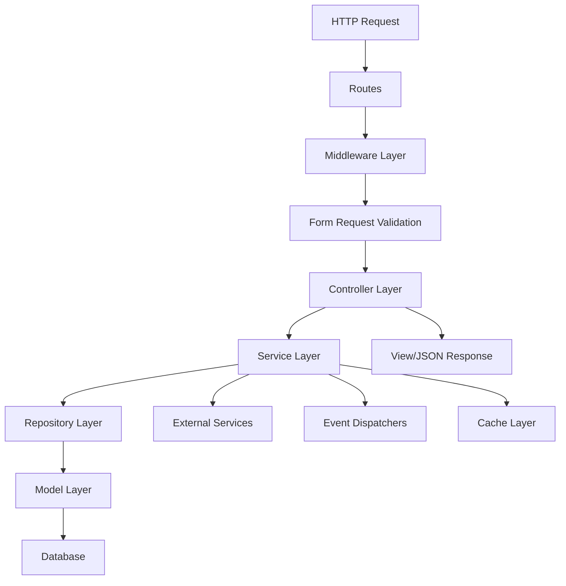
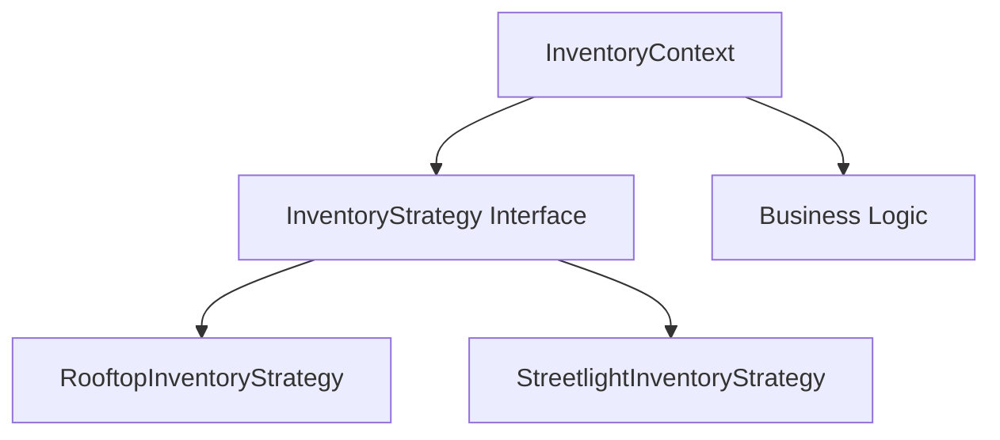
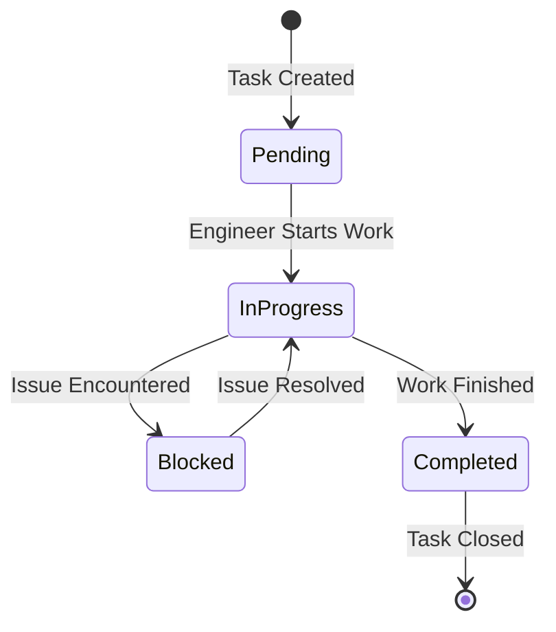
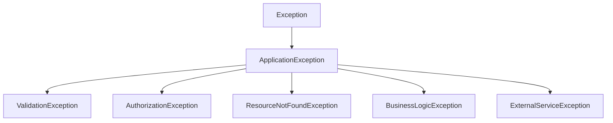
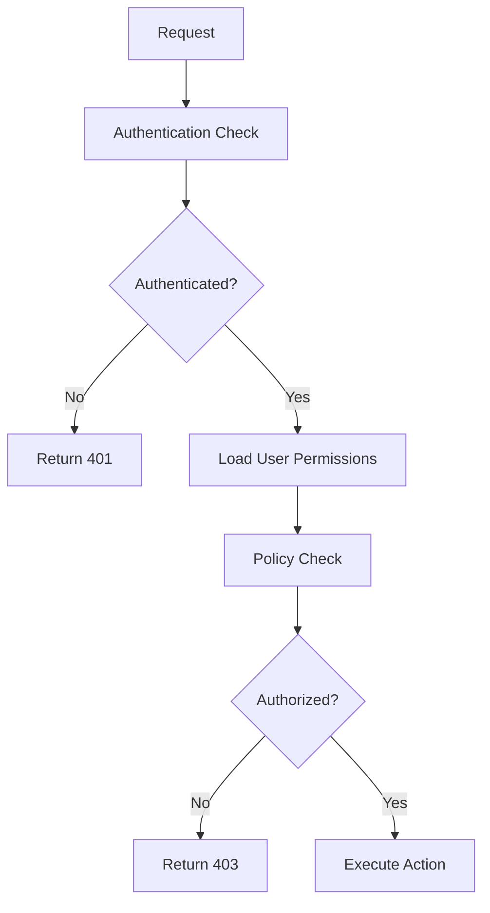

# Laravel CRM Code Refactoring Design

## Overview

### Objective

Refactor the Laravel CRM/ERP system to enhance code quality, maintainability, security, and performance while adhering to industry best practices and SOLID principles.

### Scope

This refactoring encompasses all layers of the application including Controllers, Models, Helpers, Services, Middleware, and associated business logic across both web and API implementations.

### Success Criteria

-   Improved code readability through consistent naming conventions
-   Reduced code duplication following DRY principle
-   Enhanced maintainability via single-responsibility functions
-   Strengthened security through comprehensive validation and authorization
-   Optimized performance through efficient database queries and caching
-   Full SOLID principle compliance

---

## Design Principles to Follow

### 1. Meaningful and Consistent Naming

Establish unified naming conventions across the entire codebase to improve readability and maintainability.

### 2. Consistent Formatting

Maintain uniform code formatting, indentation, and structure throughout all files.

### 3. Small and Focused Functions

Decompose large methods into smaller, single-responsibility functions with clear purposes.

### 4. Purposeful Comments

Add meaningful documentation that explains why decisions were made, not what the code does.

### 5. Logical File Organization

Structure code into appropriate layers: Controllers, Services, Repositories, DTOs, and Utilities.

### 6. DRY Principle (Don't Repeat Yourself)

Eliminate code duplication by extracting common logic into reusable components.

### 7. Comprehensive Error Handling

Implement robust exception handling with meaningful error messages and logging.

### 8. Input Validation and Sanitization

Validate all user inputs at multiple layers with dedicated Request classes.

### 9. Principle of Least Privilege

Enforce strict authorization checks and role-based access control.

### 10. Performance Optimization

Optimize database queries, implement caching, and reduce unnecessary computations.

### 11. SOLID Principles

-   **Single Responsibility**: Each class has one reason to change
-   **Open/Closed**: Open for extension, closed for modification
-   **Liskov Substitution**: Subtypes must be substitutable for their base types
-   **Interface Segregation**: Clients shouldn't depend on interfaces they don't use
-   **Dependency Inversion**: Depend on abstractions, not concretions

---

## Architecture Refactoring Strategy

### Current Architecture Analysis

**Identified Issues:**

-   Business logic heavily concentrated in controllers
-   Direct database queries in controllers without repository abstraction
-   Inconsistent model relationship definitions
-   Lack of service layer for complex business operations
-   Mixed concerns between web and API controllers
-   Insufficient validation layer
-   Hard-coded values and magic numbers throughout codebase
-   No consistent error handling strategy

### Target Architecture

**Layered Responsibilities:**

| Layer      | Responsibility                               | Example                                |
| ---------- | -------------------------------------------- | -------------------------------------- |
| Routes     | Request routing and grouping                 | web.php, api.php                       |
| Middleware | Authentication, authorization, rate limiting | AuthMiddleware, RoleMiddleware         |
| Request    | Input validation and sanitization            | StoreProjectRequest, UpdateSiteRequest |
| Controller | Request handling and response formatting     | ProjectController, SiteController      |
| Service    | Business logic orchestration                 | ProjectService, InventoryService       |
| Repository | Data access abstraction                      | ProjectRepository, UserRepository      |
| Model      | Data structure and relationships             | Project, User, Site                    |
| DTO        | Data transfer between layers                 | ProjectDTO, SiteDTO                    |

---

## Module-by-Module Refactoring Design

### Module 1: User and Authentication Management

#### Current Issues

-   User model has mixed responsibilities (authentication, authorization, relationships)
-   Role identification uses magic numbers (0, 1, 2, 3, etc.)
-   Inconsistent naming: firstName/lastName vs name
-   Missing proper password policies
-   No centralized authorization logic

#### Refactoring Design

**1.1 Introduce Role Enumeration**

Create enumeration for user roles to replace magic numbers throughout the codebase.

**Structure:**

-   Role enumeration with constants
-   Human-readable labels
-   Permission mappings

**Role Definitions:**
| Constant | Value | Label | Description |
|----------|-------|-------|-------------|
| ADMIN | 0 | Administrator | Full system access |
| SITE_ENGINEER | 1 | Site Engineer | Field operations management |
| PROJECT_MANAGER | 2 | Project Manager | Project oversight |
| VENDOR | 3 | Vendor | External contractor |
| STORE_INCHARGE | 4 | Store Manager | Inventory management |
| HR_MANAGER | 5 | HR Manager | Human resources |
| CLIENT | 10 | Client | View-only external access |

**1.2 Extract User-Related Services**

Separate authentication, authorization, and user management concerns.

**Service Components:**

-   UserManagementService: CRUD operations for users
-   AuthenticationService: Login, logout, password reset
-   AuthorizationService: Permission checking, role validation
-   UserHierarchyService: Manager-engineer-vendor relationships

**1.3 Implement Policy-Based Authorization**

Replace inline role checks with Laravel Policy classes.

**Policy Structure:**

-   UserPolicy: Can view, create, update, delete users
-   ProjectPolicy: Can manage projects based on role
-   SitePolicy: Can access and modify site data
-   InventoryPolicy: Can dispatch and manage inventory

**Authorization Checks:**

-   Before controller actions execute
-   At service layer for business operations
-   In Blade templates for UI elements

**1.4 Standardize User Attributes**

Consolidate inconsistent naming and remove duplicates.

**Attribute Mapping:**
| Current | Standardized | Justification |
|---------|--------------|---------------|
| firstName, lastName, name | first_name, last_name | Snake case consistency |
| contactNo | contact_number | Full word naming |
| project_id (duplicate in fillable) | project_id | Remove duplication |
| disableLogin | login_disabled | Boolean naming convention |
| lastOnline | last_online_at | Timestamp suffix |

---

### Module 2: Project Management

#### Current Issues

-   ProjectsController has excessive responsibilities
-   Complex database queries embedded in controller methods
-   No separation between rooftop and streetlight project handling
-   Stock calculation logic duplicated across multiple locations
-   Missing validation for business rules

#### Refactoring Design

**2.1 Implement Project Service Layer**

Extract all business logic from ProjectsController into dedicated services.

**Service Breakdown:**

**ProjectService:**

-   createProject: Project creation with validation
-   updateProject: Project modification
-   deleteProject: Soft deletion with cleanup
-   assignStaffToProject: Staff assignment logic
-   getProjectStatistics: Aggregated metrics

**ProjectInventoryService:**

-   calculateInitialStock: Sum of all inventory
-   calculateDispatchedStock: Sum of dispatched materials
-   calculateInStoreStock: Difference calculation
-   getInventoryByProject: Filtered inventory retrieval

**ProjectTypeService:**

-   getRooftopProjects: Filtered rooftop projects
-   getStreetlightProjects: Filtered streetlight projects
-   determineInventoryModel: Returns appropriate model class
-   determineSiteModel: Returns appropriate site model

**2.2 Create Project Repository**

Abstract data access through repository pattern.

**Repository Methods:**

-   findById: Retrieve project with relationships
-   findByWorkOrderNumber: Unique identifier lookup
-   getAllForUser: Projects accessible by user based on role
-   getProjectsInDateRange: Filtered by date criteria
-   getProjectsByState: Geographic filtering
-   getProjectsByType: Project type filtering

**2.3 Introduce Form Request Validation**

Replace inline validation with dedicated Request classes.

**Request Classes:**

**StoreProjectRequest:**

-   Validation rules for project creation
-   Conditional rules based on project_type
-   Agreement fields mandatory for streetlight projects
-   Unique work_order_number validation

**UpdateProjectRequest:**

-   Validation rules for project updates
-   Unique validation excluding current record
-   End date must be after start date

**AssignStaffRequest:**

-   User ID validation
-   Role compatibility validation
-   Project access validation

**2.4 Extract Project Calculation Logic**

Move all calculation logic to dedicated calculator classes.

**ProjectStockCalculator:**

-   Input: Project ID, Project Type
-   Methods:
    -   calculateInitialValue
    -   calculateDispatchedValue
    -   calculateInStoreValue
    -   calculateConsumptionValue

**ProjectProgressCalculator (Rooftop):**

-   Input: Project ID
-   Methods:
    -   calculateInstallationTasks
    -   calculateRMSTasks
    -   calculateInspectionTasks
    -   calculateSiteCompletionPercentage

**ProjectProgressCalculator (Streetlight):**

-   Input: Project ID
-   Methods:
    -   calculateTotalPoles
    -   calculateSurveyedPoles
    -   calculateInstalledPoles
    -   calculateCompletionPercentage

---

### Module 3: Inventory Management

#### Current Issues

-   InventoryController exceeds 787 lines with mixed responsibilities
-   Separate tables for rooftop and streetlight inventory cause code duplication
-   QR code validation logic scattered across multiple methods
-   Material dispatch and consumption tracking tightly coupled
-   No transaction management for critical operations

#### Refactoring Design

**3.1 Create Inventory Service Layer**

Centralize all inventory business logic.

**InventoryManagementService:**

-   addInventoryItem: Create inventory records with validation
-   updateInventoryQuantity: Stock quantity adjustments
-   dispatchMaterial: Material dispatch workflow
-   receiveMaterial: Material receipt workflow
-   getMaterialAvailability: Stock availability check

**QRCodeValidationService:**

-   validateQRCode: Check QR code authenticity
-   checkDispatchStatus: Verify dispatch state
-   checkConsumptionStatus: Verify consumption state
-   getQRCodeHistory: Audit trail retrieval

**MaterialDispatchService:**

-   createDispatch: Dispatch record creation
-   approveDispatch: Store incharge approval
-   markAsConsumed: Consumption tracking
-   trackSerialNumbers: Serial number management

**3.2 Implement Inventory Repository Pattern**

Abstract inventory data access.

**InventoryRepository:**

-   findByItemCode: Retrieve by item code
-   findByStore: Filter by store location
-   findByProject: Filter by project
-   getAvailableStock: Current stock levels
-   getDispatchedItems: Dispatched materials

**3.3 Unify Inventory Data Structure**

Create abstraction to handle both inventory types uniformly.

**Strategy Pattern Implementation:**

**InventoryStrategy Interface:**

-   getModel: Returns appropriate Eloquent model
-   validateInventoryData: Type-specific validation
-   calculateTotalValue: Value calculation logic
-   prepareForStorage: Data transformation

**RooftopInventoryStrategy:**

-   Implements InventoryStrategy
-   Uses Inventory model
-   Handles site-specific inventory

**StreetlightInventoryStrategy:**

-   Implements InventoryStrategy
-   Uses InventroyStreetLightModel
-   Handles component-based inventory

**3.4 Introduce Database Transactions**

Wrap critical operations in database transactions.

**Transaction Boundaries:**

-   Material dispatch (reduce stock + create dispatch record)
-   Material consumption (update dispatch + link to pole)
-   Inventory import (bulk insert with validation)
-   Material replacement (deduct + create replacement record)

**Transaction Pattern:**

-   Begin transaction
-   Execute operations
-   Commit on success
-   Rollback on exception
-   Log all transaction events

**3.5 Implement Bulk Import Service**

Extract Excel import logic into dedicated service.

**InventoryImportService:**

-   validateImportFile: File format and structure validation
-   parseImportData: Excel parsing
-   validateInventoryRecords: Business rule validation
-   importInventory: Batch insertion with progress tracking
-   generateImportReport: Success/failure summary

---

### Module 4: Task Management

#### Current Issues

-   Task assignment logic mixed with display logic
-   Different task types (Task, StreetlightTask) handled inconsistently
-   No workflow state machine for task status transitions
-   Performance tracking calculations duplicated
-   Material consumption tracking loosely coupled

#### Refactoring Design

**4.1 Implement Task Service Layer**

Centralize task management operations.

**TaskManagementService:**

-   createTask: Task creation with assignments
-   assignEngineer: Engineer assignment
-   assignVendor: Vendor assignment
-   updateTaskStatus: Status transition management
-   recordProgress: Progress documentation

**TaskProgressTrackingService:**

-   trackSurveyProgress: Survey completion tracking
-   trackInstallationProgress: Installation tracking
-   calculateTaskCompletion: Completion percentage
-   generateProgressReport: Progress summary

**TaskMaterialService:**

-   linkMaterialsToTask: Material-task association
-   recordMaterialConsumption: Consumption tracking
-   validateMaterialAvailability: Stock check before assignment

**4.2 Create Task State Machine**

Implement formal state machine for task status transitions.

**Task States:**
| State | Allowed Transitions | Validation |
|-------|---------------------|------------|
| Pending | In Progress | Assigned engineer required |
| In Progress | Completed, Blocked | Progress documentation required |
| Blocked | In Progress | Blocker resolution required |
| Completed | None | Final approval required |

**Transition Rules:**

-   Only assigned engineer or manager can transition
-   Progress must be documented
-   Materials must be tracked
-   Timestamps recorded for all transitions

**State Machine Flow:**

**4.3 Extract Performance Calculation Logic**

Separate performance metrics from controller.

**PerformanceCalculator:**

-   Input: User ID, Project ID, Date Range
-   Methods:
    -   calculateTaskCompletion
    -   calculateSurveyRate
    -   calculateInstallationRate
    -   calculateEfficiencyScore

**Performance Metrics:**
| Metric | Calculation | Unit |
|--------|-------------|------|
| Task Completion Rate | (Completed Tasks / Total Tasks) × 100 | Percentage |
| Survey Rate (Streetlight) | (Surveyed Poles / Total Poles) × 100 | Percentage |
| Installation Rate (Streetlight) | (Installed Poles / Total Poles) × 100 | Percentage |
| Average Task Duration | Sum(Completion Time) / Completed Tasks | Days |

**4.4 Implement Task Repository**

Abstract task data access.

**TaskRepository:**

-   findByProject: Project-specific tasks
-   findByEngineer: Engineer-assigned tasks
-   findByVendor: Vendor-assigned tasks
-   findByStatus: Status-filtered tasks
-   findInDateRange: Date-range filtering
-   getTasksWithMaterials: Tasks with material relationships

**4.5 Consolidate Task Type Handling**

Create unified interface for different task types.

**TaskTypeStrategy Interface:**

-   getTaskModel: Returns Task or StreetlightTask model
-   validateTaskData: Type-specific validation
-   calculateProgress: Progress calculation logic
-   getProgressMetrics: Metric retrieval

**Task-Specific Implementations:**

-   RooftopTaskStrategy
-   StreetlightTaskStrategy

---

### Module 5: Meeting and Discussion Management

#### Current Issues

-   MeetController handles too many responsibilities
-   Meeting notes and discussion points lack proper versioning
-   Follow-up tracking not integrated with task management
-   Whiteboard data handling needs improvement
-   No notification system for meeting updates

#### Refactoring Design

**5.1 Create Meeting Service Layer**

Extract meeting management logic.

**MeetingManagementService:**

-   createMeeting: Meeting creation with participants
-   updateMeeting: Meeting modification
-   cancelMeeting: Meeting cancellation with notifications
-   addParticipants: Participant management
-   removeParticipants: Participant removal

**MeetingNotesService:**

-   saveNotes: Meeting notes persistence
-   createNoteVersion: Version control
-   retrieveNoteHistory: Historical notes
-   compareVersions: Version diff

**DiscussionPointService:**

-   createDiscussionPoint: Action item creation
-   assignDiscussionPoint: Assignment to user
-   updateDiscussionStatus: Status updates
-   trackProgress: Progress tracking
-   linkToProject: Project association

**5.2 Implement Meeting Repository**

Abstract meeting data access.

**MeetingRepository:**

-   findById: Meeting retrieval with relationships
-   findByDateRange: Date-filtered meetings
-   findByParticipant: User-specific meetings
-   findByProject: Project-related meetings
-   findUpcomingMeetings: Future meetings
-   findPastMeetings: Historical meetings

**5.3 Create Discussion Point Workflow**

Formalize discussion point lifecycle.

**Discussion Point States:**
| State | Transition To | Required Action |
|-------|---------------|-----------------|
| Pending | In Progress | Assignee acknowledgment |
| In Progress | Completed, Blocked | Progress update |
| Blocked | In Progress | Issue resolution |
| Completed | Closed | Approver verification |

**Workflow Automation:**

-   Auto-create tasks from high-priority discussion points
-   Send reminders for approaching due dates
-   Escalate overdue items to assignee's manager
-   Generate weekly summary reports

**5.4 Enhance Whiteboard Integration**

Improve collaborative whiteboard functionality.

**WhiteboardService:**

-   createWhiteboard: Initialize for meeting
-   saveWhiteboardData: Persist drawing data
-   retrieveWhiteboard: Load whiteboard state
-   exportWhiteboard: Export as image/PDF

---

### Module 6: Site and Location Management

#### Current Issues

-   Site and Streetlight models have overlapping functionality
-   Geographical data validation inconsistent
-   Complex site import logic embedded in controllers
-   Installation phase tracking needs improvement

#### Refactoring Design

**6.1 Create Site Service Layer**

Centralize site management operations.

**SiteManagementService:**

-   createSite: Site creation with validation
-   updateSite: Site modification
-   updateInstallationPhase: Phase progression
-   recordGeographicalData: Lat/long recording
-   validateCoordinates: Coordinate validation

**SiteImportService:**

-   validateImportFile: File validation
-   parseSiteData: Data extraction
-   validateSiteRecords: Business rule validation
-   importSites: Bulk site creation
-   generateImportReport: Import summary

**6.2 Extract Installation Phase Tracking**

Create dedicated service for phase management.

**InstallationPhaseService:**

-   updatePhaseStatus: Status update for specific phase
-   getPhaseProgress: Overall installation progress
-   validatePhaseTransition: Ensure proper phase sequence
-   recordPhaseCompletion: Phase completion documentation

**Installation Phases Sequence:**
| Phase | Prerequisites | Documentation Required |
|-------|---------------|------------------------|
| Drawing Approval | None | Approved drawings |
| Inspection | Drawing Approval | Inspection report |
| Material Supplied | Inspection | Material receipt |
| Structure Installation | Material Supplied | Installation photos |
| ... | ... | ... |

**6.3 Implement Site Repository**

Abstract site data access.

**SiteRepository:**

-   findByProject: Project-specific sites
-   findByDistrict: Geographic filtering
-   findByEngineer: Engineer-assigned sites
-   findByInstallationStatus: Status filtering
-   getSitesWithTasks: Sites with task relationships

---

### Module 7: Dashboard and Analytics

#### Current Issues

-   HomeController exceeds 400 lines with complex calculations
-   Performance metrics calculated on every request
-   No caching for expensive aggregations
-   Dashboard logic tightly coupled to view

#### Refactoring Design

**7.1 Extract Dashboard Service**

Centralize dashboard data preparation.

**DashboardService:**

-   getDashboardData: Complete dashboard data
-   getSiteStatistics: Site-related metrics
-   getUserCounts: User count aggregations
-   getRolePerformances: Role-based performance
-   getProjectSummary: Project overview

**7.2 Implement Analytics Service**

Create dedicated analytics calculations.

**AnalyticsService:**

-   calculateSiteStatistics: Site aggregations
-   calculateInventoryMetrics: Stock metrics
-   calculateTaskMetrics: Task performance
-   calculateUserPerformance: Individual metrics
-   generateTrends: Time-series analysis

**Cached Metrics:**
| Metric | Cache Duration | Cache Key Pattern |
|--------|----------------|-------------------|
| Site Statistics | 1 hour | dashboard:sites:{projectId}:{date} |
| Inventory Totals | 30 minutes | dashboard:inventory:{projectId} |
| Task Counts | 15 minutes | dashboard:tasks:{projectId}:{userId} |
| User Performance | 1 hour | dashboard:performance:{userId}:{date} |

**7.3 Implement Caching Strategy**

Add intelligent caching to reduce database load.

**Cache Strategy:**

-   Cache aggregated metrics
-   Invalidate on relevant data changes
-   Use cache tags for grouped invalidation
-   Implement cache warming for frequently accessed data

**Cache Invalidation Events:**

-   Project updated → Invalidate project dashboard caches
-   Task status changed → Invalidate task metrics
-   Inventory dispatched → Invalidate inventory caches
-   Site updated → Invalidate site statistics

**7.4 Extract Date Range Filtering**

Create reusable date filtering utility.

**DateRangeFilter:**

-   Input: Filter type (today, week, month, custom)
-   Output: Start and end datetime objects
-   Presets: Today, This Week, This Month, This Quarter, This Year, Custom

---

## Cross-Cutting Concerns

### Error Handling and Logging

#### Design Strategy

**Exception Hierarchy:**

**Custom Exception Classes:**

| Exception                 | Use Case                  | HTTP Status |
| ------------------------- | ------------------------- | ----------- |
| ValidationException       | Input validation failures | 422         |
| AuthorizationException    | Permission denied         | 403         |
| ResourceNotFoundException | Resource not found        | 404         |
| BusinessLogicException    | Business rule violations  | 400         |
| ExternalServiceException  | Third-party API failures  | 503         |

**Logging Strategy:**

**Log Levels:**

-   DEBUG: Detailed diagnostic information
-   INFO: General informational messages
-   WARNING: Warning messages for potential issues
-   ERROR: Error events that might still allow continuation
-   CRITICAL: Critical conditions requiring immediate attention

**Logging Contexts:**
| Context | Information Logged | Log Level |
|---------|-------------------|-----------|
| Authentication | User login/logout, failed attempts | INFO, WARNING |
| Authorization | Permission checks, denials | WARNING, ERROR |
| Database | Query execution time, errors | DEBUG, ERROR |
| External APIs | Request/response, failures | INFO, ERROR |
| Business Operations | Task creation, inventory dispatch | INFO |

**Error Response Format:**

**Web Responses:**

-   Flash error messages to session
-   Redirect to previous page with input
-   Display user-friendly error messages

**API Responses:**

-   Consistent JSON error structure
-   Error codes for client handling
-   Detailed validation messages
-   Stack trace in development only

---

### Input Validation and Sanitization

#### Design Strategy

**Validation Layers:**

**Layer 1: Request Validation (Form Requests)**

-   Laravel validation rules
-   Custom validation rules for business logic
-   File upload validation
-   Array and nested data validation

**Layer 2: Service Layer Validation**

-   Cross-entity validation
-   Database constraint validation
-   Business rule validation

**Layer 3: Model Validation**

-   Data type casting
-   Mutators and accessors
-   Attribute validation

**Sanitization Rules:**

| Input Type    | Sanitization                     | Example                    |
| ------------- | -------------------------------- | -------------------------- |
| Text Fields   | Strip HTML tags, trim whitespace | Project name, descriptions |
| Email         | Lowercase, trim                  | User email                 |
| Phone Numbers | Remove non-numeric characters    | Contact numbers            |
| Dates         | Convert to standard format       | Project dates              |
| Numbers       | Remove currency symbols          | Rates, quantities          |
| File Uploads  | Validate MIME type, file size    | Excel imports, images      |

**Custom Validation Rules:**

**UniqueWorkOrderNumber:**

-   Validates work order uniqueness
-   Excludes current record on update

**ValidProjectType:**

-   Ensures valid project type value
-   Validates type-specific required fields

**ValidRoleAssignment:**

-   Validates user role compatibility
-   Checks hierarchical relationships

**ValidQRCode:**

-   Validates QR code format
-   Checks QR code existence in inventory

---

### Security and Authorization

#### Design Strategy

**Authentication Enhancements:**

**Password Policies:**

-   Minimum 8 characters
-   Require uppercase, lowercase, number, special character
-   Password history (prevent reuse of last 5 passwords)
-   Expiration after 90 days

**Session Security:**

-   Regenerate session ID after login
-   Implement CSRF protection
-   Set secure session cookies
-   Implement session timeout

**Authorization Architecture:**

**Policy-Based Authorization:**

**ProjectPolicy Rules:**
| Action | Authorization Logic |
|--------|---------------------|
| View | Admin OR assigned to project |
| Create | Admin OR Project Manager |
| Update | Admin OR Project Manager of project |
| Delete | Admin only |
| Assign Staff | Admin OR Project Manager of project |

**SitePolicy Rules:**
| Action | Authorization Logic |
|--------|---------------------|
| View | Admin OR assigned engineer OR vendor |
| Create | Admin OR Project Manager |
| Update | Admin OR assigned engineer |
| Delete | Admin only |

**InventoryPolicy Rules:**
| Action | Authorization Logic |
|--------|---------------------|
| View | Admin OR Store Incharge OR assigned to project |
| Create | Admin OR Store Incharge |
| Dispatch | Admin OR Store Incharge |
| Consume | Admin OR Vendor with dispatch record |

**API Security:**

-   Sanctum token authentication
-   Rate limiting per endpoint
-   API versioning
-   Request throttling

---

### Database Query Optimization

#### Design Strategy

**Query Optimization Techniques:**

**Eager Loading:**

-   Replace N+1 queries with eager loading
-   Use `with()` for related models
-   Conditional eager loading based on usage

**Example Refactoring:**

-   Before: User::all() then access user->projects in loop
-   After: User::with('projects')->get()

**Database Indexing:**

**Recommended Indexes:**
| Table | Columns | Type | Justification |
|-------|---------|------|---------------|
| users | role, project_id | Composite | Frequent filtering |
| projects | project_type, work_order_number | Composite | Unique lookup and filtering |
| sites | project_id, site_engineer | Composite | Relationship queries |
| streetlights | project_id, district | Composite | Geographic filtering |
| tasks | project_id, status | Composite | Dashboard queries |
| inventory | project_id, store_id | Composite | Inventory lookups |
| inventory_dispatch | project_id, vendor_id, is_consumed | Composite | Dispatch tracking |
| poles | task_id, isSurveyDone, isInstallationDone | Composite | Progress tracking |

**Query Caching:**

-   Cache frequently accessed static data
-   Cache aggregated calculations
-   Use cache tags for invalidation
-   Implement query result caching

**Pagination:**

-   Implement cursor-based pagination for large datasets
-   Use Laravel's built-in pagination
-   Limit default page size to 50 records

**Select Optimization:**

-   Only select required columns
-   Avoid SELECT \*
-   Use `select()` to specify columns

---

### Code Organization and Structure

#### Design Strategy

**Directory Structure:**

**Services Layer:**

-   app/Services/Project/ProjectService.php
-   app/Services/Project/ProjectInventoryService.php
-   app/Services/Inventory/InventoryManagementService.php
-   app/Services/Task/TaskManagementService.php
-   app/Services/User/UserManagementService.php

**Repositories Layer:**

-   app/Repositories/ProjectRepository.php
-   app/Repositories/UserRepository.php
-   app/Repositories/InventoryRepository.php
-   app/Repositories/TaskRepository.php

**Data Transfer Objects (DTOs):**

-   app/DTOs/ProjectDTO.php
-   app/DTOs/UserDTO.php
-   app/DTOs/InventoryDTO.php

**Enums:**

-   app/Enums/UserRole.php
-   app/Enums/ProjectType.php
-   app/Enums/TaskStatus.php
-   app/Enums/InstallationPhase.php

**Policies:**

-   app/Policies/ProjectPolicy.php
-   app/Policies/SitePolicy.php
-   app/Policies/InventoryPolicy.php
-   app/Policies/TaskPolicy.php

**Form Requests:**

-   app/Http/Requests/Project/StoreProjectRequest.php
-   app/Http/Requests/Project/UpdateProjectRequest.php
-   app/Http/Requests/Inventory/DispatchInventoryRequest.php

**Traits:**

-   app/Traits/HasProjectScope.php
-   app/Traits/HasRoleFiltering.php
-   app/Traits/Loggable.php

**Helpers Refactoring:**

-   Move ExcelHelper logic into dedicated ImportService classes
-   Move WhatsappHelper into notification service
-   Move RemoteApiHelper into dedicated API client classes

---

## SOLID Principles Implementation

### Single Responsibility Principle (SRP)

**Current Violations:**

**HomeController:**

-   Handles dashboard rendering
-   Calculates statistics
-   Filters data by role
-   Processes date ranges
-   Calculates performance metrics

**Refactored Approach:**

-   HomeController: Only handle HTTP request/response
-   DashboardService: Prepare dashboard data
-   AnalyticsService: Calculate metrics
-   DateRangeFilter: Process date filters
-   PerformanceCalculator: Calculate performance

**ProjectsController:**

-   Handles CRUD operations
-   Calculates stock values
-   Manages staff assignments
-   Filters inventory
-   Aggregates data

**Refactored Approach:**

-   ProjectsController: HTTP layer only
-   ProjectService: Business operations
-   ProjectInventoryService: Inventory calculations
-   ProjectStaffService: Staff assignments
-   ProjectRepository: Data access

### Open/Closed Principle (OCP)

**Strategy Pattern for Project Types:**

Current code has if-else statements checking project_type everywhere. Refactor to use strategy pattern.

**Implementation:**

-   Define ProjectTypeStrategy interface
-   Create RooftopProjectStrategy
-   Create StreetlightProjectStrategy
-   Context class selects strategy based on type

**Extensibility:**

-   Adding new project type requires new strategy class
-   No modification to existing code
-   Pluggable architecture

### Liskov Substitution Principle (LSP)

**Repository Implementations:**

All repository implementations must follow the repository interface contract without breaking expectations.

**Contract Enforcement:**

-   Define repository interfaces
-   Implement Eloquent-based repositories
-   Ensure substitutability with different data sources
-   Maintain consistent return types

### Interface Segregation Principle (ISP)

**Segregated Interfaces:**

Instead of large interfaces, create specific ones:

**Current Issue:**

-   Large controller with many methods
-   Models with too many relationships loaded

**Refactored Approach:**

**InventoryOperations Interface:**

-   addInventory
-   updateInventory
-   removeInventory

**InventoryDispatch Interface:**

-   dispatchMaterial
-   approveDis patch
-   trackDispatch

**QRCodeValidation Interface:**

-   validateCode
-   checkStatus
-   getHistory

### Dependency Inversion Principle (DIP)

**Dependency Injection:**

**Controller Dependencies:**

-   Inject service interfaces, not concrete classes
-   Use Laravel service container
-   Bind interfaces to implementations in service providers

**Service Dependencies:**

-   Services depend on repository interfaces
-   Repositories depend on model contracts
-   Avoid direct model instantiation

**Example Pattern:**

-   ProjectController depends on ProjectServiceInterface
-   ProjectService depends on ProjectRepositoryInterface
-   ProjectRepository implements ProjectRepositoryInterface

---

## Migration and Implementation Strategy

### Phase 1: Foundation (Weeks 1-2)

**Objectives:**

-   Establish new directory structure
-   Create base interfaces and abstract classes
-   Implement enums for constants
-   Set up service providers

**Deliverables:**

-   Directory structure created
-   Enum classes implemented
-   Base service and repository classes
-   Interface definitions

### Phase 2: User and Authentication (Week 3)

**Objectives:**

-   Refactor User model
-   Implement user services
-   Create user policies
-   Implement password policies

**Deliverables:**

-   UserManagementService
-   AuthenticationService
-   AuthorizationService
-   UserPolicy
-   Form request classes

### Phase 3: Project Management (Weeks 4-5)

**Objectives:**

-   Refactor ProjectsController
-   Implement project services
-   Create project repository
-   Implement calculation classes

**Deliverables:**

-   ProjectService
-   ProjectInventoryService
-   ProjectRepository
-   Calculator classes
-   Form request classes

### Phase 4: Inventory Management (Weeks 6-7)

**Objectives:**

-   Refactor InventoryController
-   Implement inventory services
-   Create strategy pattern for inventory types
-   Implement transaction management

**Deliverables:**

-   InventoryManagementService
-   QRCodeValidationService
-   MaterialDispatchService
-   InventoryRepository
-   Strategy implementations

### Phase 5: Task Management (Weeks 8-9)

**Objectives:**

-   Refactor task controllers
-   Implement task services
-   Create state machine
-   Implement performance calculators

**Deliverables:**

-   TaskManagementService
-   TaskProgressTrackingService
-   Task state machine
-   PerformanceCalculator
-   TaskRepository

### Phase 6: Additional Modules (Weeks 10-11)

**Objectives:**

-   Refactor meeting management
-   Refactor site management
-   Implement supporting services

**Deliverables:**

-   MeetingManagementService
-   SiteManagementService
-   Supporting repositories
-   Form request classes

### Phase 7: Dashboard and Analytics (Week 12)

**Objectives:**

-   Refactor HomeController
-   Implement dashboard service
-   Implement caching
-   Optimize queries

**Deliverables:**

-   DashboardService
-   AnalyticsService
-   Caching implementation
-   Query optimization

### Phase 8: Testing and Optimization (Weeks 13-14)

**Objectives:**

-   Write unit tests for services
-   Write feature tests for controllers
-   Performance testing
-   Security audit

**Deliverables:**

-   Unit test suite
-   Feature test suite
-   Performance report
-   Security audit report

### Phase 9: Documentation and Deployment (Week 15)

**Objectives:**

-   Update code documentation
-   Create migration guide
-   Deploy to staging
-   Conduct user acceptance testing

**Deliverables:**

-   Updated documentation
-   Migration guide
-   Staging deployment
-   UAT report

---

## Testing Strategy

### Unit Testing

**Coverage Targets:**

-   Services: 90% code coverage
-   Repositories: 85% code coverage
-   Calculators: 95% code coverage
-   Validators: 90% code coverage

**Testing Approach:**

-   Mock dependencies
-   Test business logic isolation
-   Test edge cases
-   Test error handling

### Feature Testing

**Coverage Areas:**

-   Authentication flows
-   Authorization checks
-   CRUD operations
-   API endpoints
-   Form validation

**Testing Approach:**

-   Test complete user workflows
-   Test role-based access
-   Test data persistence
-   Test API responses

### Performance Testing

**Metrics:**

-   Dashboard load time < 2 seconds
-   API response time < 500ms
-   Database query count reduction
-   Memory usage optimization

---

## Risk Mitigation

### Technical Risks

| Risk                            | Impact | Mitigation Strategy                   |
| ------------------------------- | ------ | ------------------------------------- |
| Breaking changes in refactoring | High   | Comprehensive testing, phased rollout |
| Performance degradation         | Medium | Benchmarking before/after, caching    |
| Data migration issues           | High   | Backup strategy, rollback plan        |
| Third-party integration breaks  | Medium | Version locking, integration tests    |

### Business Risks

| Risk                       | Impact   | Mitigation Strategy                      |
| -------------------------- | -------- | ---------------------------------------- |
| User workflow disruption   | High     | Maintain UI consistency, user training   |
| Downtime during deployment | Medium   | Blue-green deployment, feature flags     |
| Data loss                  | Critical | Database backups, transaction management |

---

## Success Metrics

### Code Quality Metrics

| Metric                    | Current | Target                     |
| ------------------------- | ------- | -------------------------- |
| Average method complexity | High    | < 10 cyclomatic complexity |
| Code duplication          | ~15%    | < 3%                       |
| Test coverage             | < 10%   | > 80%                      |
| Documentation coverage    | ~30%    | > 90%                      |

### Performance Metrics

| Metric                       | Current  | Target              |
| ---------------------------- | -------- | ------------------- |
| Dashboard load time          | Variable | < 2 seconds         |
| API response time            | Variable | < 500ms             |
| Database queries per request | High     | < 20 queries        |
| Memory usage                 | Variable | < 128MB per request |

### Maintainability Metrics

| Metric                 | Target                |
| ---------------------- | --------------------- |
| Average file length    | < 300 lines           |
| Average method length  | < 30 lines            |
| Class responsibilities | Single responsibility |
| Dependency depth       | < 4 levels            |

---

## Rollback Strategy

### Rollback Triggers

-   Critical bugs discovered in production
-   Performance degradation > 50%
-   Data integrity issues
-   Security vulnerabilities introduced

### Rollback Procedure

**Step 1: Immediate Actions**

-   Switch to previous deployment
-   Restore database from backup if needed
-   Notify stakeholders

**Step 2: Investigation**

-   Identify root cause
-   Document issues
-   Plan remediation

**Step 3: Recovery**

-   Fix identified issues
-   Test thoroughly
-   Re-deploy when ready

---

## Maintenance and Future Enhancements

### Post-Refactoring Maintenance

**Code Review Process:**

-   All changes require peer review
-   Automated code quality checks
-   Adherence to established patterns

**Continuous Improvement:**

-   Regular performance monitoring
-   Code quality metrics tracking
-   Technical debt management

### Future Enhancement Considerations

**Architecture Evolution:**

-   Microservices migration path
-   Event-driven architecture
-   Real-time notifications
-   Advanced analytics and reporting
-   Mobile application support
