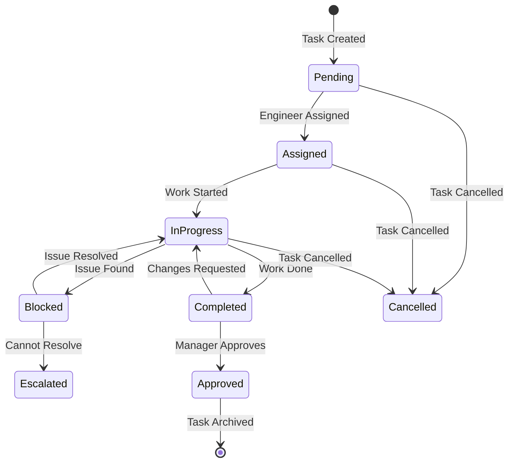

# Laravel CRM Refactoring - Pending Phases Design

## Overview

This design document outlines the strategic approach for completing the remaining phases of the Laravel CRM refactoring initiative. Phases 1-4 have been successfully completed, establishing a solid foundation with enums, base classes, contracts, and refactored modules for User Management, Project Management, and Inventory Management.

### Completed Foundation

**Architecture Achieved:**

-   Layered architecture with Repository and Service patterns
-   SOLID principles implementation
-   Enum-based type safety
-   Policy-based authorization
-   Strategy pattern for inventory management
-   Transaction-wrapped business operations

### Remaining Work

**Pending Phases:**

-   Phase 5: Task Management Module
-   Phase 6: Additional Modules (Meeting and Site Management)
-   Phase 7: Dashboard and Analytics
-   Phase 8: Testing and Optimization
-   Phase 9: Documentation and Deployment

### Design Goals

-   Maintain consistency with established patterns from Phases 1-4
-   Ensure all modules follow the same architectural principles
-   Optimize performance through caching and query optimization
-   Achieve comprehensive test coverage
-   Complete full system refactoring with production-ready quality

---

## Phase 5: Task Management Module

### Objectives

Transform task management into a robust, state-machine-driven system that handles both rooftop and streetlight project task types with consistent business logic and proper lifecycle management.

### Current State Analysis

**Identified Issues:**

-   Task assignment logic mixed with display concerns in controllers
-   Inconsistent handling between Task and StreetlightTask models
-   No formal workflow for task status transitions
-   Performance tracking calculations duplicated across multiple locations
-   Material consumption tracking loosely coupled with task operations
-   Direct model queries in controllers without repository abstraction

### Strategic Design

#### 5.1 Task Repository Pattern

**Purpose:** Centralize all task data access with optimized queries and relationship loading.

**TaskRepository Interface:**

Define contract extending the base RepositoryInterface with task-specific query methods:

-   findByProject: Retrieve tasks filtered by project with eager loading
-   findByEngineer: Get tasks assigned to specific engineer
-   findByVendor: Get tasks assigned to specific vendor
-   findByStatus: Filter tasks by status with relationships
-   findInDateRange: Date-range based task retrieval
-   getTasksWithMaterials: Load tasks with material consumption relationships
-   getTasksByType: Filter by task type (rooftop vs streetlight)
-   getPendingTasksForUser: Get actionable tasks for user based on role

**Repository Implementation Strategy:**

Leverage eager loading to eliminate N+1 query problems:

-   Load task relationships (engineer, vendor, project, materials) in single query
-   Use conditional eager loading based on task type
-   Implement query scopes for common filters
-   Cache frequently accessed task lists

#### 5.2 Task State Machine

**Purpose:** Enforce valid task lifecycle transitions with business rule validation.

**State Definitions:**

| State       | Description                       | Allowed Actions                  |
| ----------- | --------------------------------- | -------------------------------- |
| Pending     | Task created, awaiting assignment | Assign engineer, cancel          |
| Assigned    | Engineer assigned, not started    | Start work, reassign             |
| In Progress | Work actively being performed     | Update progress, block, complete |
| Blocked     | Work halted due to impediment     | Resolve blocker, escalate        |
| Completed   | Work finished, pending review     | Approve, reject                  |
| Approved    | Reviewed and accepted             | Archive                          |
| Cancelled   | Task cancelled before completion  | None (terminal)                  |

**Transition Rules:**

Define validation logic for each state transition:

-   Pending to Assigned: Requires engineer assignment
-   Assigned to In Progress: Requires engineer acknowledgment
-   In Progress to Blocked: Requires blocker description and category
-   Blocked to In Progress: Requires blocker resolution documentation
-   In Progress to Completed: Requires progress documentation and material tracking
-   Completed to Approved: Requires manager or admin approval
-   Any to Cancelled: Requires cancellation reason and appropriate authorization

**State Machine Flow:**

**Implementation Approach:**

Create TaskStateMachine service:

-   validateTransition: Check if transition is allowed
-   executeTransition: Perform state change with logging
-   getAvailableTransitions: Return valid next states for current state
-   requiresApproval: Determine if transition needs authorization
-   logStateChange: Record transition history with timestamp and user

#### 5.3 Task Service Layer

**Purpose:** Encapsulate all task business logic with transaction safety and comprehensive validation.

**TaskManagementService:**

Core task operations:

-   createTask: Create task with validation and initial assignment
-   assignEngineer: Assign engineer with role validation
-   assignVendor: Assign vendor to engineer's task
-   updateTaskStatus: Execute state transition through state machine
-   recordProgress: Document task progress with evidence
-   cancelTask: Cancel task with reason and authorization check
-   reassignTask: Transfer task to different engineer
-   escalateTask: Escalate blocked task to manager

**Business Rules Enforced:**

-   Only assigned engineer or manager can update task
-   Status transitions must follow state machine rules
-   Progress documentation required for completion
-   Material consumption must be tracked
-   Vendor can only be assigned to engineer's tasks
-   Task cancellation requires appropriate role authorization

**TaskProgressTrackingService:**

Progress monitoring and reporting:

-   trackSurveyProgress: Record survey completion for streetlight projects
-   trackInstallationProgress: Record installation milestones
-   calculateTaskCompletion: Compute completion percentage
-   generateProgressReport: Create detailed progress summary
-   identifyDelayedTasks: Flag tasks behind schedule
-   calculateEstimatedCompletion: Predict completion based on progress rate

**Metrics Calculated:**

-   Completion percentage based on task type
-   Time spent vs estimated time
-   Delay days for overdue tasks
-   Efficiency score based on completion rate
-   Quality metrics from review feedback

**TaskMaterialService:**

Material tracking integration:

-   linkMaterialsToTask: Associate dispatched materials with task
-   recordMaterialConsumption: Mark materials as consumed in task
-   validateMaterialAvailability: Check stock before task assignment
-   trackSerialNumbers: Record serial numbers of installed components
-   calculateMaterialUsage: Compare allocated vs consumed materials

**Material Consumption Flow:**

1. Materials dispatched from inventory to project
2. Engineer links dispatched materials to task
3. Vendor installs materials and records serial numbers
4. Material consumption recorded with pole/site reference
5. Stock levels automatically updated

#### 5.4 Task Type Strategy Pattern

**Purpose:** Handle differences between rooftop and streetlight tasks without code duplication.

**TaskTypeStrategy Interface:**

Define contract for task type-specific operations:

-   getTaskModel: Return appropriate model class (Task or StreetlightTask)
-   validateTaskData: Execute type-specific validation rules
-   calculateProgress: Compute progress based on task type metrics
-   getProgressMetrics: Return relevant metrics for task type
-   getRequiredFields: Define mandatory fields for task type
-   prepareTaskData: Transform input data for storage

**RooftopTaskStrategy Implementation:**

Rooftop-specific logic:

-   Works with Task model
-   Tracks installation phases per site
-   Monitors drawing approval, inspection, material supply, installation
-   Calculates progress based on phase completion
-   Validates site-specific requirements
-   Handles RMS task tracking

**StreetlightTaskStrategy Implementation:**

Streetlight-specific logic:

-   Works with StreetlightTask model
-   Tracks pole survey and installation
-   Monitors district-wise progress
-   Calculates progress based on pole counts
-   Validates streetlight-specific requirements
-   Handles pole-level material consumption

**Strategy Selection:**

TaskContext class determines strategy based on project type:

-   Load project type from task's project relationship
-   Instantiate appropriate strategy
-   Delegate operations to selected strategy
-   Maintain consistent interface regardless of type

#### 5.5 Performance Calculation Service

**Purpose:** Extract performance metrics calculation from controllers into dedicated, testable service.

**PerformanceCalculator:**

User performance metrics:

-   calculateTaskCompletionRate: (Completed Tasks / Total Tasks) × 100
-   calculateAverageTaskDuration: Mean time from assignment to completion
-   calculateSurveyRate: (Surveyed Poles / Assigned Poles) × 100 for engineers
-   calculateInstallationRate: (Installed Poles / Assigned Poles) × 100
-   calculateEfficiencyScore: Composite score considering speed and quality
-   calculateQualityScore: Based on review feedback and rework requests
-   identifyTopPerformers: Rank users by performance metrics
-   generatePerformanceReport: Comprehensive performance summary

**Metrics by Role:**

| Role            | Key Metrics                                                                    |
| --------------- | ------------------------------------------------------------------------------ |
| Site Engineer   | Task completion rate, survey rate, installation oversight, quality score       |
| Vendor          | Installation rate, material usage efficiency, work quality, timeline adherence |
| Project Manager | Team performance, project progress, resource allocation efficiency             |

**Calculation Period Options:**

-   Today
-   This Week
-   This Month
-   This Quarter
-   Custom Date Range

**Caching Strategy:**

Performance metrics cached with invalidation triggers:

-   Cache duration: 1 hour for completed periods, 15 minutes for current period
-   Invalidate on task status change
-   Invalidate on progress update
-   Cache key pattern: `performance:{userId}:{projectId}:{period}:{date}`

#### 5.6 Form Request Validation

**Purpose:** Move validation from controllers to dedicated request classes.

**StoreTaskRequest:**

Validation rules for task creation:

-   project_id: Required, exists in projects table, user has access
-   task_type: Required, valid task type for project
-   title: Required, string, max 255 characters
-   description: Optional, string
-   engineer_id: Optional, exists in users, role is site engineer
-   vendor_id: Optional, exists in users, role is vendor, assigned to engineer
-   estimated_hours: Optional, numeric, min 0
-   due_date: Optional, date, after today

Conditional validation:

-   If project type is streetlight, require streetlight-specific fields
-   If engineer assigned, validate engineer has project access
-   If vendor assigned, validate vendor is linked to engineer

**UpdateTaskRequest:**

Validation rules for task updates:

-   status: Optional, valid task status enum value
-   progress_notes: Required if status is changing to completed
-   blocker_description: Required if status is changing to blocked
-   completion_evidence: Optional, file upload for proof

**AssignTaskRequest:**

Validation for task assignment:

-   engineer_id: Required, exists, has site engineer role
-   vendor_id: Optional, exists, has vendor role
-   Validate engineer-vendor relationship
-   Validate user has authorization to assign tasks

---

## Phase 6: Additional Modules

### Objectives

Refactor Meeting Management and Site Management modules to align with established architectural patterns, improving data organization, workflow automation, and collaborative features.

### Module 6.1: Meeting Management

#### Current State Analysis

**Issues Identified:**

-   MeetController exceeds single responsibility
-   Meeting notes lack proper version control
-   Discussion points disconnected from task workflow
-   Follow-up tracking not systematically integrated
-   Whiteboard data handling needs structure
-   No automated notification system

#### Strategic Design

**6.1.1 Meeting Repository Pattern**

**MeetingRepository Interface:**

Query methods for meeting data access:

-   findById: Retrieve meeting with all relationships (participants, notes, discussion points)
-   findByDateRange: Filter meetings within date period
-   findByParticipant: Get meetings for specific user
-   findByProject: Project-related meetings
-   findUpcomingMeetings: Future meetings ordered by date
-   findPastMeetings: Historical meetings with pagination
-   findWithPendingActionItems: Meetings with unresolved discussion points

**Optimized Loading:**

-   Eager load participants, projects, discussion points
-   Conditionally load whiteboard data only when needed
-   Cache frequently accessed meeting summaries

**6.1.2 Meeting Service Layer**

**MeetingManagementService:**

Core meeting operations:

-   createMeeting: Create meeting with participants and agenda
-   updateMeeting: Modify meeting details with validation
-   cancelMeeting: Cancel meeting with notification dispatch
-   addParticipants: Add users to meeting with role validation
-   removeParticipants: Remove participants with authorization check
-   scheduleMeeting: Validate participant availability and schedule
-   rescheduleMeeting: Change meeting time with notifications

**Business Rules:**

-   Only organizer or admin can cancel meeting
-   Minimum 24-hour notice for cancellation
-   All participants notified of changes
-   Meeting time conflicts validated
-   Participant role compatibility checked

**MeetingNotesService:**

Version-controlled notes management:

-   saveNotes: Persist meeting notes with version increment
-   createNoteVersion: Create new version on update
-   retrieveNoteHistory: Get all versions with diff capability
-   compareVersions: Show changes between versions
-   restoreVersion: Revert to previous version
-   exportNotes: Generate PDF or Word document

**Version Control Strategy:**

-   Each save creates new version record
-   Store change author and timestamp
-   Maintain complete version history
-   Enable side-by-side comparison
-   Track who made each modification

**DiscussionPointService:**

Action item lifecycle management:

-   createDiscussionPoint: Create action item with assignment
-   assignDiscussionPoint: Assign to user with notification
-   updateDiscussionStatus: Update status through workflow
-   trackProgress: Monitor completion progress
-   linkToProject: Associate with project for tracking
-   convertToTask: Create formal task from discussion point
-   sendReminders: Automated reminders for approaching deadlines
-   escalateOverdue: Notify managers of overdue items

**Discussion Point States:**

| State       | Next States            | Trigger                        |
| ----------- | ---------------------- | ------------------------------ |
| Pending     | In Progress, Cancelled | Assignment acknowledgment      |
| In Progress | Completed, Blocked     | Progress update                |
| Blocked     | In Progress, Escalated | Issue resolution or escalation |
| Completed   | Closed                 | Verification                   |
| Closed      | None                   | Final state                    |
| Cancelled   | None                   | Cancellation                   |

**6.1.3 Whiteboard Integration Service**

**WhiteboardService:**

Collaborative whiteboard functionality:

-   createWhiteboard: Initialize whiteboard for meeting
-   saveWhiteboardData: Persist drawing data in JSON format
-   retrieveWhiteboard: Load whiteboard state for editing
-   shareWhiteboard: Share with participants
-   exportWhiteboard: Export as PNG or PDF image
-   archiveWhiteboard: Archive old whiteboard data

**Data Storage Strategy:**

-   Store whiteboard data as JSON in database
-   Save snapshots at intervals
-   Enable undo/redo functionality
-   Support export in multiple formats

**6.1.4 Meeting Notification Service**

**MeetingNotificationService:**

Automated notification dispatch:

-   notifyMeetingScheduled: Notify participants of new meeting
-   notifyMeetingUpdated: Alert on meeting changes
-   notifyMeetingCancelled: Inform of cancellation
-   sendMeetingReminders: Automated reminders before meeting
-   notifyActionItemAssigned: Alert on discussion point assignment
-   notifyActionItemDue: Remind of approaching deadlines
-   notifyActionItemOverdue: Escalate overdue items

**Notification Timing:**

-   Meeting reminder: 24 hours before, 1 hour before
-   Action item reminder: 3 days before due date, 1 day before
-   Overdue escalation: Daily until resolved

**Notification Channels:**

-   Email notifications
-   In-app notifications
-   WhatsApp integration for urgent items (leveraging existing WhatsappHelper)

### Module 6.2: Site Management

#### Current State Analysis

**Issues Identified:**

-   Site and Streetlight models have overlapping functionality
-   Geographical data validation inconsistent
-   Complex site import logic embedded in controllers
-   Installation phase tracking lacks workflow enforcement
-   No systematic phase progression validation

#### Strategic Design

**6.2.1 Site Repository Pattern**

**SiteRepository Interface:**

Site data access methods:

-   findById: Retrieve site with full relationships
-   findByProject: Project-specific sites with filtering
-   findByDistrict: Geographic filtering by district
-   findByEngineer: Sites assigned to engineer
-   findByInstallationStatus: Filter by installation phase
-   getSitesWithTasks: Sites with associated tasks
-   getSitesRequiringAction: Sites needing attention
-   findByCoordinates: Geographic proximity search

**Query Optimization:**

-   Index on project_id, district, site_engineer
-   Eager load project, engineer, tasks
-   Cache site lists for project dashboards

**6.2.2 Site Service Layer**

**SiteManagementService:**

Site lifecycle operations:

-   createSite: Create site with validation
-   updateSite: Modify site details
-   updateInstallationPhase: Progress through phases
-   recordGeographicalData: Capture and validate coordinates
-   validateCoordinates: Ensure valid latitude/longitude
-   assignEngineer: Assign site engineer
-   linkToProject: Associate site with project
-   archiveSite: Soft delete completed sites

**Validation Rules:**

-   Latitude: -90 to 90
-   Longitude: -180 to 180
-   Site name unique within project
-   Engineer must have access to project
-   Installation phases follow sequence

**SiteImportService:**

Bulk site import from Excel:

-   validateImportFile: Validate file format and structure
-   parseSiteData: Extract data from Excel rows
-   validateSiteRecords: Business rule validation
-   importSites: Batch site creation with transactions
-   generateImportReport: Success/failure summary with errors
-   handleDuplicates: Detect and handle duplicate sites

**Import Validation:**

-   Required fields present
-   Data types correct
-   Coordinates within valid range
-   District codes valid
-   Project exists and accessible

**6.2.3 Installation Phase Management**

**InstallationPhaseService:**

Phase progression workflow:

-   updatePhaseStatus: Update specific phase status
-   getPhaseProgress: Calculate overall installation progress
-   validatePhaseTransition: Ensure phases completed in order
-   recordPhaseCompletion: Document completion with evidence
-   getNextRequiredPhase: Identify next phase to complete
-   identifyBlockedPhases: Phases waiting on prerequisites

**Installation Phase Sequence:**

| Phase                  | Prerequisites          | Required Documentation                 |
| ---------------------- | ---------------------- | -------------------------------------- |
| Drawing Approval       | None                   | Approved drawing files                 |
| Site Inspection        | Drawing Approval       | Inspection report                      |
| Material Supplied      | Site Inspection        | Material receipt confirmation          |
| Structure Installation | Material Supplied      | Installation photos, engineer sign-off |
| Electrical Work        | Structure Installation | Electrical completion certificate      |
| Testing                | Electrical Work        | Test results                           |
| Final Inspection       | Testing                | Final inspection report                |
| Commissioning          | Final Inspection       | Commissioning certificate              |

**Phase Transition Rules:**

-   Cannot skip phases
-   Previous phase must be completed
-   Required documentation must be uploaded
-   Appropriate role must approve transition
-   Phase completion timestamp recorded

**6.2.4 Geographic Data Service**

**GeographicDataService:**

Location and mapping features:

-   validateCoordinates: Validate latitude/longitude
-   calculateDistance: Distance between two sites
-   findNearbySites: Sites within radius
-   geocodeAddress: Convert address to coordinates
-   reverseGeocode: Convert coordinates to address
-   validateDistrict: Ensure district code exists
-   getDistrictBoundary: Retrieve district geographic boundary

**Coordinate Validation:**

-   Format validation (decimal degrees)
-   Range validation
-   Precision validation
-   Duplicate coordinate detection

---

## Phase 7: Dashboard and Analytics

### Objectives

Extract dashboard logic from controllers into dedicated services, implement intelligent caching, optimize database queries, and provide real-time analytics with minimal performance impact.

### Current State Analysis

**Issues Identified:**

-   HomeController exceeds 400 lines with complex calculations
-   Performance metrics calculated on every page load
-   No caching for expensive aggregations
-   Dashboard logic tightly coupled to view rendering
-   Multiple N+1 query problems
-   Inconsistent date range filtering

### Strategic Design

#### 7.1 Dashboard Service Architecture

**Purpose:** Centralize dashboard data preparation with role-based customization.

**DashboardService:**

Role-specific dashboard data:

-   getDashboardData: Complete dashboard data for user role
-   getAdminDashboard: Admin-specific metrics and overview
-   getProjectManagerDashboard: PM-specific project metrics
-   getSiteEngineerDashboard: Engineer task and site metrics
-   getStoreInchargeDashboard: Inventory and dispatch metrics
-   getVendorDashboard: Vendor task and material metrics

**Dashboard Components:**

-   Recent activities timeline
-   Key performance indicators
-   Pending actions requiring attention
-   Progress charts and visualizations
-   Quick statistics summary
-   Alerts and notifications

**7.2 Analytics Service Layer**

**Purpose:** Provide comprehensive analytics with intelligent caching.

**AnalyticsService:**

Metric calculation methods:

-   calculateSiteStatistics: Site-related aggregations
-   calculateInventoryMetrics: Stock levels and dispatch metrics
-   calculateTaskMetrics: Task completion and performance
-   calculateUserPerformance: Individual and team performance
-   generateTrends: Time-series analysis for metrics
-   comparePerformance: Compare across projects, users, or periods
-   identifyAnomalies: Detect unusual patterns or outliers

**Site Statistics:**

-   Total sites count
-   Sites by installation phase distribution
-   Completion percentage
-   Geographic distribution by district
-   Engineer workload distribution
-   Delayed sites requiring attention

**Inventory Metrics:**

-   Total inventory value
-   Stock levels by category
-   Dispatched vs in-store comparison
-   Low stock alerts
-   Material consumption rate
-   Procurement recommendations

**Task Metrics:**

-   Total tasks by status
-   Completion rate
-   Average task duration
-   Overdue tasks count
-   Engineer efficiency scores
-   Vendor performance ratings

**7.3 Intelligent Caching Strategy**

**Purpose:** Reduce database load and improve response times through strategic caching.

**Cache Architecture:**

| Metric Type      | Cache Duration | Cache Key Pattern                         | Invalidation Trigger             |
| ---------------- | -------------- | ----------------------------------------- | -------------------------------- |
| Site Statistics  | 1 hour         | `dashboard:sites:{projectId}:{date}`      | Site updated, phase changed      |
| Inventory Totals | 30 minutes     | `dashboard:inventory:{projectId}`         | Inventory added, dispatched      |
| Task Counts      | 15 minutes     | `dashboard:tasks:{projectId}:{userId}`    | Task status changed              |
| User Performance | 1 hour         | `dashboard:performance:{userId}:{period}` | Task completed, progress updated |
| Project Summary  | 2 hours        | `dashboard:project:{projectId}`           | Project data changed             |
| Trends           | 6 hours        | `analytics:trends:{metric}:{period}`      | End of day batch update          |

**Cache Implementation Strategy:**

Use Laravel cache with Redis backend:

-   Tag-based cache for grouped invalidation
-   Remember pattern for lazy loading
-   Cache warming for predictable access patterns
-   Partial cache for large datasets
-   Cache versioning for schema changes

**Cache Warming:**

Precompute frequently accessed data:

-   Daily dashboard metrics batch job at midnight
-   Project summaries on project update
-   User performance on task completion
-   Trend data on scheduled intervals

**Cache Invalidation Events:**

Trigger cache clearing on relevant changes:

-   Project updated → Clear project-related caches
-   Task status changed → Clear task and performance caches
-   Inventory dispatched → Clear inventory caches
-   Site updated → Clear site statistics caches
-   User action → Clear user-specific caches

**7.4 Query Optimization Strategy**

**Purpose:** Minimize database queries and execution time.

**Optimization Techniques:**

**Eager Loading:**

-   Replace all N+1 queries with eager loading
-   Use `with()` for consistent relationships
-   Conditional eager loading based on data usage
-   Count relationships without loading full data

**Select Optimization:**

-   Specify only required columns
-   Avoid `SELECT *` in production queries
-   Use `select()` to limit data transfer
-   Leverage database views for complex joins

**Aggregation Optimization:**

-   Use database aggregation functions
-   Avoid loading all records for counting
-   Use `withCount()` for relationship counts
-   Batch aggregations in single query

**Index Optimization:**

Recommended indexes for dashboard queries:

| Table              | Columns                             | Type      | Purpose             |
| ------------------ | ----------------------------------- | --------- | ------------------- |
| projects           | project_type, state, created_at     | Composite | Dashboard filtering |
| sites              | project_id, installation_phase      | Composite | Phase distribution  |
| tasks              | project_id, status, assigned_to     | Composite | Task metrics        |
| inventory_dispatch | project_id, is_consumed, created_at | Composite | Dispatch tracking   |
| users              | role, project_id, last_online_at    | Composite | User activity       |

**Query Result Caching:**

-   Cache expensive aggregation results
-   Cache paginated result sets
-   Cache search results
-   Invalidate on data changes

**7.5 Date Range Filtering Service**

**Purpose:** Provide consistent, reusable date range filtering.

**DateRangeFilter:**

Preset date ranges:

-   Today: Current day boundaries
-   This Week: Monday to Sunday of current week
-   This Month: First to last day of current month
-   This Quarter: Start to end of current quarter
-   This Year: January 1 to December 31
-   Custom: User-specified start and end dates

**Implementation:**

-   Input: Filter type and optional custom dates
-   Output: Carbon datetime objects for start and end
-   Timezone handling for consistent results
-   Validation of custom date ranges

**Usage in Services:**

-   Dashboard date filtering
-   Performance period selection
-   Report generation
-   Analytics trend analysis

**7.6 Real-Time Metrics Service**

**Purpose:** Provide near real-time metrics without performance degradation.

**RealTimeMetricsService:**

Live metric calculation:

-   getLiveTaskCount: Current task counts by status
-   getLiveUserActivity: Currently active users
-   getLiveProgressUpdates: Recent progress changes
-   getLiveAlerts: Active alerts requiring attention

**Implementation Strategy:**

-   Cache with short TTL (1-5 minutes)
-   Async updates through queue jobs
-   Database triggers for critical metrics
-   WebSocket push for truly real-time updates

**7.7 Report Generation Service**

**Purpose:** Generate exportable reports with dashboard data.

**ReportGenerationService:**

Report types:

-   generateProjectReport: Comprehensive project summary
-   generatePerformanceReport: User and team performance
-   generateInventoryReport: Stock and dispatch summary
-   generateExecutiveSummary: High-level overview for management
-   generateCustomReport: User-defined metric selection

**Export Formats:**

-   PDF using DomPDF (existing library)
-   Excel using Maatwebsite/Excel (existing library)
-   CSV for data analysis
-   JSON for API consumption

**Report Scheduling:**

-   Daily summary reports
-   Weekly performance reports
-   Monthly executive reports
-   On-demand custom reports

---

## Phase 8: Testing and Optimization

### Objectives

Establish comprehensive test coverage, validate system performance, identify and fix bottlenecks, and ensure production readiness through systematic testing and optimization.

### Testing Strategy

#### 8.1 Unit Testing

**Purpose:** Validate individual components in isolation with high code coverage.

**Coverage Targets:**

| Component Type | Target Coverage | Priority |
| -------------- | --------------- | -------- |
| Services       | 90%             | High     |
| Repositories   | 85%             | High     |
| Calculators    | 95%             | Critical |
| Validators     | 90%             | High     |
| Enums          | 100%            | Medium   |
| Policies       | 90%             | High     |

**Testing Approach:**

Service Testing:

-   Mock repository dependencies
-   Test business logic in isolation
-   Validate transaction handling
-   Test error handling paths
-   Verify logging behavior

Repository Testing:

-   Use in-memory SQLite database
-   Test query building
-   Validate eager loading
-   Test pagination
-   Verify relationship loading

Calculator Testing:

-   Test calculation accuracy
-   Validate edge cases
-   Test zero and null handling
-   Verify percentage calculations
-   Test date range calculations

Policy Testing:

-   Test all authorization rules
-   Validate role-based access
-   Test resource ownership checks
-   Verify admin override rules

**Testing Tools:**

-   PHPUnit for test execution
-   Mockery for mocking dependencies
-   Factory for test data generation
-   Database transactions for test isolation

#### 8.2 Feature Testing

**Purpose:** Validate complete user workflows and integration between components.

**Coverage Areas:**

Authentication and Authorization:

-   User login with various roles
-   Password reset workflow
-   Session management
-   Permission checks across modules
-   Policy enforcement

CRUD Operations:

-   Project creation, update, deletion
-   User management workflows
-   Inventory operations
-   Task lifecycle management
-   Site management

API Endpoints:

-   All API routes tested
-   Authentication validation
-   Input validation
-   Response structure
-   Error handling
-   Rate limiting

Form Validation:

-   All Form Request classes tested
-   Validation rule effectiveness
-   Custom validation rules
-   Error message accuracy

**Testing Scenarios:**

Happy Path:

-   Normal workflow completion
-   Expected user interactions
-   Standard data input

Edge Cases:

-   Boundary value testing
-   Empty and null inputs
-   Maximum length inputs
-   Special character handling

Error Paths:

-   Invalid input handling
-   Authorization failures
-   Resource not found
-   Concurrent access conflicts

**Testing Tools:**

-   Laravel HTTP Testing
-   Database factories and seeders
-   API testing with assertions
-   Browser testing with Laravel Dusk (optional)

#### 8.3 Integration Testing

**Purpose:** Verify interactions between modules and external services.

**Integration Points:**

Module Integration:

-   Task-Inventory integration
-   Project-User integration
-   Meeting-Task integration
-   Dashboard-Analytics integration

External Service Integration:

-   WhatsApp API integration
-   Remote API helper functionality
-   Email service testing
-   File storage operations

Database Integration:

-   Transaction rollback testing
-   Concurrent access handling
-   Database constraint enforcement
-   Migration compatibility

**Testing Strategy:**

-   Use test database
-   Mock external API calls where appropriate
-   Verify data consistency across modules
-   Test transaction boundaries

#### 8.4 Performance Testing

**Purpose:** Ensure system meets performance requirements under load.

**Performance Metrics:**

| Metric               | Target              | Measurement Method       |
| -------------------- | ------------------- | ------------------------ |
| Dashboard Load Time  | < 2 seconds         | Laravel Telescope timing |
| API Response Time    | < 500ms             | API benchmarking         |
| Database Query Count | < 20 per request    | Query logging            |
| Memory Usage         | < 128MB per request | Xdebug profiling         |
| Concurrent Users     | 100 simultaneous    | Load testing             |

**Testing Approach:**

**Load Testing:**

-   Simulate realistic user load
-   Test concurrent access patterns
-   Identify bottlenecks
-   Measure response degradation

**Stress Testing:**

-   Test system limits
-   Identify breaking points
-   Verify graceful degradation
-   Test recovery mechanisms

**Endurance Testing:**

-   Long-running sessions
-   Memory leak detection
-   Performance degradation over time

**Database Performance:**

-   Query execution time monitoring
-   Index effectiveness
-   Connection pool management
-   Cache hit rate analysis

**Testing Tools:**

-   Laravel Telescope for profiling
-   Blackfire for performance analysis
-   Apache JMeter for load testing
-   MySQL slow query log

#### 8.5 Security Testing

**Purpose:** Identify and fix security vulnerabilities.

**Security Checks:**

Authentication Security:

-   Password policy enforcement
-   Session fixation prevention
-   Brute force protection
-   Password reset security

Authorization Security:

-   Policy enforcement verification
-   Privilege escalation prevention
-   Resource access control
-   API authentication

Input Validation:

-   SQL injection prevention
-   XSS attack prevention
-   CSRF protection
-   File upload security

Data Security:

-   Sensitive data encryption
-   Password hashing verification
-   Data sanitization
-   PII protection

**Testing Approach:**

-   Manual security review
-   Automated vulnerability scanning
-   Penetration testing (if budget allows)
-   Code security analysis

#### 8.6 Optimization Implementation

**Purpose:** Apply optimizations based on testing findings.

**Query Optimization:**

-   Add missing database indexes
-   Optimize slow queries
-   Implement query caching
-   Reduce query count

**Caching Implementation:**

-   Apply caching strategy
-   Configure Redis cache
-   Implement cache warming
-   Set up cache invalidation

**Code Optimization:**

-   Refactor inefficient algorithms
-   Optimize loops and iterations
-   Reduce memory allocations
-   Lazy load resources

**Asset Optimization:**

-   Minify CSS and JavaScript
-   Optimize images
-   Implement browser caching
-   Use CDN for static assets (if applicable)

---

## Phase 9: Documentation and Deployment

### Objectives

Complete comprehensive documentation, create deployment procedures, ensure smooth production rollout, and establish ongoing maintenance processes.

### Documentation Strategy

#### 9.1 Code Documentation

**Purpose:** Ensure all code is well-documented for maintainability.

**Documentation Standards:**

PHPDoc Blocks:

-   All public methods documented
-   Parameter types and descriptions
-   Return type documentation
-   Exception documentation
-   Usage examples for complex methods

Class Documentation:

-   Class purpose and responsibility
-   Dependencies and relationships
-   Design pattern used
-   Usage examples

File Headers:

-   File purpose
-   Author information (if applicable)
-   Creation date (if tracked)
-   Namespace documentation

**Documentation Coverage Target:** 90% of public methods and classes

#### 9.2 API Documentation

**Purpose:** Provide clear API documentation for developers.

**Documentation Contents:**

Endpoint Documentation:

-   HTTP method and URI
-   Authentication requirements
-   Request parameters
-   Request body schema
-   Response structure
-   Status codes
-   Error responses
-   Example requests and responses

**Documentation Tools:**

-   Laravel API Documentation Generator or Scribe
-   Postman collections for manual testing
-   OpenAPI/Swagger specification

#### 9.3 Architecture Documentation

**Purpose:** Document system architecture for onboarding and planning.

**Architecture Documents:**

System Overview:

-   High-level architecture diagram
-   Module dependencies
-   Data flow diagrams
-   Technology stack

Design Patterns:

-   Repository pattern implementation
-   Service layer architecture
-   Strategy pattern usage
-   State machine implementation

Database Schema:

-   Entity relationship diagrams
-   Table descriptions
-   Index documentation
-   Migration history

**Diagram Types:**

-   Architecture diagrams (Mermaid)
-   Sequence diagrams for complex workflows
-   State diagrams for workflows
-   Component diagrams

#### 9.4 User Documentation

**Purpose:** Guide end-users through system functionality.

**User Guides:**

Role-Specific Guides:

-   Admin user manual
-   Project Manager guide
-   Site Engineer guide
-   Store Incharge guide
-   Vendor guide

Feature Documentation:

-   Project management workflows
-   Task assignment procedures
-   Inventory management
-   Meeting scheduling
-   Reporting features

**Format:**

-   Step-by-step instructions
-   Screenshots and visual aids
-   Video tutorials (optional)
-   FAQ section

#### 9.5 Development Guide

**Purpose:** Enable developers to work effectively with the codebase.

**Developer Documentation:**

Setup Guide:

-   Environment setup instructions
-   Dependency installation
-   Configuration steps
-   Database setup

Development Workflow:

-   Git branching strategy
-   Code review process
-   Testing requirements
-   Deployment procedures

Coding Standards:

-   PSR-12 compliance
-   Naming conventions
-   SOLID principles application
-   Design pattern usage

Adding New Features:

-   Creating services
-   Implementing repositories
-   Adding form requests
-   Creating policies
-   Writing tests

### Deployment Strategy

#### 9.6 Pre-Deployment Checklist

**Purpose:** Ensure all requirements met before deployment.

**Checklist Items:**

Code Quality:

-   All tests passing
-   Code coverage targets met
-   No critical security issues
-   Performance benchmarks met

Configuration:

-   Environment variables set
-   Database migrations ready
-   Cache configuration verified
-   Queue workers configured

Dependencies:

-   Composer dependencies updated
-   NPM packages current
-   No conflicting versions
-   Vendor assets published

Backup:

-   Database backup created
-   Code repository tagged
-   Configuration backed up
-   Rollback plan documented

#### 9.7 Deployment Procedure

**Purpose:** Systematic deployment to minimize risk.

**Deployment Steps:**

Pre-Deployment:

1. Create database backup
2. Tag release in version control
3. Notify stakeholders of deployment window
4. Enable maintenance mode

Deployment Execution: 5. Pull latest code from repository 6. Install/update Composer dependencies 7. Install/update NPM dependencies 8. Run database migrations 9. Clear and warm caches 10. Compile assets 11. Restart queue workers 12. Verify environment configuration

Post-Deployment: 13. Run smoke tests 14. Verify critical functionality 15. Monitor error logs 16. Disable maintenance mode 17. Monitor performance metrics 18. Notify stakeholders of completion

**Deployment Commands:**

-   `php artisan down` (maintenance mode)
-   `git pull origin main`
-   `composer install --optimize-autoloader --no-dev`
-   `npm ci && npm run build`
-   `php artisan migrate --force`
-   `php artisan config:cache`
-   `php artisan route:cache`
-   `php artisan view:cache`
-   `php artisan queue:restart`
-   `php artisan up` (exit maintenance mode)

#### 9.8 Rollback Strategy

**Purpose:** Quick recovery if deployment issues arise.

**Rollback Triggers:**

-   Critical bugs in production
-   Performance degradation > 50%
-   Data integrity issues
-   Security vulnerabilities
-   System unavailability

**Rollback Procedure:**

Immediate Actions:

1. Enable maintenance mode
2. Revert code to previous version
3. Restore database from backup if needed
4. Clear all caches
5. Restart services
6. Verify system functionality
7. Notify stakeholders

Investigation: 8. Identify root cause 9. Document issues 10. Plan remediation 11. Test fixes in staging

Recovery: 12. Fix identified issues 13. Test thoroughly in staging 14. Schedule re-deployment 15. Communicate timeline

**Rollback Commands:**

-   `php artisan down`
-   `git checkout <previous-tag>`
-   `composer install`
-   `php artisan migrate:rollback` (if needed)
-   Restore database backup (if needed)
-   Clear caches
-   `php artisan up`

#### 9.9 Post-Deployment Monitoring

**Purpose:** Ensure stable operation after deployment.

**Monitoring Activities:**

Performance Monitoring:

-   Response time tracking
-   Database query performance
-   Memory usage monitoring
-   CPU utilization

Error Monitoring:

-   Application error logs
-   Database error logs
-   PHP error logs
-   Failed job monitoring

Business Metrics:

-   User activity levels
-   Feature usage tracking
-   Transaction completion rates
-   System availability

**Monitoring Tools:**

-   Laravel Telescope for debugging
-   Log aggregation (Laravel Log Viewer or external service)
-   Performance monitoring (optional APM tool)
-   Uptime monitoring

**Monitoring Duration:**

-   Intensive monitoring for 24 hours post-deployment
-   Daily checks for one week
-   Normal monitoring thereafter

#### 9.10 Maintenance Plan

**Purpose:** Ongoing system health and improvement.

**Regular Maintenance Tasks:**

Daily:

-   Monitor error logs
-   Check system performance
-   Review failed jobs
-   Verify backup completion

Weekly:

-   Review user feedback
-   Analyze performance trends
-   Update dependencies (security patches)
-   Clean up old logs

Monthly:

-   Review and optimize slow queries
-   Audit user access and permissions
-   Update documentation
-   Review and prune old data

Quarterly:

-   Security audit
-   Performance review
-   Code quality assessment
-   Technology stack updates

**Maintenance Windows:**

-   Schedule regular maintenance windows
-   Communicate schedule to users
-   Minimize disruption
-   Document all changes

---

## Cross-Cutting Concerns

### Logging and Monitoring

**Logging Strategy:**

Log Levels:

-   DEBUG: Detailed diagnostic information (development only)
-   INFO: General informational messages
-   WARNING: Warning messages for potential issues
-   ERROR: Error events that might still allow continuation
-   CRITICAL: Critical conditions requiring immediate attention

Logging Contexts:

| Context             | Information Logged                                 | Log Level      |
| ------------------- | -------------------------------------------------- | -------------- |
| Authentication      | Login/logout, failed attempts, password changes    | INFO, WARNING  |
| Authorization       | Permission checks, access denials                  | WARNING, ERROR |
| Business Operations | Task creation, inventory dispatch, project updates | INFO           |
| External APIs       | API calls, responses, failures                     | INFO, ERROR    |
| Database            | Slow queries, connection errors                    | DEBUG, ERROR   |
| Performance         | Response times, memory usage                       | DEBUG, INFO    |

**Monitoring Metrics:**

System Health:

-   Server uptime
-   Application availability
-   Database connectivity
-   Queue processing status

Performance Metrics:

-   Average response time
-   95th percentile response time
-   Database query count
-   Cache hit rate

Business Metrics:

-   Active users
-   Daily transactions
-   Feature usage
-   Error rate

### Error Handling

**Exception Strategy:**

Custom Exception Hierarchy:

-   ApplicationException (base)
    -   ValidationException (422)
    -   AuthorizationException (403)
    -   ResourceNotFoundException (404)
    -   BusinessLogicException (400)
    -   ExternalServiceException (503)

**Error Response Format:**

Web Responses:

-   Flash error message to session
-   Redirect to previous page with input
-   Display user-friendly error message
-   Log technical details

API Responses:

-   Consistent JSON structure
-   Error code for client handling
-   Detailed validation messages
-   Stack trace in development only

**Error Logging:**

-   All exceptions logged
-   Include request context
-   Record user information
-   Track error frequency

### Security Considerations

**Authentication Security:**

-   Strong password policy enforcement
-   Session security measures
-   CSRF protection
-   Rate limiting on login attempts

**Authorization Security:**

-   Policy-based access control
-   Resource ownership validation
-   Role-based permissions
-   Audit trail for sensitive operations

**Data Security:**

-   Input validation and sanitization
-   SQL injection prevention
-   XSS attack prevention
-   Secure file upload handling
-   Sensitive data encryption

### Performance Optimization

**Database Optimization:**

-   Proper indexing strategy
-   Query optimization
-   Eager loading to prevent N+1
-   Connection pooling

**Caching Strategy:**

-   Application-level caching
-   Query result caching
-   View fragment caching
-   Cache invalidation strategy

**Asset Optimization:**

-   Asset compilation and minification
-   Browser caching headers
-   Lazy loading images
-   CDN usage (if applicable)

---

## Implementation Timeline

### Phase 5: Task Management (2 weeks)

Week 1:

-   Create TaskRepository and interface
-   Implement Task State Machine
-   Create TaskManagementService
-   Implement TaskProgressTrackingService

Week 2:

-   Create TaskMaterialService
-   Implement Task Type Strategy pattern
-   Create PerformanceCalculator
-   Create Form Request validation classes

### Phase 6: Additional Modules (2 weeks)

Week 1:

-   Create MeetingRepository and services
-   Implement DiscussionPointService
-   Create WhiteboardService
-   Implement MeetingNotificationService

Week 2:

-   Create SiteRepository and services
-   Implement InstallationPhaseService
-   Create SiteImportService
-   Implement GeographicDataService

### Phase 7: Dashboard and Analytics (1 week)

-   Create DashboardService with role-specific methods
-   Implement AnalyticsService
-   Implement caching strategy
-   Create DateRangeFilter utility
-   Implement RealTimeMetricsService
-   Create ReportGenerationService
-   Optimize database queries

### Phase 8: Testing and Optimization (2 weeks)

Week 1:

-   Write unit tests for all services
-   Write unit tests for repositories
-   Write unit tests for calculators and policies
-   Write feature tests for critical workflows

Week 2:

-   Perform integration testing
-   Conduct performance testing
-   Execute security testing
-   Implement optimizations based on findings

### Phase 9: Documentation and Deployment (1 week)

-   Complete code documentation
-   Generate API documentation
-   Create architecture documentation
-   Write user guides
-   Create developer documentation
-   Deploy to staging environment
-   Conduct user acceptance testing
-   Deploy to production
-   Post-deployment monitoring

**Total Timeline: 8 weeks**

---

## Success Criteria

### Code Quality Metrics

| Metric                 | Target          |
| ---------------------- | --------------- |
| Test Coverage          | > 80% overall   |
| Service Test Coverage  | > 90%           |
| Cyclomatic Complexity  | < 10 per method |
| Code Duplication       | < 3%            |
| Documentation Coverage | > 90%           |
| PSR-12 Compliance      | 100%            |

### Performance Metrics

| Metric                       | Target      |
| ---------------------------- | ----------- |
| Dashboard Load Time          | < 2 seconds |
| API Response Time            | < 500ms     |
| Database Queries per Request | < 20        |
| Memory Usage per Request     | < 128MB     |
| Cache Hit Rate               | > 80%       |

### Maintainability Metrics

| Metric                      | Target      |
| --------------------------- | ----------- |
| Average File Length         | < 300 lines |
| Average Method Length       | < 30 lines  |
| Dependency Depth            | < 4 levels  |
| SOLID Principles Compliance | 100%        |

### Business Metrics

| Metric            | Target                 |
| ----------------- | ---------------------- |
| System Uptime     | > 99.5%                |
| User Satisfaction | Positive feedback      |
| Bug Reports       | < 5 critical per month |
| Feature Adoption  | Tracked per module     |

---

## Risk Management

### Technical Risks

| Risk                    | Probability | Impact | Mitigation                                    |
| ----------------------- | ----------- | ------ | --------------------------------------------- |
| Breaking Changes        | Medium      | High   | Comprehensive testing, phased rollout         |
| Performance Degradation | Low         | Medium | Benchmarking, load testing, caching           |
| Data Migration Issues   | Low         | High   | Backup strategy, rollback plan, staging tests |
| Integration Failures    | Medium      | Medium | Integration tests, mock external services     |
| Cache Invalidation Bugs | Medium      | Low    | Cache versioning, manual clear options        |

### Business Risks

| Risk                     | Probability | Impact   | Mitigation                                   |
| ------------------------ | ----------- | -------- | -------------------------------------------- |
| User Workflow Disruption | Low         | High     | UI consistency, user training, documentation |
| Deployment Downtime      | Low         | Medium   | Maintenance window, quick rollback           |
| Data Loss                | Very Low    | Critical | Automated backups, transaction management    |
| User Resistance          | Medium      | Medium   | Communication, training, gradual rollout     |

---

## Conclusion

This design document provides a comprehensive strategic blueprint for completing the Laravel CRM refactoring initiative. By following the established architectural patterns from Phases 1-4 and systematically implementing the remaining phases, the system will achieve:

-   **Architectural Excellence**: Consistent application of SOLID principles and design patterns
-   **Code Quality**: High test coverage, low complexity, minimal duplication
-   **Performance**: Optimized queries, intelligent caching, fast response times
-   **Maintainability**: Clear separation of concerns, comprehensive documentation
-   **Security**: Robust authorization, input validation, secure practices
-   **Scalability**: Layered architecture ready for future growth

The phased approach ensures manageable implementation, thorough testing, and minimal disruption to ongoing operations, resulting in a production-ready, enterprise-grade application.
