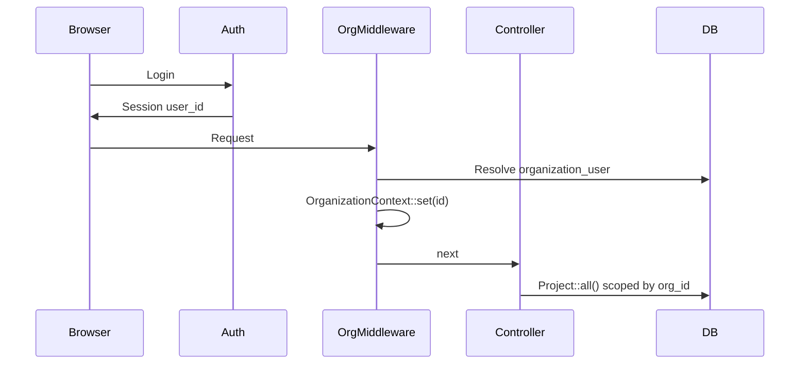

# SaaS Settings & Multi-Tenancy — Implementation Plan

**Status:** Draft plan (not started)  
**Created:** 2026-05-19  
**Audience:** Product, engineering, AI agents  
**Companion:** [`PROJECT_TRACKER.md`](./PROJECT_TRACKER.md) — add epic `CRM-SAAS-*` when execution starts  

---

## 1. Goal

Turn the Laravel CRM from a **single-tenant deployment** (one company, one database, global data) into a **multi-tenant SaaS** where:

- Each **customer company** is an isolated **Organization (tenant)**.
- **Organization Settings** is the control plane: branding, modules, integrations, defaults, seats, and (later) subscription.
- Existing production data becomes **Tenant #1** without a big-bang rewrite.

**Non-goal for v1:** Full self-serve signup + payments on day one. v1 can be “platform admin creates tenant + settings UI”; signup/billing follow in later phases.

---

## 2. Current state (verified)

| Area | Today |
|------|--------|
| Tenant / `organization_id` | **None** in schema or models |
| Top-level scope | **Project** + **UserRole** (integer enum) + project assignment |
| “Settings” in UI | Sidebar **Setting** is a **disabled** label (`sidebar.blade.php`); only **Billing → Settings** (`/billing/settings`) exists for TA/DA vehicles/users/categories |
| Permissions | `spatie/laravel-permission` on `User`, but app logic still uses `UserRole` int heavily |
| API | Sanctum; no tenant claim in tokens |
| Models | ~38 Eloquent models; many `DB::` raw queries in controllers (especially `StoreController`, `ProjectsController`) |
| Hosting | MySQL, shared hosting + queue — favors **shared DB + `organization_id`** over DB-per-tenant |

**Implication:** SaaS is not a “settings page” alone. Settings is the **product surface**; **tenant isolation** is the **platform prerequisite**.

---

## 3. Terminology

| Term | Meaning |
|------|---------|
| **Organization (tenant)** | Paying customer company (e.g. “Sugslloyd”, “Acme Solar”). Owns users, projects, inventory, billing config. |
| **Platform** | Your SaaS operator (you). Manages all organizations. |
| **Organization admin** | Tenant-level admin (maps from today’s `UserRole::ADMIN` **within** one org). |
| **Platform super-admin** | Cross-tenant operator; **not** stored as normal tenant user without explicit bypass. |
| **Project** | Stays a **domain** entity **inside** an organization (do not confuse with tenant). |

---

## 4. Recommended tenancy model

### 4.1 Choice: shared database, row-level isolation

```
┌─────────────────────────────────────────────────────────┐
│                    MySQL (single DB)                     │
│  organizations │ organization_user │ projects (org_id) │
│  users (org_id) │ stores (org_id)   │ … all tenant rows  │
└─────────────────────────────────────────────────────────┘
```

**Why (for this repo):**

- Matches XAMPP / shared hosting and existing MySQL investment.
- Incremental migration: add `organization_id`, backfill `1`, enforce scopes module-by-module.
- PostgreSQL RLS is **not** available; use **Laravel global scopes + middleware + tests** instead.

**Defer:** schema-per-tenant or database-per-tenant until regulatory isolation requires it.

### 4.2 Tenant resolution (how we know “who”)

Pick **one primary** strategy for v1; add others later.

| Strategy | Pros | Cons | Recommendation |
|----------|------|------|----------------|
| **Session `organization_id`** | Simple for web | API must mirror | **v1 web default** |
| **Subdomain** `acme.app.com` | Classic SaaS UX | DNS + SSL + hosting | Phase 4 |
| **Path** `/org/acme/...` | No DNS | Ugly URLs, route churn | Skip |
| **JWT claim** `org_id` | Mobile API | Token migration | Phase 3 with API |

**v1 flow:**

1. User logs in → `organization_user` gives default org (or last used).
2. Middleware `SetOrganizationContext` sets `OrganizationContext::id()` for request.
3. All tenant models use `BelongsToOrganization` global scope.
4. Platform routes use `withoutOrganizationScope()` explicitly.



---

## 5. What “Settings” includes (product map)

Use the disabled sidebar **Setting** as **Organization Settings** (`/settings` or `/organization/settings`).

### 5.1 Settings areas (tabs)

| Tab | Purpose | v1 scope |
|-----|---------|----------|
| **General** | Legal name, display name, timezone, locale, date/number format | Yes |
| **Branding** | Logo, favicon, primary color, email/PDF footer | Yes |
| **Modules** | Enable/disable: Billing, JICR, HRM, Meetings, RMS sync, Backup | Yes |
| **Roles** | Tenant role labels; which roles exist; map to Spatie (optional v1: read-only) | Partial |
| **Integrations** | RMS URL/key, S3 bucket prefix, SMS/email provider keys | Yes (encrypted) |
| **Notifications** | Default event notification rules, bell retention | Phase 2 |
| **Security** | Session lifetime, password rules, allowed domains | Phase 2 |
| **Billing (SaaS)** | Plan, seats, usage — Stripe | Phase 5 |
| **Danger zone** | Export data, delete org (platform-only) | Phase 5 |

**Keep separate:** `/billing/settings` remains **TA/DA module settings**, not org settings. Rename in UI if confusing (“TA/DA settings”).

### 5.2 Settings storage pattern

**Hybrid (recommended):**

- **`organizations` table** — stable identity + branding columns.
- **`organization_settings` JSON** — module flags, feature toggles, non-indexed config.
- **`organization_integrations` table** — encrypted secrets (RMS, webhooks), one row per integration type.

```php
// Read pattern
OrganizationSettings::for($org)->get('modules.billing', true);
OrganizationSettings::for($org)->set('branding.primary_color', '#0d6efd');
```

Service: `App\Services\Organization\OrganizationSettingsService` (cache per request).

---

## 6. Data model (new tables)

### 6.1 Core tenancy

```sql
organizations
  id, uuid, slug, name, legal_name, logo_path, timezone, locale,
  status (active|suspended|trial), plan_key (nullable), settings (json),
  created_at, updated_at

organization_user
  id, organization_id, user_id, role (owner|admin|member),
  is_default, last_accessed_at, unique(organization_id, user_id)

-- users table ADD:
  organization_id (nullable until backfill, then NOT NULL)
```

### 6.2 Platform

```sql
platform_users   -- optional: separate from tenant users
  id, email, password, ...

platform_audit_logs  -- cross-tenant actions
```

### 6.3 Tenant-scoped tables (add `organization_id`)

**Tier 1 — must have before any new tenant:**

- `users`, `projects`, `project_user` (via project)

**Tier 2 — core operations:**

- `sites`, `streetlights`, `poles`, `streetlight_tasks`, `tasks`
- `stores`, `inventories`, `inventory_dispatches`, `inventory_histories`
- `candidates`, `meets`, `conveyances`, `tadas`, related billing tables

**Tier 3 — logs & jobs:**

- `activity_logs`, `rms_push_logs`, `rms_sync_batches`, `user_event_notifications`
- `pole_import_jobs`, `target_deletion_jobs`

**Global (no `organization_id`):**

- `states`, `cities`, `district_codes` (reference data) — **or** copy per tenant if customization needed later
- `plans`, `subscription_invoices` (SaaS catalog)

---

## 7. Application architecture

### 7.1 Building blocks

| Piece | Responsibility |
|-------|----------------|
| `Organization` model | Tenant root |
| `BelongsToOrganization` trait | `organization_id` fillable, `booted` global scope, auto-set on create |
| `OrganizationContext` | Request singleton: `id()`, `organization()`, `check()` |
| `SetOrganizationContext` middleware | Web + API |
| `EnsureOrganizationAccess` | User belongs to org |
| `OrganizationSettingsService` | Read/write settings + cache |
| `SettingsController` | Settings UI |
| Policies | `OrganizationPolicy` — only org admin/owner |
| `Platform\*` namespace | Super-admin controllers, no global scope |

### 7.2 Role model evolution

**Today:** `users.role` int + `UserRole` enum = global god-mode Admin sees **all** data.

**Target:**

| Role layer | Who |
|------------|-----|
| **Platform super-admin** | You; `platform_users` or `users.is_platform_admin` |
| **Organization owner/admin** | Tenant admin; `organization_user.role` |
| **Operational roles** | Keep `UserRole` **scoped to organization** (PM, SE, Vendor, …) |

**Migration rule:** Today’s `UserRole::ADMIN` → `organization_user.role = owner` **and** `users.role = ADMIN` within that org only.

**Spatie:** Enable [teams feature](https://spatie.be/docs/laravel-permission/v6/basic-usage/teams-permissions) with `organization_id` as team key — **Phase 3**, after scopes work. Until then, keep enum for field roles.

### 7.3 Query safety

1. **Global scope** on all tenant models (default).
2. **CI grep** for `::withoutGlobalScopes`, raw `DB::` without org filter.
3. **Feature tests:** User A in org 1 cannot `GET` org 2 project id (404, not 403 leak).
4. **Queue jobs:** Pass `organizationId` in job payload; call `OrganizationContext::run($id, fn () => ...)`.

---

## 8. Phased implementation

### Phase 0 — Discovery (1 week)

**Deliverables**

- [ ] Table inventory: every model → `tenant` / `global` / `derived`
- [ ] Route inventory: web + API → middleware group
- [ ] Raw query audit (`DB::table` files list)
- [ ] ADR: tenancy model + tenant resolution

**Exit criteria:** Signed-off spreadsheet; no unknown “orphan” tables.

---

### Phase 1 — Tenant foundation (2–3 weeks)

**Goal:** One logical tenant in DB; zero user-visible change.

| Task | Detail |
|------|--------|
| Migrations | `organizations`, `organization_user`, `users.organization_id` |
| Backfill | Single org “Default Organization”, all users/projects `organization_id = 1` |
| Context + middleware | `SetOrganizationContext` on `web`, `api` groups |
| Trait | `BelongsToOrganization` on `Project`, `User` |
| Tests | Scope prevents cross-org read when second org seeded in test |

**Exit criteria:** `php artisan test` green; production data still works as today.

---

### Phase 2 — Settings MVP (2 weeks)

**Goal:** Real **Organization Settings** UI at sidebar “Setting”.

| Task | Detail |
|------|--------|
| Routes | `GET/PATCH /settings/{tab?}` — `settings.general`, `settings.branding`, … |
| Controller | `OrganizationSettingsController` thin → service |
| Views | Tabbed UI; match existing Star Admin patterns |
| General + Branding | Name, logo upload (S3), timezone, locale |
| Modules | Toggles stored in JSON; sidebar hides disabled modules |
| Policy | Only org owner/admin |
| Header | Use org logo + name from settings (replace static branding) |

**Exit criteria:** Admin can change org name/logo; disabled module disappears from sidebar; changes persist per org.

---

### Phase 3 — Data isolation rollout (4–6 weeks)

**Goal:** Every customer-facing query is org-scoped.

Roll out **by module** (order minimizes leak risk):

1. Projects + project_user + users list  
2. Staff / vendors  
3. Streetlight sites, tasks, poles  
4. Inventory + stores  
5. Dashboard analytics services  
6. Billing / JICR / HRM / meetings  
7. Notifications, activity log, exports, queue jobs  
8. API: add `organization_id` to Sanctum token abilities / login response  

**Per module checklist**

- [ ] Migration `organization_id` + backfill from `project.organization_id` where applicable  
- [ ] Trait on models  
- [ ] Policies updated  
- [ ] Controller `DB::` queries fixed  
- [ ] Feature test: cross-tenant 404  

**Exit criteria:** Second test organization with dummy project; User org1 cannot access org2 IDs on all Tier 1–2 modules.

---

### Phase 4 — Onboarding & tenant UX (2–3 weeks)

| Task | Detail |
|------|--------|
| Org switcher | If user in multiple orgs (rare v1) |
| Invite flow | Owner invites email → accept → `organization_user` |
| Provisioning | `OrganizationProvisioner` creates org + owner + default settings |
| Subdomain (optional) | `{slug}.domain.com` → resolve org in middleware |
| Registration | Public signup creates trial org (if product wants) |

**Exit criteria:** New org created without SQL manual steps; owner lands in empty dashboard.

---

### Phase 5 — SaaS billing & limits (3+ weeks)

| Task | Detail |
|------|--------|
| Plans table | free / pro / enterprise |
| Limits | max users, max projects, max poles, storage |
| Enforcement | Middleware or service checks before create |
| Stripe | Checkout, webhooks, `subscription_status` on org |
| Settings tab | Plan, billing portal link, usage meters |

**Exit criteria:** Exceeding seat limit blocks user invite with clear UI.

---

### Phase 6 — Platform console (2 weeks)

| Task | Detail |
|------|--------|
| `/platform/organizations` | List, suspend, impersonate (audit logged) |
| Impersonation | Super-admin → tenant session with banner |
| Metrics | MRR, active users per org |

**Exit criteria:** Support can open tenant without sharing passwords.

---

## 9. Settings ↔ module integration (examples)

| Module toggle key | Sidebar / routes affected |
|-------------------|---------------------------|
| `modules.billing` | Billing, TA/DA, convenience |
| `modules.jicr` | JICR routes |
| `modules.hrm` | Candidates |
| `modules.meetings` | Meets |
| `modules.rms` | RMS sync UI |
| `modules.backup` | Backup (org admin only) |

Implementation: `ViewComposer` or `MenuBuilder` reads `OrganizationSettings::modules()` — **do not** sprinkle `@if` in 20 blade files long-term.

---

## 10. Migration strategy (existing deployment)

1. **Maintenance window optional** — Phase 1 backfill can be online.  
2. Create `organizations` id=1 matching current company.  
3. `UPDATE users SET organization_id = 1`.  
4. `UPDATE projects SET organization_id = 1`; cascade to children in dependency order.  
5. Deploy code with scope **before** enabling second real tenant.  
6. Verify counts: `projects` without org_id = 0.

**Rollback:** Feature flag `TENANCY_ENFORCED=false` disables scope (emergency only).

---

## 11. Testing strategy

| Layer | What |
|-------|------|
| Unit | `OrganizationSettingsService` get/set, encryption |
| Feature | Cross-tenant access 404 on projects, staff, inventory |
| Browser | Settings save → sidebar module hide → logo in header |
| API | Login returns `organization_id`; wrong org resource 404 |
| Manual | Queue job with org context; export CSV only org data |

Add to `TESTING_RULES.md`: **never mark SaaS ticket DONE without cross-tenant test.**

---

## 12. Risks & mitigations

| Risk | Impact | Mitigation |
|------|--------|------------|
| Missed `DB::` query | Data leak | Audit list + grep CI + penetration test |
| Admin = global god | Total leak | Split platform vs org admin |
| Mobile API | Wrong tenant data | JWT `org_id` + test suite |
| Shared hosting | Long migrations | Chunked backfills |
| Scope breaks reports | Wrong aggregates | Dashboard services last; compare totals pre/post |
| Settings vs billing settings | User confusion | Rename TA/DA settings label |

---

## 13. Suggested tracker epics (when starting)

| Epic | Keys prefix |
|------|-------------|
| SaaS foundation | `CRM-SAAS-1xx` |
| Organization settings UI | `CRM-SAAS-2xx` |
| Module isolation | `CRM-SAAS-3xx` |
| Onboarding | `CRM-SAAS-4xx` |
| Subscription | `CRM-SAAS-5xx` |
| Platform admin | `CRM-SAAS-6xx` |

---

## 14. Decision log (fill as you go)

| # | Decision | Options | Chosen | Date |
|---|----------|---------|--------|------|
| D1 | Tenant column name | `organization_id` vs `tenant_id` | `organization_id` | — |
| D2 | Package vs custom | `stancl/tenancy` vs trait+scope | TBD | — |
| D3 | Tenant resolution v1 | session vs subdomain | session | — |
| D4 | Reference data | global states vs per-tenant | global (TBD) | — |

---

## 15. Out of scope (explicit)

- Multi-region data residency  
- White-label mobile apps per tenant  
- Per-tenant custom code branches  
- Full Spatie replacement of `UserRole` in one release  

---

## 16. Rough timeline

| Phase | Duration | Cumulative |
|-------|----------|------------|
| 0 Discovery | 1 wk | 1 wk |
| 1 Foundation | 2–3 wk | 4 wk |
| 2 Settings MVP | 2 wk | 6 wk |
| 3 Isolation | 4–6 wk | 12 wk |
| 4 Onboarding | 2–3 wk | 15 wk |
| 5 Billing | 3+ wk | 18 wk |
| 6 Platform | 2 wk | 20 wk |

**Minimum viable SaaS (one extra paying customer safely):** Phase **0 + 1 + 2 + 3 Tier 1–2** ≈ **10–12 weeks**.

---

*Next step when approved: create `CRM-SAAS-*` tickets in `PROJECT_TRACKER.md` and start Phase 0 table inventory.*
